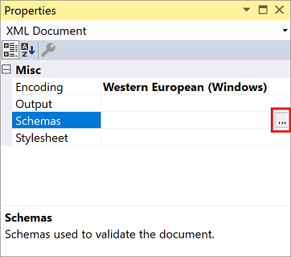

# How to: Select the XML schemas to use

The XML editor provides a schema cache located in the *%VSInstallDir%\xml\Schemas* directory. The schema cache includes well-known XML schemas that are used for IntelliSense and XML document validation.

Use the **Schemas** document property to select one or more XML schema definition language (XSD) schemas. You can select schemas from the schema cache or elsewhere.

The schemas you specify are saved in a (hidden) solution user options file (.*suo*), along with all other XML document properties. As a result, you don't have to reenter these values the next time you open the solution.

> [!NOTE]
> The editor can validate using an inline schema or a schema referenced by the `xsd:schemaLocation` attribute. For more information, see [XML document validation](../xml-tools/xml-document-validation.md).

## To select an XML schema from the schema cache

1. Open a file in the XML editor.

2. In the document properties window, click in the **Schemas** field. When the browse button (...) appears, click it.

   

   The [XML Schemas dialog box](xml-schemas-dialog-box.md) opens. The dialog box lists all schemas with an .*xsd* extension in the schema cache (including schemas referenced in the *catalog.xml* file), and also any schema that is in the current solution, open in Visual Studio, referenced in an `xsd:schemaLocation` attribute, or referenced in the **Schemas** property.

3. Select the schemas to use for validation by doing one of the following:

   - Select a schema listed in the **XML Schemas** dialog, click the **Use** column, and then select **Use this schema**.

     -or-

   - Select multiple schemas listed in the **XML Schemas** dialog, and then right-click and select **Use this schema**.

4. Choose **OK**.

   The list of selected schemas is copied back to the **Schemas** document property.

## To add an XML schema to the schema cache

1. In the document properties window, click the button on the **Schemas** field.

2. Click **Add**.

   The **Open XSD Schema** dialog opens.

3. Browse and select the schema(s) to add to the schema cache.

4. Click **Open**.

   The schemas are added to the schema cache and the **Use** column value is set to **Use this schema**.

## To delete an XML schema from the schema cache

1. In the document properties window, click the button on the **Schemas** field.

2. Select the schema to remove and then click **Remove**.

   The schema is removed from the in-memory schema cache, but it is not removed from the file system.

   > [!NOTE]
   > If you still have a reference to the schema via a `schemaLocation` attribute, or a matching `targetNamespace` then **Remove** will not work in this situation due to auto-association. In this case it is recommended that you mark the schema as **Do not use selected schemas** in the **Use** column.

## See also

- [Schema cache](../xml-tools/schema-cache.md)
- [XML schemas dialog box](../xml-tools/xml-schemas-dialog-box.md)
- [XML editor](../xml-tools/xml-editor.md)