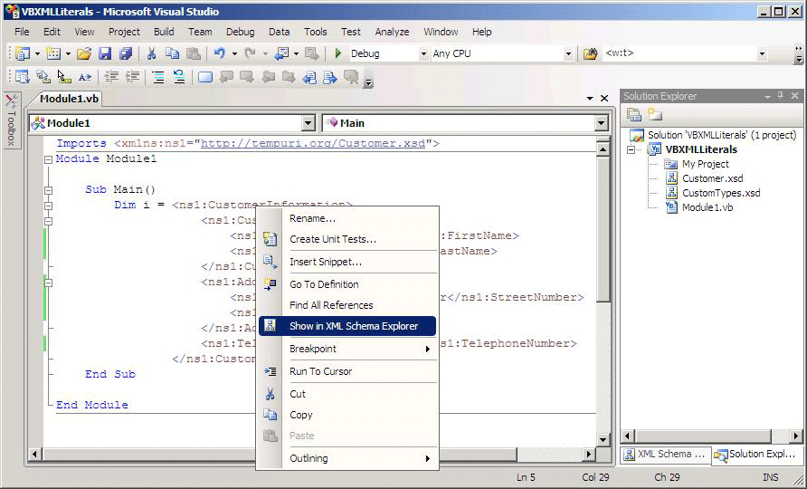

# Integration of XML literals with XML Schema Explorer

Visual Basic supports XML literals, which means that you can incorporate XML fragments directly into your Visual Basic code. For more information, see [XML literals overview](/dotnet/visual-basic/programming-guide/language-features/xml/xml-literals-overview).

## How to

If an XSD file in your Visual Basic project includes an XML literal, you can view the XML schema set in the **XML Schema Explorer**. To view the schema set associated with an XML literal, right-click on an XML node in an XML literal or an XML namespace import and select **Show in Schema Explorer**.

This opens the **XML Schema Explorer** side by side with your Visual Basic file.

## Related content

- [How to: Use the XML schema designer with XML literals](../xml-tools/how-to-use-the-xml-schema-designer-with-xml-literals.md)
