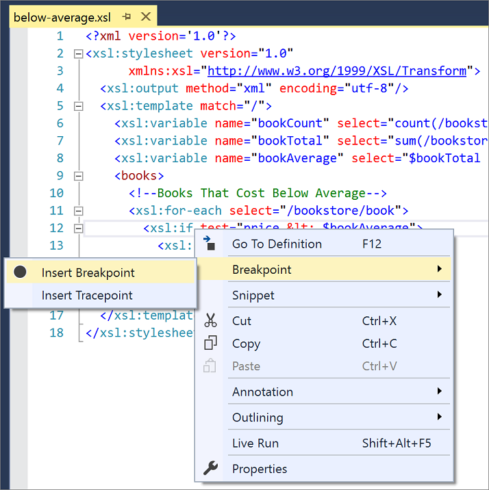
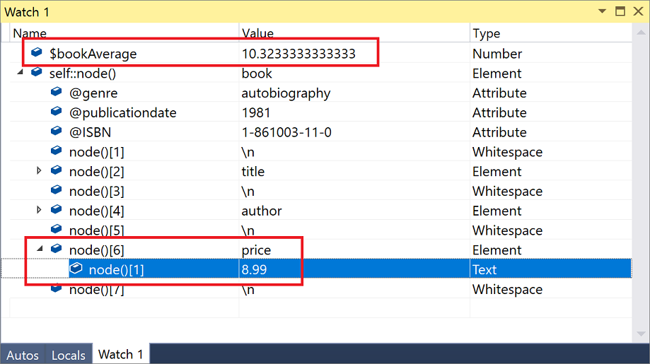

# Walkthrough: Debug an XSLT style sheet

The steps in this walkthrough demonstrate how to use the XSLT debugger. Steps include viewing variables, setting breakpoints, and stepping through the code. The debugger lets you execute code one line at a time.

To prepare for this walkthrough, first copy the two [sample files](#sample-files) to your local computer. One is the style sheet, and one is the XML file we'll use as input to the style sheet. In this walkthrough, the style sheet we use finds all books whose cost is below the average book price.

> [!NOTE]
> The XSLT debugger is only available in the Enterprise edition of Visual Studio.

## Start debugging

1. From the **File** menu, choose **Open** > **File**.

2. Locate the *below-average.xsl* file and choose **Open**.

   The style sheet opens in the XML editor.

3. Click the browse button (**...**) on the **Input** field of the document properties window. (If the **Properties** window is not visible, right-click anywhere on the open file in the editor, and then choose **Properties**.)

4. Locate the *books.xml* file, and then choose **Open**.

   This sets the source document file that's used for the XSLT transformation.

5. Set a [breakpoint](../debugger/using-breakpoints.md) on line 12 of *below-average.xsl*. You can do this in one of multiple ways:

   - Click in the margin of the editor on line 12.

   - Click anywhere on line 12, and then press **F9**.

   - Right-click the `xsl:if` start tag, and then choose **Breakpoint** > **Insert Breakpoint**.

      

6. On the menu bar, choose **XML** > **Start XSLT Debugging** (or, press **Alt**+**F5**).

   The debugging process starts.

   In the editor, the debugger is positioned on the `xsl:if` element of the style sheet. Another file named *below-average.xml* opens in the editor; this is the output file that will be populated as each node in the input file *books.xml* is processed.

   The **Autos**, **Locals**, and **Watch 1** windows appear at the bottom of the Visual Studio window. The **Locals** window displays all the local variables and their current values. This includes variables defined in the style sheet and also variables that the debugger uses to track the nodes that are currently in context.

## Watch window

We'll add two variables to the **Watch 1** window so we can examine their values as the input file is processed. (You can also use the **Locals** window to examine values if the variables you want to watch are already there.)

1. From the **Debug** menu, choose **Windows** > **Watch** > **Watch 1**.

   The **Watch 1** window becomes visible.

2. Type `$bookAverage` in the **Name** field, and then press **Enter**.

   The value of the `$bookAverage` variable displays in the **Value** field.

3. On the next line, type `self::node()` in the **Name** field, and then press **Enter**.

   `self::node()` is an XPath expression that evaluates to the current context node. The value of the `self::node()` XPath expression is the first book node. This changes as we progress through the transformation.

4. Expand the `self::node()` node, and then expand the node who's value is `price`.

   

   You can see the value of the book price for the current book node and compare it to the `$bookAverage` value. Because the book price is below the average, the `xsl:if` condition should succeed when you continue the debugging process.

## Step through the code

1. Press **F5** to continue.

   Because the first book node satisfied the `xsl:if` condition, the book node is added to the *below-average.xml* output file. The debugger continues to execute until it is positioned again on the `xsl:if` element in the style sheet. The debugger is now positioned on the second book node in the *books.xml* file.

   In the **Watch 1** window, the `self::node()` value changes to the second book node. By examining the value of the price element, you can determine that the price is above the average, thus the `xsl:if` condition should fail.

2. Press **F5** to continue.

   Because the second book node does not meet the `xsl:if` condition, the book node is not added to the *below-average.xml* output file. The debugger continues to execute until it's positioned again on the `xsl:if` element in the style sheet. The debugger is now positioned on the third `book` node in the *books.xml* file.

   In the **Watch 1** window, the `self::node()` value changes to the third book node. By examining the value of the `price` element, you can determine that the price is below the average. The `xsl:if` condition should succeed.

3. Press **F5** to continue.

   Because the `xsl:if` condition was satisfied, the third book is added to the *below-average.xml* output file. All books in the XML document have been processed and the debugger stops.

## Sample files

The following two files are used by the walkthrough.

### below-average.xsl

```xml
<?xml version='1.0'?>
<xsl:stylesheet version="1.0"
      xmlns:xsl="http://www.w3.org/1999/XSL/Transform">
  <xsl:output method="xml" encoding="utf-8"/>
  <xsl:template match="/">
    <xsl:variable name="bookCount" select="count(/bookstore/book)"/>
    <xsl:variable name="bookTotal" select="sum(/bookstore/book/price)"/>
    <xsl:variable name="bookAverage" select="$bookTotal div $bookCount"/>
    <books>
      <!--Books That Cost Below Average-->
      <xsl:for-each select="/bookstore/book">
        <xsl:if test="price &lt; $bookAverage">
          <xsl:copy-of select="."/>
        </xsl:if>
      </xsl:for-each>
    </books>
  </xsl:template>
</xsl:stylesheet>
```

### books.xml

```xml
<?xml version='1.0'?>
<!-- This file represents a fragment of a book store inventory database -->
<bookstore>
  <book genre="autobiography" publicationdate="1981" ISBN="1-861003-11-0">
    <title>The Autobiography of Benjamin Franklin</title>
    <author>
      <first-name>Benjamin</first-name>
      <last-name>Franklin</last-name>
    </author>
    <price>8.99</price>
  </book>
  <book genre="novel" publicationdate="1967" ISBN="0-201-63361-2">
    <title>The Confidence Man</title>
    <author>
      <first-name>Herman</first-name>
      <last-name>Melville</last-name>
    </author>
    <price>11.99</price>
  </book>
  <book genre="philosophy" publicationdate="1991" ISBN="1-861001-57-6">
    <title>The Gorgias</title>
    <author>
      <name>Plato</name>
    </author>
    <price>9.99</price>
  </book>
</bookstore>
```

## See also

- [Debugging XSLT](../xml-tools/debugging-xslt.md)