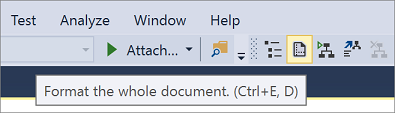

# Walkthrough: Use XML editor features

The steps in this walkthrough show you how to create a new XML document. The walkthrough also uses some of the features of the XML editor that make it valuable for XML authoring.

> [!NOTE]
> Before starting the walkthrough, save the *hireDate.xsd* file (included below in this topic) to your local computer.

## To create a new XML file and associate it with an XML schema

1. On the **File** menu, point to **New**, and click **File**.

2. Select **XML File** in the **Templates** pane and click **Open**.

     A new file is opened in the editor. The file contains a default XML declaration, `<?xml version="1.0" encoding="utf-8">`.

3. In the document properties window, click the browse button (**...**) on the **Schemas** field.

     The **XSD Schemas** dialog box is displayed.

4. Click **Add**.

     The **Open XSD Schema** dialog box is displayed.

5. Select the *hireDate.xsd* file and click **Open**.

6. Click **OK**.

     The XML Schema is now associated with the XML document. The XML Schema is used to validate the document. It is also used by IntelliSense to populate the member list of valid elements.

## To add data

1. Type `<` in the editor pane.

     The members list displays the possible items:

    - **!--** to add a comment.

    - **!DOCTYPE** to add a document type.

    - **?** to add a processing instruction.

    - **employee** to add the root element.

2. Select **&lt;!--** to add a comment node and press **Enter**.

     The editor inserts a comment end tag and places the cursor between the start and end comment tags.

3. Type in **Test XML file**.

4. On a new line, type `<`, and select **employee** from the member list.

     The editor adds the start of an XML element, `<employee`. At this point you can add attributes to the element or you can close the start tag by typing `>`.

5. Type `>` to close the tag.

6. The editor adds the end tag. The end tag is added with a wavy underline indicating a validation error. The **ToolTip** displays the message: **The element 'employee' has incomplete content. Expected 'ID'**.

7. Type `<` and select **ID** from the member list. Then type `>`.

     The editor adds the XML element, `<ID></ID>`, and positions the cursor after the ID start tag.

8. Type **abc**.

     The **abc** text has a wavy underline. The **ToolTip** displays the message: **The 'ID' element has an invalid value according to its data type**.

9. Right-click on the ID element and select **Go To Definition**.

     The editor opens the *hireDate.xsd* file in a new document window and positions the cursor on the ID schema element definition.

10. Return to the XML file, and replace the **abc** text with **123**.

     The wavy underline and **ToolTip** are cleared under the ID element value. The **ToolTip** for the employee end tag now displays the message: **The element 'employee' has incomplete content. Expected 'hire-date'**.

11. Place the cursor after the ID end tag, type in `<`, select **hire-date** from the member list, and then type in `>`.

     The editor adds the XML element, `<hire-date></hire-date>`, and positions the cursor after the hire-date start tag.

12. Type in **2003-01-10** for the hire-date value.

## To format the XML document

- Select the **Format Document** button on the XML editor toolbar, or press **Ctrl**+**E**,**D**.

   

   The XML document is reformatted.

## To save the XML document

1. From the **File** menu, select **Save As**.

     The **Save File As** dialog box is displayed. The default filename is *'XMLFile1'*.

2. Enter the file name and location for the XML document and click **Save**.

## hireDate.xsd file

The following schema file is used in this walkthrough:

```xml
<?xml version="1.0"?>
<xs:schema attributeFormDefault="unqualified"
     elementFormDefault="qualified" targetNamespace="urn:empl-hire"
     xmlns:xs="http://www.w3.org/2001/XMLSchema">
  <xs:element name="employee">
    <xs:complexType>
      <xs:sequence>
        <xs:element name="ID" type="xs:unsignedShort" />
        <xs:element name="hire-date" type="xs:date" />
      </xs:sequence>
    </xs:complexType>
  </xs:element>
</xs:schema>
```

## See also

- [XML editor](../xml-tools/xml-editor.md)