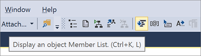

# XML editor IntelliSense features

The XML editor provides full IntelliSense features comparable to other language editors provided in Visual Studio. This section explains how you can use the IntelliSense with XML Schema definition language (XSD) and XSLT documents.

## IntelliSense in an XSD document

After a schema is associated with your document, you get a drop-down list of expected elements any time you type `"<"` or click the **Display an Object Member List** button on the XML editor toolbar.

For information about how to associate schemas with your XML documents, see [XML document validation](../xml-tools/xml-document-validation.md).

When you type SPACE from inside a start tag, you also get a drop-down list showing all attributes that can be added to the current element.

When you type `"="` for an attribute value, or the opening quote for the value, you also get list of possible values for that attribute. Values are only provided if the schema provides enumerated values via `xsd:enumeration` facets, or if the attribute is a `Boolean` type. An IntelliSense list of known language codes is also provided for `xml:lang` or any `simpleType` that derives from `xsd:language`. An IntelliSense list of known `targetNamespace` values is provided for namespace declarations.

An IntelliSense list of possible values is also provided when you type `">"` to close a start tag if the element is a `simpleType`. The behavior for elements is similar to the behavior for attributes described in the previous paragraph.

ToolTips also appear on these IntelliSense lists based on `xsd:annotation` and `xsd:documentation` information found in the associated schema.

## IntelliSense in an XSLT document

After you add a named template or an attribute to your XSLT document, you can use IntelliSense to insert the following:

- Attribute set names.

- Template modes.

- Template names.

- Parameter names for a given mode.

- Parameter names for a given named template.

For more information, see [Walkthrough: Using XSLT IntelliSense](../xml-tools/walkthrough-using-xslt-intellisense.md) topic.

## Auto-completion

The XML editor also makes editing XML easier by filling in required XML syntax for you. For example, if you type the following start tag:

`<book>`

The XML editor fills in the end tag and positions the cursor after the start tag. The following is an example of this (the "&#124;" notes the cursor position):

`<book>`&#124;`</book>`

Because attribute values must always have quotes, the XML editor fills in the quotes for you. For example, if you type the following:

`<book title=`

The XML editor adds the quotes and positions the cursor between the quotes:

`<book title="`&#124;`"`

Similarly, the XML editor also inserts the following XML syntax automatically for you:

- End a processing instruction:  `?>`

- End a CDATA block: `]]>`

- End a comment: `-->`

- End a DTD declaration: `>`

The XML editor also has the ability to insert a namespace declaration if you select a namespace qualified element or attribute from an IntelliSense list and the namespace for that element or attribute is not yet in scope.

For example, if you select the `e:Book` element from the IntelliSense list where the prefix is bound to the `http://books` namespace that has not been declared in the document, the XML editor inserts the required namespace declaration for you. The following is the resulting XML text:

`<e:Book xmlns:e="http://books"`

## Brace matching

The XML editor provides brace highlighting to give you immediate feedback on elements you have just closed. You can also use the keyboard shortcut (**Ctrl**+**]**) to jump from one brace to the matching brace.

The XML editor does this for the following items:

- Matching start and end tags.

- Any pair of "\<" or ">" angle brackets.

- Start and end of comments.

- Start and end of processing instructions.

- Start and end of CDATA blocks.

- Start and end of DTD declarations.

- Opening and closing quotes on attributes.

## Modify the IntelliSense options

The IntelliSense and auto-completion features are enabled by default. However, you can change this by modifying your **Tools** > **Options** settings.

The **Auto Insert** section of the **Miscellaneous** page controls the following behavior:

|Name|Description|
|-|-----------------|
|Close tags|Inserts close tags for new elements.|
|Attribute quotes|Inserts attribute value quotes when you enter a new attribute name.|
|Other markup|Completes comments, CDATA, DOCTYPE, processing instructions, and other markup declarations.|

### To change the auto-completion behavior

1. Select **Options** from the **Tools** menu.

2. Expand **Text Editor**, expand **XML**, and select **Miscellaneous**.

3. Make any changes to the **Auto insert** section and click **OK**.

## Related content

- [XML editor](../xml-tools/xml-editor.md)
- [Using IntelliSense](../ide/using-intellisense.md)
- [Walkthrough: Using XSLT IntelliSense](../xml-tools/walkthrough-using-xslt-intellisense.md)
