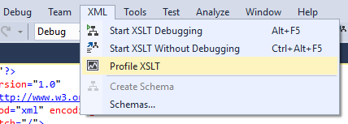

# The XSLT Profiler

The XSLT Profiler creates detailed XSLT performance reports that help measure, evaluate, and target performance-related problems in XSLT code. The XSLT Profiler includes useful hints for XSL and XSLT style sheet optimizations. For XSLT applications that demand maximum performance, this tool can be essential.

The XSLT Profiler is part of Visual Studio and is available on the **XML** menu.

> [!NOTE]
> The XSLT Profiler is only available in the Enterprise edition of Visual Studio.

## Create a performance report

1. Open an XSLT document in Visual Studio.

2. On the menu bar, choose **XML** > **Profile XSLT**.

3. Provide an input XML document. If an XML document is not already open, you will be prompted for the file.

   The analysis starts, and a progress bar displays the progress within the editor. The XSLT output is also visible.

4. After the performance session ends, check the performance report to analyze XSLT performance.

## Get all available views

1. Click on the **Current View** drop-down list to get all available views.

2. Select the **Summary View** option in the **Current View** drop-down list. By default, a performance report is displayed in the **Summary View**. This view is a starting point to determine performance issues with XSLT documents. The **Summary View** lists the following data points:

   - Most called functions

   - Functions with the most individual work

   - Functions taking the longest time to execute

   By default, there are three columns for each data point: the name of the function, the number of calls in absolute value, and a percentage value of the named function to total function calls. From each data point in the **Summary View**, you can navigate to more detailed views by right-clicking on the function data points.

3. Select the **Function View** option in the **Current View** drop-down list. The **Function View** lists functions called during profiling. You can sort the data by clicking a column name. The columns displayed by default are:

    - **Function Name**

    - **Elapsed Inclusive Time**

    - **Elapsed Exclusive Time**

    - **Application Inclusive Time**

    - **Application Exclusive Time**

    - **Number of Calls**

   All time columns are displayed in both absolute values and percentages. The term **Exclusive** refers to the total time a function spent executing exclusive of time spent by other functions called during the execution of this function.

   The term **Inclusive** refers to the total time a function spent executing, including execution time of all the functions it called and whether any of these called functions called other functions.

## Select Caller/Callee view

Select **Caller/Callee** view in the **Current View** drop-down list. The **Caller/Callee** view has the following three distinct parts:

- **Functions that called**: All the functions that called a particular function are listed at the top part of the view.

- **Current Function**: The particular function that was called is listed in the middle part of the view.

- **Functions that were called by**: All the functions that were called by the particular function are listed at the bottom part of the view.

If a function named `SyncToNavigator` appears in the middle part of the view, all the functions that called the `SyncToNavigator` function appear in the top part of the view, and all the functions that were called by the `SyncToNavigator` appear in the bottom part of the view.

- You can change the function in the middle part of the view by double-clicking any of the functions listed in the other two parts of the view. The view is then updated to reflect the changes automatically.

- You can also sort the data by clicking column names.

## Select Call Tree View

- Select **Call Tree View** in the **Current View** drop-down list. This view is a tree view of program execution.

   The **Call Tree View** shows the root of the tree as the process name. The functions are the nodes of the tree. This view allows you to drill into specific call traces and analyze which traces have the greatest performance impact. The view is similar to the **Call Stack View** available during debugging. In addition to the columns in the **Function View**, in the **Call Tree View**, there is an additional column to display the **Module Name**.

- Select **Marks** in the **Current View** drop-down list.

   With the XSLT Profiler, there are marks that show up in the data collection stream with an associated comment. Marks are places in the code that have counters. When you tell the XSLT Profiler to collect XSLT performance counters, the counters get collected every time one of these marks gets executed. The data is displayed in a table containing the **Mark ID**, **Mark Name** (**Start Program**, **End Program**), and the **Time Stamp**. The marks are not aggregated and show up in chronological order in the **Marks View** of the performance report.

## Select Modules in the Current View

- Select **Modules** in the **Current View** drop-down list.

   The modules view is a flat list of all functions aggregated to the module level. Expand or collapse the module name to display or close the view of module performance data. You can sort the data by clicking a column name. By default, there are both absolute values and percentage numbers for **Elapsed Inclusive Time**, **Elapsed Exclusive Time**, **Application Inclusive Time**, **Application Exclusive Time**, and **Number of Calls**.

- Select **Process** in the **Current View** drop-down list.

   The process view displays a table that includes the **Process ID**, **Process Name**, **Begin Time**, and the **End Time**. Data can be sorted by clicking column names.

## See also

- [Walkthrough: Using XSLT hierarchy](../xml-tools/walkthrough-using-xslt-hierarchy.md)