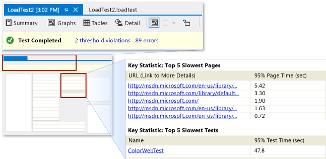
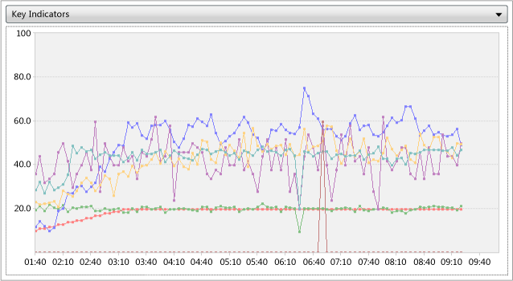
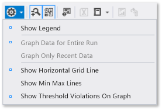
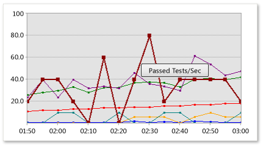
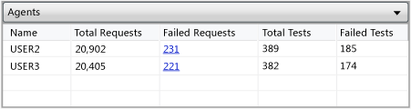
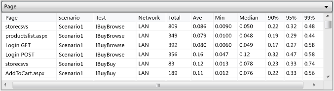

# Load Test Analyzer Overview
You can use the *Load Test Analyzer* to help locate bottlenecks, identify errors, and measure improvements in your application.  
  
 You can use the Load Test Analyzer to conduct load test analysis in three ways:  
  
-   [Analyze a load test while you monitor a running load test](#AnalyzeRunning).  
  
-   [Analyze your load test results after the load test run is completed](#AnalyzeComp).  
  
-   [Analyze the load test results of a previously run load test](#AnalyzePrev).  
  
 **Requirements**  
  
-   Visual Studio Enterprise  
  
 The data that is stored in load test results contains performance counter samples that are collected periodically from the computers under test. For more information, see [Specifying the Counter Sets and Threshold Rules for Computers in a Load Test](../test/specifying-the-counter-sets-and-threshold-rules-for-computers-in-a-load-test.md). It also contains error logs and threshold rule violation information, and also data that is collected by data collectors and detailed timing information.  
  
 The amount of performance data that is collected during a load test depends on these factors:  
  
-   **Length of the test run**  
  
-   **Sampling interval**  
  
     For more information, see [How to: Specify the Sample Rate](../test/how-to--specify-the-sample-rate-for-a-load-test-run-setting.md).  
  
-   **Number of computers that are under test**  
  
     For more information, see [Distributing Load Test Runs Across Multiple Test Machines Using Test Controllers and Test Agents](../test/distributing-load-test-runs-across-multiple-test-machines-using-test-controllers-and-test-agents.md).  
  
-   **Number of counters that are being collected**  
  
     For more information, see [Specifying the Counter Sets and Threshold Rules for Computers in a Load Test](../test/specifying-the-counter-sets-and-threshold-rules-for-computers-in-a-load-test.md).  
  
-   **Data collectors that are configured**  
  
     For more information, see [Specifying Test Settings for Visual Studio Tests](../test/specifying-test-settings-for-visual-studio-tests.md).  
  
-   **Logging levels**  
  
     For more information, see [Modifying Load Test Logging Settings](../test/modifying-load-test-logging-settings.md).  
  
 By default, the test controller saves all performance counter data that is collected to a database when the load test is running. Some additional data, such as error details and timing details, is loaded into the database only after the test is completed. For more information, see [Managing Load Test Results in the Load Test Results Repository](../test/managing-load-test-results-in-the-load-test-results-repository.md).  
  
##   Analyzing and Monitoring a Running Load Test  
 When a test is running, a condensed set of the performance counter data that can be monitored in the Load Test Analyzer is maintained in memory. To prevent the results memory requirements from growing unbounded, up to 200 samples for each performance counter are maintained. This includes 100 evenly spaced samples that span the current elapsed time of the run and the most recent 100 samples. The result that is accumulated during a run is called an *in-progress load test result*.  
  
   
Analyzing a running test in the Load Test Analyzer  
  
 In addition to the condensed set of performance counter data, the Load Test Analyzer has the following functionality available to analyze the in-progress load test result data that is unique when a load test is running:  
  
-   The [status bar](#StatusBar) displays the status of the load test, the number of threshold violations and errors that were found, and the time that remains.  
  
-   A button on the load test [toolbar](#Toolbar) enables you to stop the load test.  
  
-   [Collapsing](#CollapsingMode) and [scrolling](#ScrollingMode) modes are available on graphs.  
  
-   The Legend panel in the [Graphs View](#GraphsView) or the [Counters panel](#CountersPanel) in either the [Graphs View](#GraphsView) or the [Tables View](#TablesView) enable you to add, delete, or modify the appearance of the available performance counters in the condensed set that you want to analyze.  
  
-   An [Overview panel](#OverviewPanel) displays the configuration, requests, and test cases information for the running load test.  
  
-   [Add analysis comments](#Notes) that will be saved together with the load test results.  
  
 The following table shows the functionality that the toolbar of the Load Test Analyzer enables in the Load Test Analyzer when a load test is running:  
  
> [!NOTE]
>  For a complete list of the Load Test Analyzer toolbar commands, see [toolbar](#Toolbar) in this topic.  
  
### Load Test Analyzer toolbar command for a running load test  
  
|Tool bar command|Description|Additional information in the topic|  
|----------------------|-----------------|-----------------------------------------|  
|**Stop**|Stops a currently running test.||  
|**Graphs**|Displays the Graphs view (default view).|[Graphs](#GraphsView)|  
|**Tables**|Displays the Tables view.|[Tables](#TablesView)|  
|**Show Counters Panel**|Shows or hides the load test performance counters panel (default is show).|[Show Counters Panel](#CountersPanel)|  
|**Show Overview Panel**|Shows or hides the Overview panel (default is show).|[Show Overview Panel](#OverviewPanel)|  
|**Panels drop-down**|Configures various panel arrangements to display tables and graphs.|[Panels drop-down](#GraphsView)|  
|**Restore Default Views**|Resets the panel arrangements in the Graphs view to the default configuration.|[Restore Default Views](#GraphsViewOptions)|  
|**Add New Graph**|Adds a new graph when in the Graphs view.|[Add New Graph](#GraphsView)|  
|**Remove Graph**|Removes selected graph in the Graphs view.|[Remove Graph](#GraphsView)|  
|Graph options drop-down|Shows or hides the legend in the Graphs view and configures aspects of the graphs. These include horizontal gridlines, minimum and maximum lines, and threshold violations.|[Graph options drop-down](#GraphsViewGraphingModes)   -   [Graphs View Legend](#GraphsViewLegend) -   [Graph Data For Entire Run](#CollapsingMode)      (Collapsing mode) -   [Graph Only Recent Data](#ScrollingMode)      (Scrolling mode)|  
|**Add Analysis Notes**|Adds notes that you want to associate with the load test result.|[Add Analysis Notes](#Notes)|  
  
 For more information, see [Create and run a load test](assetId:///7041cbcf-9ab1-4579-98ff-8f296aeaded4).  
  
###   The Overview panel  
  
|Completed test or previously run test|Running load test|  
|-------------------------------------------|-----------------------|  
|||  
  
   
Overview Panel  
  
 The Overview panel displays the configuration, requests, and test cases information for a running load test. You can show or hide the overview panel by choosing **Show Overview Panel** on the load test [toolbar](#toolbar).  
  
##   Analyzing a Completed Test  
 After a load test has completed, the Load Test Analyzer appears as a new tabbed document that displays the load test summary. The Load Test Analyzer can also be docked or set to float by using the usual Visual Studio window manipulation techniques. The title of the window is the name of your load test and the time that the test was started, for example, LoadTest2 [1:15 PM].  
  
 The load test result for the completed load test contains performance counter samples and error information that were collected periodically from the computers under test. A large number of performance counter samples can be collected over the course of a load test run. The amount of performance data that is collected depends on the length of the test run, the sampling interval, the number of computers under test, the number of counters that are being collected, the data collectors that are configured, and the logging levels. For a large load test, the amount of performance data that is collected can easily be several gigabytes. For more information, see [Distributing Load Test Runs Across Multiple Test Machines Using Test Controllers and Test Agents](../test/distributing-load-test-runs-across-multiple-test-machines-using-test-controllers-and-test-agents.md) and [Considerations for Load Testing](assetId:///e2985d15-60a7-4177-93b4-f986c2936337#CreatingEditingLoadTestsConsiderations).  
  
 The *test controller* spools all collected performance counter data to a database while the test is running. Additional data, such as timing details and error details, is loaded into the database when the test completes. The performance data for a completed test is loaded from the database and analyzed by the Load Test Analyzer. A completed test result that is loaded from a load test result database is called a *post-run load test result* or simply the *load test result*.  
  
 The Load Test Analyzer has the following unique functionality that is available to analyze the post-run load test result data after a load test finishes:  
  
-   The full set of performance counter data is loaded from the database. You can add, delete, or modify the appearance of performance counters that you want to analyze by using either the [Counters panel](#CountersPanel) or the [Legend panel](#GraphsViewLegend) in the [Graphs View](#GraphsView).  
  
-   Percentile data is available.  
  
-   Min / Max lines are available on graphs.  
  
-   [Zooming mode](#ZoomingMode) is available on graphs. This view lets you analyze data that is contained in any time range.  
  
-   [Summary view](#SummaryView) lets you conduct a quick analysis of the load test results.  
  
-   [Details view](#DetailsView) lets you analyze the virtual user activity for the load test.  
  
-   [Tables view](#TablesView) lets you view collected information in a tabular format. This includes data from some types of data collectors.  
  
-   [Data and Diagnostics Attachments](#DataAndDiagnosticAdapter) command on the Load Test Analyzer [toolbar](#Toolbar) lets you open and analyze additional data that you collect from a data collector such as IntelliTrace or system information.  
  
-   [View performance report](../test/load-test-analyzer-overview.md#ProfilerReports) provides a report of ASP.NET profiler performance data on your load test.  
  
-   [Exporting Graphs Data to Microsoft Excel](../test/load-test-analyzer-overview.md#ExportExcel) lets you export data to a Microsoft Excel spreadsheet or as a .csv file from the [Graphs View](#GraphsView).  
  
 The toolbar of the Load Test Analyzer toolbar enables the following functionality in the Load Test Analyzer for a load test result:  
  
> [!NOTE]
>  For a complete list of the Load Test Analyzer toolbar commands, see [toolbar](#Toolbar) in this topic.  
  
### Load Test Analyzer toolbar commands for a load test result  
  
|Tool bar command|Description|Additional information in the topic|  
|----------------------|-----------------|-----------------------------------------|  
|**Summary**|Displays Summary view (default view).|[Summary](#SummaryView)|  
|**Graphs**|Displays the Graphs view.|[Graphs](#GraphsView)|  
|**Tables**|Displays the Tables view.|[Tables](#TablesView)|  
|**Show Counters Panel**|Shows or hides the load test performance counters panel (default is show).|[Show Counters Panel](#CountersPanel)|  
|**Panels drop-down**|Configures various panel arrangements to display tables and graphs.|[Panels drop-down](#GraphsView)|  
|**Restore Default Views**|Resets the panel arrangements in the Graphs view to the default configuration.|[Restore Default Views](#GraphsView)|  
|**Add New Graph**|Adds a new graph when in the Graphs view.|[Add New Graph](#GraphsView)|  
|**Remove Graph**|Removes selected graph in the Graphs view.|[Remove Graph](#GraphsView)|  
|Graph options drop-down|Shows or hides the legend in the Graphs view and configures aspects of the graphs. These include horizontal gridlines, minimum and maximum lines, and threshold violations.|[Graph options drop-down](#GraphsViewGraphingModes)   -   [Graphs View Legend](#GraphsViewLegend) -   [Show Horizontal Grid Line](#GraphsViewOptions) -   [Show Min Max Lines](#GraphsViewOptions) -   [Show Threshold Violations on Graph](#GraphsViewOptions)|  
|**Show Zoom Controls**|Shows or hides the slider zoom controls on the graphs that you can use to adjust the values of both the horizontal and vertical grid definition.|[Show Zoom Controls](#GraphsViewZooming)|  
|**Synchronize Horizontal Zoom Controls**|Switches on or off the automatic horizontal zoom synchronization. When automatic horizontal zoom synchronization is on, any zooming you apply to a graph will also be applied to any other graphs on the Graphs View.|[Synchronize Horizontal Zoom Controls](#GraphsViewZooming)|  
|**Add Analysis Notes**|Adds notes that you want to associate with the load test result.|[Add Analysis Notes](#Notes)|  
|**Create Excel Report**|Creates a Microsoft Excel report to conduct side-by-side analysis of two load test results or to track trend analysis.|[Create Excel Report](#ExcelReport)|  
|Export Graphs Data to Excel drop-down|Exports the graph data either to Microsoft Excel or to a file by using the comma-separated values (.CSV) format.|[Export Graphs Data to Excel drop-down](#ExportExcel)|  
|**View Data and Diagnostic Attachments**|Opens the **Choose Diagnostic Data Adapter Attachment** dialog box to select an adapter to analyze. For example, you can select an IntelliTrace adapter, choose **OK**, and open the IntelliTrace summary for the test agent that was used in the load test.|[View Data and Diagnostic Attachments](#DataAndDiagnosticAdapter)|  
  
###   Analyzing a Previously Completed Load Test  
 When you run a load test from the Load Test Editor, the load test results open automatically and the running load test is displayed in the Load Test Analyzer. When you run a load test from the command line, you must access the load test results manually. For more information, see [Create and run a load test](assetId:///7041cbcf-9ab1-4579-98ff-8f296aeaded4).  
  
 To analyze the load test results of a previously run load test, you must first retrieve the load test results by using the **Open and Manage Results** button in the Load Test Editor toolbar. For more information, see [How to: Access Load Test Results for Analysis](../test/how-to--access-load-test-results-for-analysis.md).  
  
 As with a completed load test run, the Load Test Analyzer appears as a new tabbed document. The title of the window is the name of the load test and the time that the test was started, for example, LoadTest1 [12:40 PM].  
  
> [!TIP]
>  You can have multiple Load Test Analyzers open at the same time to compare different load test results.  
  
##   Attaching Notes to a Load Test Result  
  
|Completed test or previously run test|Running load test|  
|-------------------------------------------|-----------------------|  
|||  
  
 A note can be attached to a load test result by choosing the **Add Analysis Notes** on the [toolbar](#Toolbar). You can add a description and an analysis comment to be stored permanently together with the load test result.  
  
 The description that you enter is also displayed in the **Description** column that is associated with the load test in the **Open and Manage Test Results** dialog box in the **Load Test Editor**. For more information, see [How to: Access Load Test Results for Analysis](../test/how-to--access-load-test-results-for-analysis.md). Additionally, the comments are displayed when you create an Excel report for the load test results. For more information, see [Reporting Load Tests Results for Test Comparisons or Trend Analysis](../test/reporting-load-tests-results-for-test-comparisons-or-trend-analysis.md).  
  
   
Adding notes to load test results  
  
 For more information, see [How to: Add a Comment to a Running Load Test Using the Load Test Analyzer](../test_notintoc/how-to--add-a-comment-to-a-running-load-test-using-the-load-test-analyzer.md) and [How to: Add Comments while Analyzing a Completed Load Test](../test/how-to--add-comments-while-analyzing-a-completed-load-test-using-the-load-test-analyzer.md).  
  
##   Load Test Analyzer Toolbar  
   
Load Test Analyzer Toolbar  
  
 The toolbar in the Load Test Analyzer provides different commands depending on whether the load test is running or has completed running. Some commands may be disabled on the toolbar depending on the view that you are currently using.  
  
 The Load Test Analyzer toolbar offers the following commands:  
  
1.  [Summary](#SummaryView) displays the Summary view (displays when the load test completes).  
  
2.  [Graphs](#GraphsView) displays the Graphs view.  
  
3.  [Tables](#TablesView) displays the Tables view.  
  
4.  [Details](#DetailsView) displays the Virtual User Activity Chart (displays when the load test is completed).  
  
5.  [Show Counters Panel](#CountersPanel) shows or hides the load test performance counters panel.  
  
6.  [Panels drop-down](#GraphsView) configures various panel arrangements to display tables and graphs (enabled in the Graphs view and the Tables view).  
  
7.  [Restore Default Views](#GraphsView) resets the panel arrangements in the Graphs view to the default configuration.  
  
8.  [Add New Graph](#GraphsView) adds a new graph to the Graphs view.  
  
9. [Remove Graph](#GraphsView) removes the selected graph in the Graphs view.  
  
10. [Graph options drop-down](#GraphsViewGraphingModes) shows or hides the legend in the Graphs view and configures aspects of the graphs. These include horizontal gridlines, minimum and maximum lines, and threshold violations.  
  
11. [Show Zoom Controls](#GraphsViewZooming) shows or hides the slider zoom controls on the graphs that you can use to adjust the values of both the horizontal and vertical grid definition.  
  
12. [Synchronize Horizontal Zoom Controls](#GraphsViewZooming) switches on or off the automatic horizontal zoom synchronization. When automatic horizontal zoom synchronization is on, any zooming you apply to a graph will also be applied to any other graphs on the Graphs View.  
  
13. [Add Analysis Notes](#Notes) adds notes that you want to associate with the load test result.  
  
14. [Create Excel Report](#ExcelReport) creates a Microsoft Excel report to conduct side-by-side analysis of two load test results or to track trend analysis.  
  
15. [Export Graphs Data to Excel drop-down](#ExportExcel) exports the graph data either to Microsoft Excel or to a file by using the comma-separated values (.CSV) format.  
  
16. [View Profiler Performance Report](#ProfilerReports) opens an [!INCLUDE[vstecasp](../codequality/includes/vstecasp_md.md)] profiler report that is associated with the load test result to conduct further analysis.  
  
17. [View Data and Diagnostic Attachments](#DataAndDiagnosticAdapter) opens the **Choose Diagnostic Data Adapter Attachment** dialog box to select an adapter to analyze. For example, you can select an IntelliTrace adapter, choose **OK** and open the IntelliTrace summary for the test agent that was used in the load test.  
  
18. **Stop** ends a currently running test (displayed when the load test is running).  
  
19. [Show Overview Panel](#OverviewPanel) shows or hides the Overview panel (displayed when the load test is running).  
  
##   Load Test Analyzer Status Bar  
   
  
 The Load Test Analyzer status bar shows the state of a running or completed test. The following information appears on the load test status bar:  
  
-   **Status icon** indicates the status of the running or completed load test. For example, a warning icon appears during a running test when any errors or threshold violations occur.  
  
-   **Status message** displays a text message that indicates the current state of the load test, such as Test in progress, Test Completed, and Reading counter samples from database.  
  
-   **Threshold violation count** provides a link that displays the total number of threshold violations that were reported for this load test run. Choosing this link displays the [Tables view](#TablesView) with the threshold violations table in the data panel.  
  
    > [!NOTE]
    >  This link only appears after the first threshold violation occurs.  
  
-   **Error count** Provides a link that displays the total number of errors reported for this load test run. Choosing this link displays the [Tables View](#TablesView) with the threshold violations table in the data panel.  
  
    > [!NOTE]
    >  This link appears only after the first error occurs.  
  
-   **Time remaining** displays the amount of time that remains for the test that is currently running. This label disappears when a test is completed.  
  
-   **Test progress** indicates the percentage of time that has completed for the currently running test or the estimated amount of progress when you load counter samples from the load test result database.  
  
## Viewing Data in the Load Test Analyzer  
 When you use the Load Test Analyzer to view either a running test or the result of a completed load test, you can display the following panes. The panes give you different ways to analyze the data:  
  
-   [Summary View](#SummaryView)  
  
-   [Graphs View](#GraphsView)  
  
-   [Tables View](#TablesView)  
  
-   [Details View](#DetailsView)  
  
##   Summary View  
  
|Completed test or previously run test|Running load test|  
|-------------------------------------------|-----------------------|  
|||  
  
   
Summary view in Load Test Analyzer  
  
 After you run a load test, you can view the load test summary to understand the results quickly. The load test summary provides the key results in a format that is compact and easy to read. You can also print the load test summary. This makes it convenient to use when you communicate results to stakeholders.  
  
> [!TIP]
>  You can print the load test summary by opening the shortcut menu for the summary selecting **Print**. You can preview the print first by selecting **Print Preview** on the shortcut menu for the summary. You can also print directly from the preview screen.  
  
 The load test summary is divided into sections. The initial sections appear at the top of the summary and are always visible. When you view the load test summary, the following items are displayed first:  
  
-   [Test Run Information](#TestRunInformation)  
  
-   [Overall Results](#OverallResults)  
  
-   [Key Statistic: Top Five Slowest Pages](#SlowestPages)  
  
-   [Key Statistic: Top Five Slowest Tests](#SlowestTests)  
  
-   [Key Statistic: Top Five Slowest SQL Operations](#SlowestQueries)  
  
    > [!NOTE]
    >  The SQL Operations section is displayed only when SQL tracing is enabled in the load test. For more information, see [Collecting SQL Trace Data to Monitor and Improve Performance in Load Tests](../test_notintoc/collecting-sql-trace-data-to-monitor-and-improve-performance-in-load-tests.md).  
  
 The following items appear at the end of the load test summary and can be collapsed to save space.:  
  
-   [Test Results](#TestResults)  
  
-   [Page Results](#PageResults)  
  
-   [Transaction Results](#TransactionResults)  
  
-   [System Under Test Resources](#SystemUnderTest)  
  
-   [Controller and Agent Resources](#ControllerAndAgent)  
  
-   [Errors](#Errors)  
  
###   Test Run Information  
 The test run information section contains general information about the run. This includes the name of the test, the start and end times, and the controller that ran the test. This section also contains the optional description of the run that you add when you run the load test.  
  
###   Overall Results  
 The overall results section contains summary results of the test. These include the number of requests per second, the total number of failed requests, the average response time, and the average page time.  
  
 **Request time**: Shows the total time of the response from the Web server after completing an individual request. This time excludes the time used by dependent requests.  
  
###   Key Statistic: Top Five Slowest Pages  
 The slowest pages section contains the top five slowest pages in the load test. The URL and the average page load time are displayed for each page. The pages are listed in descending order. You can choose the URL of a page to open the **Pages** table and inspect more details for that page. For more information, see [How to: View Web Page Response](../test/how-to--view-web-page-response-time-in-a-load-test-using-the-load-test-analyzer.md).  
  
###   Key Statistic: Top Five Slowest Tests  
 The slowest tests section contains the top five slowest tests in the load test. The name of the test and the average test time are displayed for each test. The tests are listed in descending order. You can choose the name of a test to open the **Tests** table and inspect more details for that test. For more information, see [Analyzing Load Test Results and Errors in the Tables View](../test/analyzing-load-test-results-and-errors-in-the-tables-view-of-the-load-test-analyzer.md).  
  
###   Key Statistic: Top Five Slowest SQL Operations  
 If SQL tracing is enabled in the load test, the slowest queries section contains the top five slowest queries in the load test. The name of the operation and the duration are displayed for each test. The duration is displayed in microseconds ([!INCLUDE[sqprsqlong](../debugger/includes/sqprsqlong_md.md)]) or milliseconds ([!INCLUDE[ss2k](../datatools/includes/ss2k_md.md)] and earlier versions). The tests are listed in descending order by duration. You can choose the name of an operation to open the **SQL Trace** table and inspect more details for that operation. For more information, see [The SQL Trace Data Table](../test/analyzing-load-test-results-and-errors-in-the-tables-view-of-the-load-test-analyzer.md#AnalyzingLoadTestResultsErrorsTablesViewViewingTheSQLTraceDataTable).  
  
###   Test Results  
 The test results section lists all tests and scenarios in the load test. It displays the name of the test, the scenario, the number of times it ran, the number of times it failed, and the average test time are displayed. You can choose the name of a test to open the **Tests** table and inspect more details for that test. For more information, see [Analyzing Load Test Results and Errors in the Tables View](../test/analyzing-load-test-results-and-errors-in-the-tables-view-of-the-load-test-analyzer.md).  
  
> [!NOTE]
>  You can collapse or expand this section by choosing the arrow to the left of the section title.  
  
###   Page Results  
 The page results section lists all Web pages in the load test. It displays the URL, the scenario, the name of the test, the average page time, and the count are displayed. You can choose the URL of a page to open the **Pages** table and inspect more details for that page. For more information, see [How to: View Web Page Response](../test/how-to--view-web-page-response-time-in-a-load-test-using-the-load-test-analyzer.md).  
  
> [!NOTE]
>  You can collapse or expand this section by choosing the arrow to the left of the section title.  
  
###   Transaction Results  
 The transaction results section lists all transactions in the load test. It displays the name of the transaction, the scenario, the test, the response time, the elapsed time, and the count are displayed. You can choose the name of a transaction to open the **Transactions** table and inspect more details for that transaction.  
  
-   **Response time**: The time elapsed between when you send the request until you get the last byte.  
  
-   **Elapsed time**: The sum of response times for all of the pages in the transaction plus the actual think times for each page in the transaction.  
  
> [!NOTE]
>  You can collapse or expand this section by choosing the arrow to the left of the section title.  
  
 See [Analyzing Load Test Results and Errors in the Tables View](../test/analyzing-load-test-results-and-errors-in-the-tables-view-of-the-load-test-analyzer.md).  
  
###   System Under Test Resources  
 The system under test resources section lists computers that compose the set of target computers for which load is being generated. This includes any computer from which you collect counter sets other than Agent or Controller. The computer name, percentage of processor time, and available memory are displayed. You can choose a computer name to open the **System under Test** graph and see the resource usage over time. For more information, see [Analyzing Load Test Results in the Graphs View](../test/analyzing-load-test-results-in-the-graphs-view-of-the-load-test-analyzer.md).  
  
> [!NOTE]
>  You can collapse or expand this section by choosing the arrow to the left of the section title.  
  
###   Controller and Agent Resources  
 The controller and agent resources section lists the computers that are used to run the test. The computer name, percentage of processor time, and available memory are displayed. You can choose a computer name to open the **Controller and Agents** graph and see the resource usage over time. For more information, see [Analyzing Load Test Results in the Graphs View](../test/analyzing-load-test-results-in-the-graphs-view-of-the-load-test-analyzer.md).  
  
> [!NOTE]
>  You can collapse or expand this section by choosing the arrow to the left of the section title.  
  
###   Errors  
 The errors section lists all errors that occurred during the load test. It displays the type and subtype of the error, the count, and the last message are displayed. You can choose an error to open the **Errors** table and inspect more details for that error. For more information, see [How to: Analyze Errors Using the Counters Panel](../test/how-to--analyze-errors-using-the-counters-panel.md).  
  
> [!NOTE]
>  You can collapse or expand this section by choosing the arrow to the left of the section title.  
  
##   Graphs View  
  
|Completed test or previously run test|Running load test|  
|-------------------------------------------|-----------------------|  
|||  
  
   
Graphs View in Load Test Analyzer  
  
 To display load test results as graphs, choose **Graphs** on the load test [toolbar](#toolbar). Each graph is displayed in a panel, with the graph name displayed at the top in a drop-down list. To display a different graph in the panel, choose a different graph name from the list. Up to four graph panels can be displayed at a time. You can switch between different panel layouts by using the **Panels drop-down**[toolbar](#toolbar) button, and restore the default view by using the **Restore Default Views** button.  
  
 Several built-in graphs are provided. They include counter information for common load testing situations. You can customize the built-in graphs by [selecting counters to graph](#CountersPanelGraphing). To do this, use the **Show Counter on Graph** option in the pop-up menu of the [Counters Panel](#CountersPanel). Additionally, you can create your own graphs by using the **Add New Graph** button in the [toolbar](#toolbar) or **Add Graph** in the Counters Panel pop-up menu. You can also delete any graphs that are no longer required for analyzing a load test by using the **Remove Graph** button on the [toolbar](#Toolbar).  
  
 For more information, see the following topics:  
  
 [How to: Add and Delete Counters on Graphs](../test/how-to--add-and-delete-counters-on-graphs-in-load-test-results.md)  
  
 [How to: Create Custom Graphs](../test/how-to--create-custom-graphs-in-load-test-results.md)  
  
 [Analyzing Load Test Results in the Graphs View](../test/analyzing-load-test-results-in-the-graphs-view-of-the-load-test-analyzer.md).  
  
###   Graphing Modes  
 Graphs in the Graph View of the Load Test Analyzer are displayed in one of three modes:  
  
-   [Collapsing mode](#CollapsingMode) is the default graph mode in the Load Test Analyzer during a running load test. A collapsing graph is used for a load test when it is running. This reduces the amount of data that must be maintained in memory but still shows the trend for a performance counter over the full duration of the test run.  
  
-   [Scrolling mode](#ScrollingMode) is available when you view the result of a load test while it is running. A scrolling graph is an optional view that shows the most recent data points. Use a scrolling graph to view only the most recent 100 data intervals in the test.  
  
-   [Zooming mode](#ZoomingMode) is used when you view the result of a completed load test from a database. The horizontal x-axis zoom can be adjusted to analyze specific time periods during the load test. The vertical y-axis zoom can be adjusted to analyze specific value ranges for the performance counters that are included in the graph.  
  
 **Changing the Graphing Mode**  
  
 Use the **Graph Options drop-down** on the [toolbar](#toolbar) to switch between collapsing and scrolling modes when a load test is running. **Choose Graph Data for Entire Run** for collapsing mode or **Graph Only Recent Data** for scrolling mode.  
  
####   Collapsing Mode (Graph data for entire run)  
 Collapsing mode is the default in the Load Test Analyzer during a running load test. A collapsing graph is used for a load test when it is running. This reduces the amount of data that must be maintained in memory but still shows the trend for a performance counter over the full duration of the test run. Although data is discarded from memory during a run because of collapsing, every data sample that is collected during the load test is stored in the load test database. The data can be accessed through [Zooming Mode](../test/load-test-analyzer-overview.md#ZoomingMode) after the run is completed.  
  
 A collapsing graph shows up to 100 data points for a performance counter. The horizontal timeline x-axis for a collapsing graph has an origin of 00:00 and a range that covers the entire test run.  
  
   
Collapsing Mode  
  
 When the number of collected data points for a counter exceeds 100, the graph collapses by removing interleaving samples in the data series and recomputes the data points next to the removed samples. For example, for a 5-second sampling interval, the first collapse will occur 500 seconds into the test.  
  
####   Scrolling Mode  
 A scrolling graph is an optional view for an in-progress run and shows the most recent data points. Use a scrolling graph to view only the most recent 100 data intervals in the test.  
  
 In scrolling mode, the x-axis origin of the graph scrolls forward as the test advances in such a way that the most recent 100 sampling intervals can be seen on the graph. As soon as the 100 data point limit is reached, the graph automatically scrolls forward by 10 sampling intervals.  
  
   
Scrolling Mode  
  
 The range of the x-axis of a scrolling graph remains fixed at 100 times the sampling interval, compared to an always-increasing range of the x-axis of a collapsing graph. The updates to a scrolling graph remain fixed at the sampling interval, compared to collapsing graphs, whose updates occur at increasing intervals as the test progresses (a multiple of the sampling interval).  
  
####   Zooming Mode  
 Zooming graph mode is used when you view a completed load test result or by loading a previously run load test result. In a zooming graph, data samples from the entire run are loaded from the database and the [zoom controls](#GraphsViewZooming) are used to select a time and counter value range to show on the graph.  
  
 The load test results database contains every data point that was collected during the load test. In a typical load test, you might have thousands of sampling intervals over the entire course of a load test run.  
  
 A zooming graph displays up to 100 data points. If the range of the graph exceeds 100 sampling intervals, interleaving samples are removed across the range to reduce the sample count in the same manner as the [collapsing mode](#CollapsingMode). However, unlike collapsing mode, the removed samples are not removed from memory and can be displayed by zooming into a smaller time period. If the zoomed range is less than 100 sampling intervals, no sampling intervals are removed to achieve the 100 data point limit.  
  
 A zooming graph always starts with the zoom range spanning the entire run. By adjusting the [zoom controls](#GraphsViewZooming), the range that is displayed on the graph changes.  
  
####   Graph View Zoom Control  
  
|Completed test or previously run test|Running load test|  
|-------------------------------------------|-----------------------|  
|||  
  
 The zoom control is visible in the Load Test Analyzer only when you view a load test result in [zooming mode](#ZoomingMode). Zooming mode is established in the [Graph View](#GraphsView) either when a load test has completed or a load test that has previously been run is loaded. For more information, see [How to: Access Load Test Results for Analysis](../test/how-to--access-load-test-results-for-analysis.md).  
  
 You can show or hide the zoom controls on the graphs by using **Show Zoom Controls** on the [toolbar](#toolbar).  
  
 The horizontal x-axis zoom can be adjusted to analyze specific time periods during the load test. The vertical y-axis zoom can be adjusted to analyze specific value ranges for the counters that are included in the graph.  
  
 Both the horizontal timeline and the vertical value range zoom controls can be adjusted by using the mouse. The horizontal timeline control can also be adjusted by using the left and right arrow keys. By using the arrow keys to adjust the zoom control, you can adjust the windows range by 1 sampling interval at a time. Using the Shift and arrow keys enables adjustments of 10 sampling intervals.  
  
 To adjust the zoom control by using the arrow key, first set the focus on the zoom control by using the Tab key. When the left slider has the focus, the arrow keys will move the starting boundary of the zoom window by 1 interval left or right. When the focus is on the center slider, you can use the arrow keys to scroll the zoom window left or right by 1 sampling interval without changing the size of the zoom window. And finally, the right-side slider moves, extending or reducing the range of the end of the zoom window by 1 sampling interval.  
  
 To return the horizontal and vertical zoom controls to show the full timeline and value ranges, you can use the **Zoom Out Horizontal** option, the **Zoom Out Vertical** option, or the **Zoom Out Both** option in the pop-up menu on the graph.  
  
> [!TIP]
>  You can use **Synchronize Horizontal Zoom Controls** in the toolbar to switch on or off the automatic horizontal zoom synchronization. With synchronization on, any zooming you apply to a graph will also be applied to any other graphs on the Graphs View.  
  
   
Graph View Zoom Control  
  
 In the previous illustration, the System under Test graph has been zoomed in to investigate threshold issues. The threshold violations have been enabled by using **Show Threshold Violations On Graph** from the [Graph Options](#GraphsViewOptions) drop-down in the [toolbar](#toolbar).  
  
 For more information, see [Analyzing Load Test Results in the Graphs View](../test/analyzing-load-test-results-in-the-graphs-view-of-the-load-test-analyzer.md).  
  
####   Graph View Options  
   
  
 You can use **Graph Options drop-down** in the [toolbar](#Toolbar) to select different ways to customize the Graph View:  
  
-   [Show Legend](#GraphsViewLegend) shows or hides the legend pane that is associated with the graph view.  
  
-   **Graph Data for Entire Run** shows data for the entire run. See a detailed description for the "collapsing graph view" later in this document.  
  
-   **Graph Only Recent Data** shows data for the most recent 100 sampling intervals. See a detailed description of the "scrolling graph view" later in this document.  
  
-   **Show Horizontal Grid Line** shows or hides horizontal gridlines on the graph.  
  
-   **Show Min/Max Lines** shows the minimum and maximum values for a collapsed data point. See a detailed description under [Graphing Modes](#GraphsViewGraphingModes) for this option.  
  
-   **Show Threshold Violation On Graph** draws a threshold violation handle on the graph for a data point that has an associated threshold violation.  
  
#### The Graph Area  
 The graph area includes the horizontal x-axis for the timeline, the y-axis for the counter value ranges, and the plot area. The selected graph is drawn in the current graphing mode. See the [Graphing Modes](#GraphsViewGraphingModes) section for a detailed description of the available graphing modes.  
  
   
Graphing Area  
  
 The selected counter can be changed by choosing a plot line in the graph area. Also, pop-up information is displayed when you pause the pointer over a data point or threshold violation in the graph area.  
  
 **Copy to Clipboard**  
  
 Also available on the graph area pop-up menu is a **Copy** operation. The copy command copies a snapshot of the graph and legend to the clipboard in HTML format, which can then be pasted into a report and e-mail by using [!INCLUDE[offoutlook](../test/includes/offoutlook_md.md)].  
  
####   Plot Options Dialog Box  
 The **Plot Options** dialog box enables you to change the color and line style of a plotted counter. You can also fix the range at a specific value or set the range to be automatically adjusted based on the sampled data.  
  
   
Plot Options Dialog Box  
  
####   The Graphs View Legend  
 You can use **Graph Options drop-down** in the [toolbar](#Toolbar) to select a different **Show Legend** to show or hide the **Legend** panel that is associated with the graph view.  
  
   
Graphs view legend  
  
 The [graphs view](#GraphsView) legend displays information for each performance counter that is associated with a graph. The following information is contained in the legend:  
  
-   **Show on graph:** Use the check boxes to specify whether the line for a particular counter, such as **User load** or **Errors/Sec**, is plotted on the graph. Select a check box if you want the line to be plotted on the graph. Clear a check box to remove the plot line from the graph. When a plot line is removed, the statistics for the counter continue to be displayed in the legend.  
  
-   **Range:** This column displays the y-axis range of the performance counter. By default, this value will automatically adjust as the range of sample data changes. An automatically adjusted range will always be the next power of 10 greater than Max value. This includes negative powers of 10. A graph can contain a variety of counters, each of which has a different range. Therefore, the y-axis is not labeled with any specific range, but is instead labeled with values from 0‒100 that represent a percentage of the total range for each counter. For example, for a counter that has a range of 1,000, a data point of 60 on the y-axis would correspond to a value of 600 for the counter.  
  
    > [!NOTE]
    >  You can turn off the automatic range value adjustment by locking the range to a specific value. When the range is locked, any values that exceed the range are displayed as the maximum value that you specified at the top of the graph. Use the **Plot Options** dialog box to lock the range at a specific value. For more information, see [How to: Specify Plot Options for Graphing Counters](../test/how-to--specify-plot-options-for-graphing-counters.md).  
  
-   **Counter:** The four columns that are named **Counter**, **Instance**, **Category**, and **Computer** together uniquely identify the performance counter.  
  
-   **Color:** The **Color** column shows the color and line style of the plotted line for the performance counter. Use the **Plot Options** dialog box to change the color or line style of a performance counter on the graph. The **Plot Options** dialog box is available from the shortcut menu of the legend. For more information, see [How to: Specify Plot Options for Graphing Counters](../test/how-to--specify-plot-options-for-graphing-counters.md).  
  
-   **Statistics:** The **Min**, **Max**, **Avg**, and **Last** columns show the respective statistics for the performance counter. These values correspond to the data that is displayed on the visible region of the graph. For example, if you zoom into a region of a run, the legend statistics will reflect values only for the zoomed area. The "Last" column is the value of the performance counter on the most recently completed sampling interval.  
  
    > [!NOTE]
    >  The Last column is displayed in the legend of the Load Test Analyzer's only when the load test is running.  
  
     For more information, see [How to: Zoom in on a Region of the Graph](../test/how-to--zoom-in-on-a-region-of-the-graph-in-load-test-results.md).  
  
 Selection of an item in the legend achieves the following:  
  
-   Allows the item to be removed from both the legend and the graph. Either right-click the item and select **Delete** or press the **Delete** key.  
  
-   Highlights the plotted line on the graph.  
  
-   Causes the data grid to display data for the selected item.  
  
-   Lets you access the **Plot Options** dialog box for the counter.  
  
> [!TIP]
>  You can choose the **Graph Options drop-down** button in the toolbar of the Load Test Analyzer and select **Show Legend** to show or hide the **Legend** panel that is associated with the graph view.  
  
 For more information, see [Using the Graphs View Legend to Analyze Load Tests](../test/using-the-graphs-view-legend-to-analyze-load-tests.md).  
  
####   Exporting Graphs Data to Microsoft Excel  
 You can export graph data to Microsoft Excel by using the **Export Graph Data to Excel** button on the [toolbar](#Toolbar).  
  
> [!NOTE]
>  You can also use the drop-down on the **Export Graph Data to Excel** button to select **Export Graph Data to Test (.CSV)**.  
  
 If you intend to use the exported data for reporting, we recommend that you use the built-in reporting functionality instead. For more information, see [Reporting Load Tests Results for Test Comparisons or Trend Analysis](../test/reporting-load-tests-results-for-test-comparisons-or-trend-analysis.md).  
  
 The following illustration is an example of graph data exported to Microsoft Excel.  
  
   
Microsoft Excel with Exported Graph Data  
  
 For more information, see [How to: Export Graph View Data to Microsoft Excel](../test/how-to--export-graph-view-data-to-microsoft-excel.md).  
  
##   Tables View  
  
|Completed test or previously run test|Running load test|  
|-------------------------------------------|-----------------------|  
|||  
  
   
Tables View in Load Test Analyzer  
  
 To display load test results as tables, choose **Tables** on the load test [toolbar](#toolbar). Each table is displayed in a panel with the table name displayed at the top in a drop-down list. To display a different table in the panel, choose a different table name from the list. Up to four horizontal table panels can be displayed at a time. You can switch between different panel layouts by using the **Panels drop-down**[toolbar](#toolbar) button. With the Tables view, load test performance counters can be viewed in tabular form. For more information, see [Analyzing Load Test Results and Errors in the Tables View](../test/analyzing-load-test-results-and-errors-in-the-tables-view-of-the-load-test-analyzer.md).  
  
 The following tables may appear in the table view:  
  
-   [Test Table](#TestsTable)  
  
-   [Agents Table](#AgentsTable)  
  
-   [Errors Table](#ErrorsTable)  
  
-   [Pages Table](#PagesTable)  
  
-   [Requests Table](#RequestsTable)  
  
-   [SQL Trace Table](#SQLTraceTable)  
  
-   [Test Details Table](#TestDetailsTable)  
  
-   [Thresholds Table](#ThresholdTable)  
  
-   [Transactions Table](#TransactionsTable)  
  
 **Collecting Percentile Data**  
  
 Some load test tables can contain additional columns, which include percentile data and response times broken into groups that are based on network emulation. By default, this data is not collected. To collect this data, in the Load Test Editor, under the **Run Settings** node, select the specific run setting node to change. In the **Properties** window, for the **Timing Details Storage** property, select **StatisticsOnly** or **AllIndividualDetails**. For more information, see [Considerations for Including Timing Details to Collect Percentile Data](#TimingDetails).  
  
###   Tests Table  
   
  
 The **Tests** table displays information for the individual Web performance and unit tests that are run during a load test. The table lists tests by test and scenario, because one test can be included in many scenarios. The **Tests** table also includes the number of times the tests were run, the number of times the tests passed or failed, how many tests occurred per second, and the amount of time that was required to run the tests..  
  
###   Agents Table  
 The **Agents** table is displayed only when your load test uses a test controller and test agents. For more information, see [Distributing Load Test Runs Across Multiple Test Machines Using Test Controllers and Test Agents](../test/distributing-load-test-runs-across-multiple-test-machines-using-test-controllers-and-test-agents.md).  
  
   
  
 The **Agents** table displays a list of the agents that were used during the load test run. The **Agents** table includes the number of requests that the agent tested and, of those requests, how many failed. Additionally, the **Agents** table includes the number of tests in the load tests test mix that the agent tested and, of those, how many failed.  
  
###   Errors Table  
   
  
 In the **Errors** table, the **Count** column may be displayed as a link, as shown earlier. To further analyze error information, an error link can be selected by opening the **Load Tests Errors** dialog box. All errors that are related to the selected counter will be displayed. The Error links appear in the following tables:  
  
-   **Requests Table and Agents Table** Selecting the error link for **Failed Requests** launches the Errors dialog box, which displays all errors that are associated with the specific request.  
  
-   **Tests Table** Selecting the error link for Failed Tests launches the Errors dialog box, which displays all errors that are associated with the specific test.  
  
-   **Errors Table** Selecting the error link for Error Count launches the Errors dialog box, which displays all errors that are associated with the specific error type/error subtype.  
  
    > [!TIP]
    >  To see all errors that have occurred in the load test, choose the link in the Count column for **Total** in the errors table.  
  
 The Load Test Errors dialog box displays error information in response to choosing an error link on a performance counter. The dialog box displays one error per row, together with the general error information that is collected by the load test.  
  
### Load Test Errors Dialog  
   
  
 If you scroll the Errors dialog box to the right, you may have links in the **Stack** column and in the **Details** column. The stack links open an **Error Stack Trace** dialog box that provides helpful debugging information.  
  
   
Error Stack Trace Dialog  
  
 The **Details** column in the **Load Test Errors** dialog box might have **Test log** links that can help you isolate errors in the load test. For example, choosing a Web Performance test request error will open the results for the Web Performance test and highlight the request error.  
  
   
  
###   Pages Table  
 Additional statistics are available in the **Pages** table when you view a post-run result.  
  
   
  
 A load test run setting contains the property Timing Details Storage, which can be set to Statistics Only or All Individual Details. Choosing one of these values causes the load test to store results for every page execution, in addition to the typical averaging of page execution times over a sampling interval.  
  
 When individual page statistics are collected, the **Pages** table of a post-run result will include additional columns. These columns include percentile data and page response times broken into groups based on network emulation.  
  
 For more information, see [How to: View Web Page Response](../test/how-to--view-web-page-response-time-in-a-load-test-using-the-load-test-analyzer.md).  
  
###   Requests Table  
   
  
 The **Requests** table displays details for individual requests issued during a load test. This includes all HTTP requests, and dependent requests such as images. The **Requests** table lists requests by test and scenario, because one request can be included in many tests and scenarios.  
  
###   SQL Trace Table  
 The **SQL Trace** table is available only when you view a post-run result.  
  
   
  
 The **SQL Trace** table displays the results of SQL tracing. This table is available only after a load test has completed, and only if SQL tracing was used during the test. For more information, see [The SQL Trace Data Table](../test/analyzing-load-test-results-and-errors-in-the-tables-view-of-the-load-test-analyzer.md#AnalyzingLoadTestResultsErrorsTablesViewViewingTheSQLTraceDataTable).  
  
###   Test Details Table  
   
  
 The **Test Details** table displays details for the tests included in the test mix for the load test. The details include the name of the test, the scenario that the test was in, the time that the test started, the length of time that it took the test to run, and the test outcome indicating if the test passed or failed. If the test failed, a link is present in the **Details** column. You can choose the link which will take you to the Web Performance Test Editor with the failed request highlighted.  
  
###   Thresholds Table  
   
  
 The **Thresholds** table displays a list of threshold rule violations that occurred during the load test run. For more information, see [Analyzing Threshold Rule Violations](../test/analyzing-threshold-rule-violations-in-load-tests-using-the-load-test-analyzer.md).  
  
###   Transactions Table  
   
  
 The **Transactions** table displays a list of transactions that occurred during a load test run. For more information, see [How to: Add a Transaction to a Web Performance Test](../test_notintoc/how-to--add-a-transaction-to-a-web-performance-test.md).  
  
### Add/Remove Columns Dialog Box  
 For some tables, a subset of available columns is displayed, although all counters are available. You can use the Add/Remove Columns dialog box to choose the set of columns to display for a particular table. The Add/Remove Columns dialog box is available through the pop-up menu on any table. The following illustration shows the Add/Remove dialog box for the Requests table.  
  
   
  
##   The Counters Panel  
  
|Completed test or previously ran test|Running load test|  
|-------------------------------------------|-----------------------|  
|||  
  
 The Counters panel is visible in the [Graphs view](#GraphsView) and [Tables view](#TablesView). The Counters panel displays a structured view of all the performance counters that have been collected during the load test. You can show or hide the counters panel by choosing **Show Counters Panel** on the Load Test Analyzer [toolbar](#toolbar).  
  
 The counters are organized in a tree structure, where the leaf nodes are performance counter instances that can be graphed.  
  
 The Counters panel provides the following features:  
  
-   Communicates threshold violation information.  
  
-   Selection of counters for graphing.  
  
-   A structured tree view of all performance counters collected during a load test run with the following primary branches:  
  
    -   **Overall** Contains performance counter data summary for each test agent and for the entire load test.  
  
    -   [Scenario Name](#CounterPanelOverallIllustration) Branches labeled with load test scenario names in the performance counter tree contain all load test counter instances associated with a particular load test scenario. Most load test counters are nested within a scenario branch.  
  
         A scenario branch contains Web performance test nodes. The Web performance test nodes contain Pages, Requests, and Transaction nodes. Any leaf node in this structure is a performance counter that can be added to a graph.  
  
    -   [Computers](#CounterPanelComputersIllustration) Contains all non-load test counter instances grouped by computer. The Computers branch contains a node for each computer that is associated with the load test controller specified in the Roles section of the currently selected test settings. For more information, see [Distributing Load Test Runs Across Multiple Test Machines Using Test Controllers and Test Agents](../test/distributing-load-test-runs-across-multiple-test-machines-using-test-controllers-and-test-agents.md).  
  
         Each computer node contains a set of performance counter categories collected from that computer. Categories contain counters and counters contain performance counter instance names.  
  
    -   [Errors](#CounterPanelErrorsIllustration) Contains all the errors detected during the load test. The Errors node contains several sub-category error nodes which are specific to different kinds of errors. For example, exceptions and HTTP errors.  
  
###   Scenario Name Node in Counters Panel  
  
|||  
|-|-|  
||1.  All performance counters associated with Scenario1 of the load test appear under this node. 2.  All tests of a scenario are located underneath the scenario node. The label indicates the test name. 3.  Leaf nodes under a test node are load test testcase counters where the instance name for the counter is the test name. This counters I the average test time for IBuyBrowse of Scenario1. 4.  All load test page counter instances associated with a Web performance test branch. At this node, all the load test pace counter instances associated with page Login GET (Reporting name) of the IBuyBrowse Web performance test in Scenario1 of the load test are contained here. 5.  Leaf nodes under a page node are load test page counters. 6.  All load test requests counter instances associated with a Web performance test are contained within a Web performance test branch. At this node, all request counter instances associated with the request Login GET (Reporting name) of IBuyBrowse Web performance test in Scenario1 o the load test contained here. 7.  Leaf node under a request node are load test request counters. 8.  All load test transaction counter instances associated with a Web performance test are contained within a Web performance test branch. At this node, all transaction counter instances associate with the transaction named Transaction1 of the IBuyBrowse Web performance test in Scenraio1 of the load test are contained here. 9. Leaf node under a transaction node are load test transaction counters. 10. Unit test node.|  
  
###   Computers Node in Counters Panel  
   
  
> [!TIP]
>  You can open the shortcut menu for a counter or an instance of the counter and then choose to show the counter on either a graph or on the legend. The previous illustration shows this for the failed instance of the **Microsoft Virtual Machine Failed Bus Network Adapter**.  
  
###   Errors Node in Counters Panel  
   
  
### Communicating Threshold Violations in the Counters Panel  
 Threshold violations are associated with specific performance counters, and indicate that the performance counter either exceeded or fell below a set threshold value. Icons in the counters panel communicate threshold violations.  
  
 The icon for a threshold violation is propagated from the tree node where the failed counter resides to the root. The icon alerts the user to a violation on a counter that might not be visible in the tree because the tree has not been expanded. This can be seen in the [Computers Node in Counters Panel](#CounterPanelComputersIllustration) previous illustration.  
  
 The icon will be one of the following:  
  
  No threshold violation.  
  
  A critical threshold violation occurred on the last interval.  
  
  A critical threshold violation occurred on a prior interval.  
  
  A warning threshold violation occurred on the last interval.  
  
  A warning threshold violation occurred on a prior interval.  
  
 In the counter tree, the icon for a threshold violation is propagated from the specific counter node, up to the root node. This alerts you to a violation on a counter that might not be visible in the tree because the tree has not been expanded.  
  
 Optionally, threshold violations can be shown on the graph also. The threshold icon appears on the graph next to the data point where the threshold violation occurred.  
  
###   Selecting Counters to Graph in the Counters Panel  
 Performance counters are chosen for a graph from the counters pane. A performance counter can be graphed using one of the following mechanisms:  
  
-   Open the shortcut menu for the counter and select **Show Counter on Graph**.  
  
-   Double-click a node in the tree.  
  
-   Drag a node from the tree and drop it onto a graph.  
  
   
  
 To graph a single performance counter, select a leaf node in the tree. This uniquely identifies the desired performance counter.  
  
 To graph a group of related performance counters, choose the shortcut menu option or drag from a non-leaf node. All children of the selected node will be added to the graph.  
  
 For more information, see [How to: Add and Delete Counters on Graphs](../test/how-to--add-and-delete-counters-on-graphs-in-load-test-results.md).  
  
###   Performance Counter Sampling Interval Considerations  
 Choose a value for the **Sample Rate** property in the load test run settings based on the length of your load test. A smaller sample rate, such as the default value of five seconds, requires more space in the load test results database. For longer load tests, increasing the sample rate reduces the amount of data that you collect. For more information, see [How to: Specify the Sample Rate](../test/how-to--specify-the-sample-rate-for-a-load-test-run-setting.md).  
  
 Here are some guidelines for sample rates:  
  
|Load Test Duration|Recommended Sample Rate|  
|------------------------|-----------------------------|  
|\< 1 Hour|5 seconds|  
|1 - 8 Hours|15 seconds|  
|8 - 24 Hours|30 seconds|  
|> 24 Hours|60 seconds|  
  
###   Considerations for including Timing Details to Collect Percentile Data  
 There is a property in the run settings in the Load Test Editor named **Timing Details Storage**. If the **Timing Details Storage** property is enabled, then the time to execute each test, transaction, and page during the load test will be stored in the load test results repository. This allows for 90th and 95th percentile data to be shown in the Load Test Analyzer in the Tests, Transactions, and Pages tables.  
  
 There are two choices for enabling the **Timing Details Storage** property in the run settings properties named **StatisticsOnly** and **AllIndividualDetails**. With either option, all the individual tests, pages, and transactions are timed, and percentile data is calculated from the individual timing data. The difference is that with the **StatisticsOnly** option, as soon as the percentile data has been calculated, the individual timing data is deleted from the repository. This reduces the amount of space that is required in the repository when you use timing details. However, advanced users might want to process the timing detail data in other ways, by using SQL tools. If this is the case, the **AllIndividualDetails** option should be used so that the timing detail data is available for that processing. Additionally, if you set the property to **AllIndividualDetails**, then you can analyze the virtual user activity using the Virtual User Activity chart in the Load Test Analyzer after the load test completes running. For more information, see For more information, see [Details View](#DetailsView).  
  
> [!NOTE]
>  In earlier versions of Visual Studio, including [!INCLUDE[vsprvsext](../test/includes/vsprvsext_md.md)] and [!INCLUDE[vs_orcas_long](../codequality/includes/vs_orcas_long_md.md)], the **All Individual Details** setting for the **Timing Details Storage** property was available. However, there are two important differences: First, the **All Individual Details** setting was not the default setting. Second, the only way to access this information was by using SQL queries.  
  
 The amount of space that is required in the load test results repository to store the timing details data could be very large, especially for longer running load tests. Also, the time to store this data in the load test results repository at the end of the load test is longer because this data is stored on the load test agents until the load test has finished executing. When the load test finishes, the data is stored into the repository. By default, the **Timing Details Storage** property is enabled. If this is an issue for your testing environment, you might want to set the **Timing Details Storage** to **None**.  
  
 For more information, see [How to: Specify the Timing Details Storage Property](../test/how-to--specify-the-timing-details-storage-property-for-a-load-test-run-setting.md).  
  
##   Details View  
  
|Completed test or previously ran test|Running load test|  
|-------------------------------------------|-----------------------|  
|||  
  
   
Details View in Load Test Analyzer  
  
 The Details view displays the Virtual User Activity Chart, which is used to visually analyze what the individual virtual users did during the load test. Virtual User Activity Chart lets you see patterns of user activity, load patterns, correlate failed or slow tests, and see requests with other virtual user activity. The Virtual User Activity Chart can also help you determine spikes in CPU usage, drops in requests per second, and what tests or pages were running during the spikes and drops.  
  
> [!NOTE]
>  Before you run the load test for which you want to use the Virtual User Activity Details Chart, you must verify that the **Timing Details Storage** property is set to the **AllIndividualDetails** option using the Load Performance Test Editor. For more information, see [Considerations for including Timing Details to Collect Percentile Data](#TimingDetails) and [How to: Configure Collecting Full Details to Enable the Virtual User Activity Chart](../test/cb22e43b-af4d-4e09-9389-3c3fa00786f7.md).  
  
 **Details Legend Panel**  
  
   
  
 The details legend panel is visible in the Virtual User Activity Chart. The details legend pane lets you filter out tests, pages and transactions based on several different criteria. For example, you can remove certain tests from the view, or remove all successful tests, or remove tests which failed with certain failures. You can also remove all tests that do not have logs.  
  
 You can highlight tests which failed, which displays all failed tests colored in red. You can also highlight tests that have test logs. Tests with logs will be colored in green.  
  
 **Filter results Panel**  
  
   
  
 The Filter results panel is visible in the Virtual User Activity Chart. The Filter results panel can filter on the following:  
  
-   **Show only results with logs** Displays only test results that have test logs associated with them.  
  
-   **Show successful results** Displays successful results.  
  
-   **Show results with errors** Displays results with errors that can help in debugging.  
  
##   Supplementing Load Test Analysis by Using Data and Diagnostic Attachments  
 You can view details for supported diagnostic and data adapters specified in the test setting that you had selected to use when the load test was run. For more information, see [How to: Create a Test Setting for a Distributed Load Test](../test/how-to--create-a-test-setting-for-a-distributed-load-test.md) and [How to: View Data and Diagnostic Attachments](../test/how-to--view-data-and-diagnostic-attachments-using-the-load-test-analyzer.md).  
  
 You can view the data and diagnostic adapter details by choosing the **View Data and Diagnostic attachments** button on the [toolbar](#Toolbar). For example is if the load test had the system information adapter configured in the test setting, you can view the system information for the machines that were used when the load test was run.  
  
   
Choosing Diagnostic Data Adapter dialog box  
  
 Another example is a load test can include the IntelliTrace adapter in the test setting, which allows you to open the IntelliTrace Summary page.  
  
   
IntelliTrace Summary for a load test  
  
 For more information, see [Setting Up Machines and Collecting Diagnostic Information Using Test Settings](../test/setting-up-machines-and-collecting-diagnostic-information-using-test-settings.md) and [Using IntelliTrace](../debugger/intellitrace.md).  
  
##   Reporting Load Tests Results for Test Comparisons or Trend Analysis Using Microsoft Excel  
 You can generate [!INCLUDE[ofprexcel](../codequality/includes/ofprexcel_md.md)] load test reports that are based on two or more test results. Two types of load test reports are available:  
  
-   **Run comparison** This creates a set of reports that compares the data from two load test results using tables and bar charts.  
  
-   **Trend** You can generate trend analysis on two or more load test results. The results are displayed using line charts, but the data is available in pivot tables.  
  
> [!TIP]
>  You can also manually create Microsoft Word reports by copying and pasting data from the summary view, graphs view and tables view. [!INCLUDE[crdefault](../codequality/includes/crdefault_md.md)][How to: Manually Create a Load Test Performance Report Using Microsoft Word](../test/how-to--manually-create-a-load-test-performance-report-using-microsoft-word.md).  
  
 Either report can be used to share performance data with stakeholders and explain whether the overall performance and health of the system is getting better or worse.  
  
 Report definitions are stored in the load test database. When a report is saved, the definition for the report is saved in the database and can be re-used later.  
  
 Also, the spreadsheet file can be shared with stakeholders so that stakeholders do not have to connect to the database to see the report.  
  
 The following illustration is an example of a report that shows a correlation between a decline in transaction (Update Cart) speed and the degeneration of the (% Processor) counter. This points to a potential problem in the application code, instead of the database or network, and is a good candidate to diagnose by using the [!INCLUDE[vstecasp](../codequality/includes/vstecasp_md.md)] Profiler.  
  
   
  
 Excel reports can be either generated in the Load Test Analyzer, by using the **Create Excel Report** button in the [toolbar](#Toolbar), or from Excel by using the **Load Test Report** option in the **Load Test** tab of the Office ribbon.  
  
> [!NOTE]
>  If you add comments to a load test, they will appear in the Excel report. For more information, see [Attaching Notes to a Load Test Result](#Notes)  
  
 By default, the following counters are selected for the report. However, you can select more counters to add to the report in the Generate a Load Test Report wizard.  
  
-   LoadTest:Page - Avg. Page Time  
  
-   LoadTest:Request - Requests/Sec  
  
-   LoadTest:Scenario - User Load  
  
-   LoadTest:Test - Avg. Test Time  
  
-   LoadTest:Test - Total Tests  
  
-   LoadTest:Transaction - Avg. Response Time  
  
-   LoadTest:Transaction - Total Transactions  
  
-   Memory - Available MBytes  
  
-   Network Interface - Bytes Total/sec  
  
-   PhysicalDisk - %Idle Time  
  
-   Process - %Processor Time  
  
-   Processor %Processor Time  
  
 The [!INCLUDE[ofprexcel](../codequality/includes/ofprexcel_md.md)] report is generated with the following tabs:  
  
-   **Table of Contents** - Displays the load test report name and provides a table of contents with links to the various tabs in the report.  
  
-   **Runs -** Provides details on which two runs are being compared in the report.  
  
-   **Test Comparison -** Provides bar graph details on performance regressions and improvements between the two runs being compared.  
  
-   **Page Comparison -** Provides bar graph and percentage performance comparison data between the two runs on the various pages in the test runs.  
  
-   **Machine Comparison -** Provides comparison data between the two runs based on the machines that were used.  
  
-   **Error Comparison -** Compares the error types encountered between the two runs and the number of occurrences.  
  
> [!TIP]
>  For better reports several properties are available in load tests and Web performance tests that enable richer reports. The page request has two properties that are presented in the reports: Goal and Reporting Name. Page response times will be reported against goal, and the reporting name will be used instead of the URL in the reports. In a load test Run Settings, under Manage Counter Sets, the Computer Tags property is presented in the report machine names. This is very useful to describe the role of a particular machine in the report.  
  
 For more information, see [Reporting Load Tests Results for Test Comparisons or Trend Analysis](../test/reporting-load-tests-results-for-test-comparisons-or-trend-analysis.md).  
  
## Considerations for Running Load Tests  
 An important part of analyzing the data in the Load Test Analyzer is making sure that the load test was correctly configured before it was run. Therefore, before you run a load test, you should verify that the load test is appropriately configured to meet the requirements or purpose of the test.  
  
> [!TIP]
>  Before you run a load test, it is a good practice to make sure that all the Web performance and unit tests that are contained in the load test will pass when they are run by themselves. You can verify the tests by running them from the Web Performance Test Editor. For Web performance tests with data-binding, run through all the data values.  
  
|||  
|-|-|  
|Choose an appropriate load pattern.|Choose a load pattern for each scenario in your load test that is appropriate for your test goals:   -   [Constant Load Pattern](#ConstantPattern) -   [Step Load Pattern](#StepPattern) -   [Goal-Based Load Pattern](#GoalPattern)|  
|Choose the location of the load test results store.|[Load test results store considerations](#ResultsStore)|  
|Set the performance counter sampling interval appropriately.|[Performance Counter Sampling Interval Considerations](#CounterSampling)|  
|Consider including timing details to collect percentile data|[Considerations for including Timing Details to Collect Percentile Data](#TimingDetails)|  
|Consider enabling SQL tracing|[Consider Enabling SQL Tracing](#SQLTracing)|  
|Determine if additional test agents are needed.|[Do Not Overload the Test Agents](#Agents)|  
  
 For more information, see [Create and run a load test](assetId:///7041cbcf-9ab1-4579-98ff-8f296aeaded4).  
  
### Load Pattern Considerations  
 Choose one of the following load patterns for each scenario in your load test that is appropriate for your test goals.  
  
 For more information, see [Editing Load Patterns to Model Virtual User Activities](../test/editing-load-patterns-to-model-virtual-user-activities.md).  
  
####   Using a Constant Load Pattern  
 A constant load pattern is used to run the same user load during the run of a load test. Be careful about using a constant load pattern with a high user count; doing this could put an unreasonable and unrealistic demand on your server or servers at the start of the load test. For example, if your load test contains a Web test that starts with a request to a home page, and you set up the load test with a constant load of 1,000 users, the load test will submit the first 1,000 requests to the home page as fast as possible. This might not be a realistic simulation of real-world access to your Web site. To prevent this, consider using a [step load pattern](#StepPattern) that ramps up gradually to 1,000 users, or specify a warm-up period in the Load Test Run Settings. For more information, see [Configuring Scenario Start Delays](../test/configuring-scenario-start-delays.md).  
  
####   Using a Step Load Pattern  
 A step load pattern can be used to increase the load on the server or servers as the load test runs so that you can see how performance varies as the user load increases. For example, to see how your server or servers perform as the user load increases to 2,000 users, you might run a 10-hour load test using a step load pattern with the following properties:  
  
-   Initial User Count: 100  
  
-   Maximum User Count: 2000  
  
-   Step Duration (seconds): 1800  
  
-   Step Ramp Time (seconds): 20  
  
-   Step User Count: 100  
  
 These settings have the load test running for 30 minutes (1800 seconds) at user loads of 100, 200, 300, up to 2,000 users. The **Step Ramp Time** property is worth special mention here because it is the only one of these properties that is not available in the New Load Test Wizard. This property allows the increase from one step to the next (for example from 100 to 200 users) to be gradual instead of immediate. In the example, the user load would be increased from 100 to 200 users over a 20 second period. This is an increase of 5 users every second. For more information, see [How to: Specify the Step Ramp Time Property for a Step Load Pattern](../test/how-to--specify-the-step-ramp-time-property-for-a-step-load-pattern.md).  
  
####   Using a Goal-Based Load Pattern  
 A goal-based load pattern is useful when you want to determine the number of users that your system can support before reaching some level of resource utilization. This option works best when you have already identified the limiting resource, that is, the bottleneck, in your system. For example, if you know that the limiting resource in your system is the CPU on your database server, and you want to see how many users can be supported when the CPU on the database server is approximately 75% busy, you could use a goal-based load pattern with the goal of keeping the value of the performance counter "%Processor Time" between 70% and 80%.  
  
> [!CAUTION]
>  if some other resource is limiting the throughput of the system, the goal specified by the goal-based load pattern might never be reached, and the user load will continue to increase until the value specified for the **Maximum User Count** is reached.  
  
 This is usually not the desired load. Therefore, be careful about the choice of the performance counter in the goal-based load pattern, and also make a conscious decision about the value for the Maximum User Count to place an upper bound on the user load.  
  
###   Load Test Results Store Considerations  
 When Visual Studio is installed, the load test results store is set up to use an instance of SQL Express that is installed on the computer. SQL Express is limited to using a maximum of 4 GB of disk space. If you will run many load tests over a long period of time, you should consider configuring the load test results store to use an instance of the full SQL Server product, if it is available. For more information, see [Managing Load Test Results in the Load Test Results Repository](../test/managing-load-test-results-in-the-load-test-results-repository.md).  
  
###   Consider Enabling SQL Tracing  
 To diagnose SQL performance problems, there is a set of properties on the run settings in the Load Test Editor that allows the SQL tracing feature of Microsoft SQL Server to be enabled for the duration of the load test. If the SQL tracing feature is enabled, SQL trace data can be displayed in the Load Test Analyzer on the SQL Trace table, which is available in the Tables View.  
  
 SQL tracing is a fairly easy-to-use alternative to starting a separate SQL Profiler session while the load test is running. To enable this feature, the user who is running the load test must have the SQL privileges needed to perform SQL tracing, and a directory where the trace file will be written must be specified. The directory is usually a share. When the load test is finished, the trace file data is imported into the load test repository and associated with the load test that was run so that it can be viewed later, at any later time, by using the Load Test Analyzer.  
  
 For more information, see [Q: I’m having some performance issues with SQL data used in my test, can I debug this?](assetId:///7041cbcf-9ab1-4579-98ff-8f296aeaded4#CreateRunLoadTest_QA_SQLTracing).  
  
###   Do Not Overload the Test Agents  
 If a test agent machine has more than 75% CPU utilization or has less than 10% of physical memory available, add more agents to your load test to ensure that the agent machine does not become the bottleneck in your load test.  
  
 For more information, see [How to: Specify Test Agents to Use](../test/how-to--specify-test-agents-to-use-in-load-test-scenarios.md) and [Distributing Load Test Runs Across Multiple Test Machines Using Test Controllers and Test Agents](../test/distributing-load-test-runs-across-multiple-test-machines-using-test-controllers-and-test-agents.md).  
  
## See Also  
 [Analyzing Load Test Results](../test/analyzing-load-test-results-using-the-load-test-analyzer.md)   
 [Specifying the Counter Sets and Threshold Rules for Computers in a Load Test](../test/specifying-the-counter-sets-and-threshold-rules-for-computers-in-a-load-test.md)   
 [Managing Load Test Results in the Load Test Results Repository](../test/managing-load-test-results-in-the-load-test-results-repository.md)