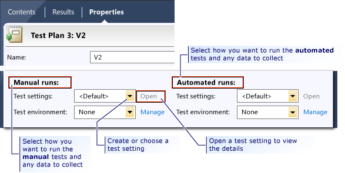
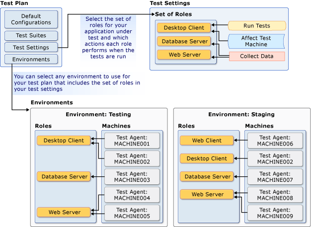

# Setting Up Machines and Collecting Diagnostic Information Using Test Settings
You can use *Test settings* in [!INCLUDE[TCMext](../codequality/includes/tcmext_md.md)] and Visual Studio to collect extra data when you run your tests. For example, you might want to make a video recording as you run your test. There are diagnostic data adapters to:  
  
-   Collect each UI action step in text format  
  
-   Record each UI action for playing back  
  
-   Collect system information  
  
-   Collect event log data  
  
-   Collect IntelliTrace data to help isolate non-reproducible bugs  
  
   
  
 Diagnostic data adapters can also be used to change the behavior of a test machine. For example, with a test setting in Visual Studio, you can emulate various network topology bottlenecks to evaluate the performance of your team’s application.  
  
 **In this topic:**  
  
-   [Using test settings with Microsoft Test Manager](#SettingUpMachinesDDAMTM)  
  
-   [Using test settings with Visual Studio](#SettingUpMachinesDDAVS)  
  
-   [Diagnostic Data Adapter details](#SettingUpMachinesDDADetails)  
  
##   Using test settings with Microsoft Test Manager  
 With [!INCLUDE[TCMext](../codequality/includes/tcmext_md.md)], you configure a test plan to run your tests. A test plan can have two test settings:  
  
-   Manual runs  
  
-   Automated runs  
  
 You create these test settings using the **Properties** page of the test plan in [!INCLUDE[TCMext](../codequality/includes/tcmext_md.md)].  
  
   
  
 You can configure both of these test settings to use a [lab environment](#SettingUpMachinesInfoEnvironments) which can emulate a single machine, or multiple machine roles. The test setting includes separate configuration settings for the types of data to collect for each machine role using [diagnostic data adapters](#SettingUpMachinesDDADetails).  
  
   
  
 *What else should I know?*  
 **Notes**  
  
-    [Manual tests are always run on a local machine role using the Test Runner](../test/running-manual-tests-using-the-web-portal.md).  
  
-    In order to run automated tests in [!INCLUDE[TCMext](../codequality/includes/tcmext_md.md)], you must use a [lab environment](#SettingUpMachinesInfoEnvironments).  
  
 **Tips**  
  
-    For additional guidance, see [Testing for Continuous Delivery with Visual Studio 2012 – Chapter 3: Lab Environments](http://go.microsoft.com/fwlink/?LinkID=255192) and [Testing for Continuous Delivery with Visual Studio 2012 – Chapter 6: A Testing Toolbox](http://go.microsoft.com/fwlink/?LinkID=255203).  
  
### Key tasks for test settings with Microsoft Test Manager  
 Use the following topics to help you create and configure test settings in Microsoft Test Manager.  
  
|Tasks|Associated Topics|  
|-----------|-----------------------|  
|**Create test settings for use in Microsoft Test Manager:** You can create separate test settings for manual and automated tests in a test plan.|-   [Collect more diagnostic data](../test/collect-more-diagnostic-data-in-manual-tests.md) -   [How to: Create Test Settings for a Test Plan](../test_notintoc/how-to--create-test-settings-for-a-test-plan.md)|  
|**Update test settings in Microsoft Test Manager:** You can make corrections to existing test settings by editing them in the Lab Center or from the Properties activity for a test plan.|-   [How to: Edit an Existing Test Setting for a Test Plan](../test_notintoc/how-to--edit-an-existing-test-setting-for-a-test-plan.md)|  
|**Choose existing test settings for a test plan in Microsoft Test Manager:** Test settings are stored in [!INCLUDE[esprtfs](../codequality/includes/esprtfs_md.md)] and can be selected for use in multiple test plans.|-   [How to: Choose Test Settings and Environments for a Test Plan](../test_notintoc/how-to--choose-test-settings-and-environments-for-a-test-plan.md)|  
  
###   Lab environments  
 A lab environment is a collection of virtual or physical machines that you can use to develop and test applications. A lab environment can contain multiple machine roles needed to test multi-tiered applications, such as workstations, web servers, and database servers. You can [create and manage lab environments](../test/using-a-lab-environment-for-your-application-lifecycle.md) and [run manual tests in a lab environment](../test/test-on-a-lab-environment.md) using [!INCLUDE[TCMext](../codequality/includes/tcmext_md.md)], or [run automated tests in a lab environment](../test/automated-build-deploy-test-workflows.md). When you run your tests using a lab environment, the test will collect data, or affect the behavior of the machine for each specific machine role that you configured in your test settings. In addition, you can use a build-deploy-test workflow with your lab environment to automate the process of building, deploying, and running automated tests on your application.  
  
 The following illustration shows examples of test settings and environments for a test plan.  
  
   
  
 The following illustration shows how you define the set of machine roles for your test settings. You can then select a lab environment that has computers or virtual machines that are assigned to each machine role to use when you run your tests. You can select any lab environment that includes at least the set of machine roles that are defined in your test settings. The lab environment may include other machine roles that are not specified in your test settings, as shown in the following illustration.  
  
   
  
##   Using test settings with Visual Studio  
 To run your unit, coded UI, web performance, or load tests by using Visual Studio, you can add, configure and select the test settings to use when you run your tests. To run your tests, collect data, or affect a test machine remotely, you must specify a test controller to use in your test settings. The test controller will have agents that can be used for each role in your test settings.  
  
 *What else should I know?*  
 **Notes**  
  
-    In this version of Visual Studio, there are some [compatibility issues of test settings with Visual Studio 2010](assetId:///c4f0f924-6a92-4fdb-a16b-6c3ef6f0acca) to be aware of:  
  
    -   In this version of Visual Studio, test settings are not included in your solution when a unit test project or coded a UI test project is added. This is a result of the enhancements in the Unit Test Framework to improve extensibility, resilience, and performance. However, you can open an existing [!INCLUDE[vs_dev10_long](../codequality/includes/vs_dev10_long_md.md)] test project with a .testsettings file and it will continue to run. Additionally, you can add a .testsettings file to your solution if you need to collect specific data from a data and diagnostic adapter or run your test with test controllers; however, this is not recommended unless necessary.  
  
    -   If you do open a [!INCLUDE[vs_dev10_long](../codequality/includes/vs_dev10_long_md.md)] test project with a .testsettings file, or determine that you must add a .testsettings file to your solution, the procedures for [selecting the active .testsettings file](../test/specifying-test-settings-for-visual-studio-tests.md#CreateTestSettingVSHowDoIUse), and [editing the .testsettings file](../test/specifying-test-settings-for-visual-studio-tests.md#EditTestSetting) have changed.  
  
    -   When you add a Web Performance and Load test project to your solution, the solution will still include a .testsettings file; however, the producers for [selecting the active .testsettings file for Web performance and load tests](../test/specifying-test-settings-for-visual-studio-tests.md#CreateTestSettingVSHowDoIUse), and [editing the .testsettings file for Web performance and load tests](../test/specifying-test-settings-for-visual-studio-tests.md#EditTestSetting) have changed.  
  
-    [Lab environments](#SettingUpMachinesInfoEnvironments) are used only when you run your tests by using [!INCLUDE[TCMext](../codequality/includes/tcmext_md.md)] and not with Visual Studio.  
  
### Key tasks for test settings with Visual Studio  
 Use the following topics to help you create and configure test settings for use with Visual Studio.  
  
|Tasks|Associated Topics|  
|-----------|-----------------------|  
|**Create test settings to use in Visual Studio:** You can create a test setting for your unit, coded UI, web performance and load tests using the supported diagnostic data adapters.|-   [Specifying Test Settings for Visual Studio Tests](../test/specifying-test-settings-for-visual-studio-tests.md)|  
|**Edit test settings in Visual Studio:** You can make corrections to existing test settings by editing them.|-   [Editing test settings](../test/specifying-test-settings-for-visual-studio-tests.md#EditTestSetting)|  
|**Specify test setting to use in your solution:** You solution can contain multiple test settings files. You can select the test setting file to use, depending on your testing needs from among them.|-   [How do I use a test settings file?](../test/specifying-test-settings-for-visual-studio-tests.md#CreateTestSettingVSHowDoIUse)|  
|**Configure your Visual Studio tests to use remote machines:** To run your tests, collect data, or affect a test machine remotely, you can install and configure test controller and test agent.|-   [Setting Up Test Controllers and Test Agents to Manage Tests with Visual Studio](../test/setting-up-test-controllers-and-test-agents-to-manage-tests-with-visual-studio.md)|  
  
##   Diagnostic Data Adapter details  
 The following table provides an overview of the various ways that the diagnostic data adapters can be configured for use with local or remote machine roles.  
  
|Diagnostic data adapter that is used in test setting|Manual Tests on local machine|Automated Tests|Manual Tests: Collecting data by using a set of roles and an environment|Notes|  
|----------------------------------------------------------|-----------------------------------|---------------------|------------------------------------------------------------------------------|-----------|  
| **Action Log:** The action log collects a text description of each UI action that is performed during a test. The action logs are saved with the test results for the test. You can view the action log to see what actions were taken.|Yes|No|Yes (See Notes)|-   When you collect data on a remote environment, the recording will work only on the local machine. -   Action logs are collected if you create an action recording when you run a manual test.|  
| **ASP.NET Client Proxy for IntelliTrace and Test Impact:** This proxy lets you collect information about the http calls from a client to a Web server for the IntelliTrace and Test Impact diagnostic data adapters.|Yes|Yes|Yes|-   Use this only when either the IntelliTrace or Test Impact diagnostic data adapters are selected for a client role.|  
| **ASP.NET profiler:** You can create a test setting that includes [!INCLUDE[vstecasp](../codequality/includes/vstecasp_md.md)] profiling, which collects performance data on [!INCLUDE[vstecasp](../codequality/includes/vstecasp_md.md)] Web applications.|No|Yes (See Notes)|No|-   This diagnostic data adapter is supported only when you run load tests from Visual Studio.|  
| **Code coverage (Visual Studio 2010):** You can create a test setting that includes code coverage information that is used to investigate how much of your code is covered by tests.|No|Yes (See Notes)|No|-   You can use code coverage only when you run an automated test from Visual Studio or mstest.exe, and only from the machine that runs the test. Remote collection is not supported. -   Collecting code coverage data does not work if you also have the test setting configured to collect IntelliTrace information. **Note:**  This diagnostic data adapter is only applicable to Visual Studio test settings. It is not used for test settings in [!INCLUDE[TCMext](../codequality/includes/tcmext_md.md)]. Additionally, this adapter is for compatibility with Visual Studio 2010 test projects. **Note:**  For compatibility, the code coverage applies when automated tests are run from Microsoft Test Manager or on a remote Test agent from Visual Studio using the legacy MSTest runner.|  
| **Event log:** You can configure a test setting to include event log collecting, which will be included in the test results.|Yes|Yes|Yes||  
| **IntelliTrace:** You can configure the diagnostic data adapter for *IntelliTrace* to collect specific diagnostic trace information to help isolate bugs that are difficult to reproduce. This creates an IntelliTrace file that contains this information. An IntelliTrace file has an extension of .iTrace. When a test fails, you can create a bug. The IntelliTrace file that is saved together with the test results is automatically linked to this bug. The data that is collected in the IntelliTrace file increases debugging productivity by reducing the time that is required to reproduce and diagnose an error in the code. From this IntelliTrace file the local session can be simulated on another computer. This reduces the risk of a bug being non-reproducible.|Yes|Yes|Yes|-   If you enable the collection of IntelliTrace data, collection of code coverage data will not work. -   If you use IntelliTrace for a Web client role, you must also select the ASP.NET Client Proxy for IntelliTrace and Test Impact diagnostic data adapter. -   Only the following versions of IIS are supported: IIS 7.0, IIS 7.5 and IIS 8.0.   For more information, see [Using IntelliTrace](../debugger/intellitrace.md).|  
| **Network emulation:** You can specify that you want to place an artificial network load on your test by using a test setting. Network emulation affects the communication to and from the machine by emulating a particular network connection speed, such as dial-up. **Note:**|No|Yes (See Notes)|No|You can use the network emulation diagnostic data adapter for a client or server role. You do not have to use the adapter on both these roles that communicate with each other. **Note:**  This diagnostic data adapter is only applicable to Visual Studio test settings. It is not used for test settings in [!INCLUDE[TCMext](../codequality/includes/tcmext_md.md)]. **Note:**  Network emulation cannot be used to increase the network connection speed. **Warning:**  If you include the network emulation diagnostic data adapter in the test settings and you intend to use it on your local machine, then you must also bind the network emulation driver to one of your machine’s network adapters. The network emulation driver is required for the network emulation diagnostic data adapter to function. The network emulation driver is installed and bound to your adapter in two ways: <ul><li>**Network emulation driver installed with Microsoft Visual Studio Test Agent:** The Microsoft Visual Studio Test Agent can be used on both remote machines and your local machine. When you install a Visual Studio Test Agent, the installation process includes a configuration step that binds the network emulation driver to your network card. [!INCLUDE[crdefault](../codequality/includes/crdefault_md.md)][Install and configure test agents](../test/install-and-configure-test-agents.md).</li><li>**Network emulation driver installed with Microsoft Visual Studio Test Professional:** When you use network emulation for the first time, you are prompted to bind the network emulation driver to a network card.</li></ul> You can also install the network emulation driver from the command line on your local machine without installing the Visual Studio test agent by using the following command: **VSTestConfig NETWORKEMULATION /install** **Warning:**  The Network Emulation adapter is ignored by load tests. Instead, load tests use the settings that are specified in the network mix of the load test scenario. For more information, see [Specifying Virtual Network Types](../test/specifying-virtual-network-types-in-a-load-test-scenario.md) and [How to: Create a Test Setting for a Distributed Load Test](../test/how-to--create-a-test-setting-for-a-distributed-load-test.md).|  
| **System information:** A test setting can be set up to include the system information about the machine on which the test is run.|Yes|Yes|Yes||  
| **Test impact:** You can collect information about which methods of your applications code were used when a test case was run. This can be used together with changes to the application code that was made by developers to determine which tests were affected by those development changes.|Yes|Yes|Yes|-   If you are collecting test impact data for a Web client role, you must also select the ASP.NET Client Proxy for IntelliTrace and Test Impact diagnostic data adapter. -   Only the following versions of IIS are supported: IIS 7.0, IIS 7.5 and IIS 8.0.|  
| **Video Recorder:** You can create a video recording of your desktop session when you run a test. The video can help other team members isolate application issues that are difficult to reproduce.|Yes|Yes (See Notes)|Yes|-   If you enable the test agent software to run as a process instead of a service, you can create a video recording when you run automated tests.   To do this, see [How to: Set Up Your Test Agent to Run Tests that Interact with the Desktop](../test/how-to--set-up-your-test-agent-to-run-tests-that-interact-with-the-desktop.md).|  
  
 *What else should I know?*  
 **Notes**  
  
-    You can [create custom diagnostic data adapters](../test/creating-a-diagnostic-data-adapter-to-collect-custom-data-or-affect-a-test-machine.md) to fulfill a specific testing requirement that is not included in the standard adapters.  
  
## Related Tasks  
 [Creating a Diagnostic Data Adapter to Collect Custom Data or Affect a Test Machine](../test/creating-a-diagnostic-data-adapter-to-collect-custom-data-or-affect-a-test-machine.md)  
  
 You can create and use a custom diagnostic data adapter to collect custom data, or perform tasks to impact a machine such as reduce available system memory, reduce available disk space, or allocate and hold other resources during a test.  
  
 [Run your tests](../test/running-manual-tests-using-the-web-portal.md)  
  
 Using Microsoft Test Manager you can run manual tests, exploratory test sessions, and automated tests from a test plan. When you run any of these tests from your test plan, the diagnostic data collected will be included in the test results.  
  
 [Running Automated Tests Using Microsoft Visual Studio](../test/running-automated-tests-using-microsoft-visual-studio.md)  
  
 After configuring your test settings in Visual Studio, you can run your tests and collect diagnostic data to help isolate bottlenecks and bugs in your application.  
  
## External resources  
  
### Guidance  
 [Testing for Continuous Delivery with Visual Studio 2012 – Chapter 3: Lab Environments](http://go.microsoft.com/fwlink/?LinkID=255192)  
  
 [Testing for Continuous Delivery with Visual Studio 2012 – Chapter 6: A Testing Toolbox](http://go.microsoft.com/fwlink/?LinkID=255203)  
  
## See Also  
 [Setting Up Test Machines to Run Tests or Collect Data](../test/setting-up-test-machines-to-run-tests-or-collect-data.md)   
 [How to: Create a Test Setting for a Distributed Load Test](../test/how-to--create-a-test-setting-for-a-distributed-load-test.md)   
 [Compatibility of Test Settings with Visual Studio 2010](assetId:///c4f0f924-6a92-4fdb-a16b-6c3ef6f0acca)