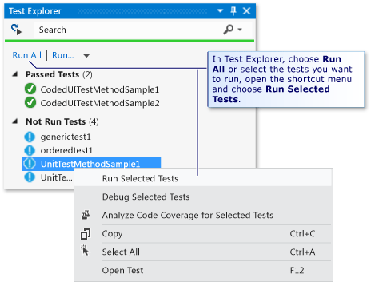

# How to: Run Tests from Microsoft Visual Studio
You can run automated tests from either Visual Studio or a command prompt. Automated tests include unit tests, coded UI tests, ordered tests, generic tests, and load tests. To find out how to run tests at a command prompt, see [Running automated tests from the command line](../dv_TeamTestALM/Running-automated-tests-from-the-command-line.md).  
  
> [!NOTE]
>  When you run one or more tests in Visual Studio, if the test contents are new or have been changed but not saved, they are automatically saved before the test is run. Similarly, if the code of a unit test has been edited but the project that contains the test has not been re-built, Visual Studio builds the project before you run the test.  
  
 You can also use Microsoft Test Manager to plan your testing effort and run your tests as part of a test plan. Microsoft Test Manager is included with Visual Studio Enterprise and Visual Studio Test Professional. To find out how to use Microsoft Test Manager, see [Defining a Test Plan](../Topic/Defining%20a%20Test%20Plan.md).  
  
 **Running Automated Tests in Visual Studio**  
  
 Visual Studio provides different ways to run tests. You can choose the way that best suits your current needs:  
  
-   [Run Tests From Test Explorer](#RunTestsFromUnitTestExplorer). You can run automated tests including unit, coded UI, ordered, and generic in your solution from Test Explorer. Test Explorer easily lets you run and monitor the status of all the automated tests in your solution.  
  
-   Run load tests from the load test editor. Load tests and web performance tests are run from either the Load Test Editor, the Web Performance Test Editor, or from the Visual Studio Enterprise **LOAD TEST** menu. For more information, see [Running Load and Web Performance Tests](assetId:///a4fd686e-69ec-485d-a335-acf12348aa30).  
  
-   [Run Tests From Your Source Code Files](#RunTestsFromSolutionFiles). By using the keyboard, you can run tests from any text-based file in your solution. In particular, you can run tests while editing a file that contains your code under test. This lets you change source code and immediately test it without using a window or a menu.  
  
-   [Run Tests From Files in Your Test Code Files](#RunTestsFromTestProject). By using the mouse or the keyboard, you can run tests from the file that contains your test code. This lets you change a test and then run it immediately without using a window or a menu.  
  
> [!NOTE]
>  After you run a test in Visual Studio, the results of all the tests that were executed in that run are saved automatically on your computer in a test run file. How many test runs are saved depends on a setting in the **Options** dialog box.  
  
 **Run Tests In a Specific Order**  
  
 You can also run tests in a specific order if you create an ordered test. For more information about ordered tests, see [Setting Up Your Test Run Sequence Using Ordered Tests](../dv_TeamTestALM/Setting-Up-Your-Test-Run-Sequence-Using-Ordered-Tests.md).  
  
##   Run Tests from Test Explorer  
   
  
#### To run tests from Test Explorer  
  
1.  In Test Explorer, choose **Run All**. Or, select the tests you want to run, right-click, and then choose **Run Select Tests**.  
  
     The automated tests will run and indicate if they passed or failed.  
  
    > [!TIP]
    >  You can also choose the drop-down list under **Run** for other options including **Run Failed Tests**, **Run Not Run Tests**, **Run Passed Tests**, **Repeat Last Run**, and **Analyze Code Coverage**.  
  
    > [!NOTE]
    >  To view Test Explorer from the **Test menu**, point to **Windows** and then choose **Test Explorer**.  
  
##   Run Tests from Your Source Code Files  
  
#### To run tests from source code files in your solution, by using the keyboard  
  
1.  In Visual Studio, open a source code file anywhere in your solution.  
  
2.  You can use the following keyboard shortcuts to run tests from that file.  
  
    |**Keyboard Shortcut**|**Description**|  
    |---------------------------|---------------------|  
    |Ctrl + R, then press A|Runs all the tests in all test projects.|  
    |Ctrl + R, then press D|Runs all tests that were run in the last test run.|  
    |Ctrl + R, then press F|Runs all tests in the last test run that did not pass.|  
  
> [!NOTE]
>  You can use these shortcuts in your source code file that contains the test methods.  
  
##   Run Tests from Files in Your Test Code Files  
  
#### To run tests from your test code files, by using the keyboard  
  
1.  In Visual Studio, open the source-code file that contains your test methods.  
  
2.  Place the cursor in the file and press Ctrl + R, then press C.  
  
#### To run tests from your test code files by using the mouse  
  
1.  In Visual Studio, open the source-code file that contains your test methods.  
  
2.  Right-click in a test method, in a test class, or outside the scope of a test class, and then choose **Run Tests**.  
  
     This command runs the tests in the current scope. That is, it runs the current test method, all the tests in the current test class, or all the tests in the current namespace, respectively.  
  
## See Also  
 [Running automated tests from the command line](../dv_TeamTestALM/Running-automated-tests-from-the-command-line.md)   
 [How to: Rerun a Test](assetId:///575548c4-3a35-4b1c-b418-ecace4936593)   
 [How to: Debug while a Test is Running](../dv_TeamTestALM/How-to--Debug-while-a-Test-is-Running.md)   
 [Run unit tests with Test Explorer](../VS_IDE/Run-unit-tests-with-Test-Explorer.md)