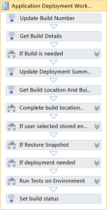
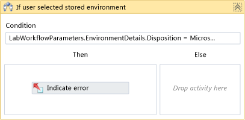
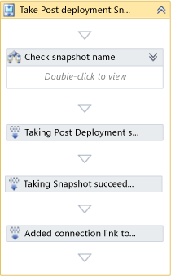

# LabDefaultTemplate workflow activities
This topic describes the Windows Workflow activities in the LabDefaultTemplate.11.xaml file. LabDefaultTemplate defines the Lab Management workflow process that enables you build, deploy, and test your application in a lab environment. To learn more about Windows Workflow, see this page [A Developer's Introduction to Windows Workflow Foundation (WF) in .NET 4](http://go.microsoft.com/fwlink/?LinkId=200470) on the MSDN website.  
  
 **Requirements**  
  
-   Visual Studio Enterprise, Visual Studio Test Professional  
  
## Initializing the Workflow  
   
  
 The root of the LabDefaultTemplate is the TfsBuild.Process activity. This <xref:System.Activities.ActivityBuilder?qualifyHint=False> initializes the global arguments for the workflow build definition from the input supplied in the Build Definition window and in the Lab Workflow Parameters wizard.  
  
### Arguments  
 The `LabWorkflowParameters` argument contains the data that is supplied in the Lab Workflow Parameters wizard. This argument is a [LabWorkflowDetails](../dv_TeamTestALM/Lab-management-workflow-activities.md#BKMK_LabWorkflowDetailsClass) object that contains the following objects:  
  
|||  
|-|-|  
|`BuildDetails`|A [BuildDetails](../dv_TeamTestALM/Lab-management-workflow-activities.md#BKMK_BuildDetailsObject) object that stores the build details for the build, deploy, and test workflow.|  
|`DeploymentDetails`|A [LabEnvironmentDetails](../dv_TeamTestALM/Lab-management-workflow-activities.md#BKMK_LabEnvironmentDetailsObject) object that stores the information that is required for the deployment of a build in the workflow.|  
|`EnvironmentDetails`|A [LabEnvironmentDetails](../dv_TeamTestALM/Lab-management-workflow-activities.md#BKMK_LabEnvironmentDetailsObject) object that stores the information that identifies the environment to use for a build, deploy, and test scenario.|  
|`TestParameters`|A [RunTestDetails](../dv_TeamTestALM/Lab-management-workflow-activities.md#BKMK_RunTestDetailsObject) object that stores the test parameter details that are required to create the automated test run.|  
  
 The following arguments are also declared at the global scope:  
  
|Argument|Type|  
|--------------|----------|  
|`Metadata`|<xref:Microsoft.TeamFoundation.Build.Workflow.ProcessParameter?qualifyHint=False>MetadataCollection|  
|**`Verbosity`**|A <xref:Microsoft.TeamFoundation.Build.Workflow.Verbosity?qualifyHint=False> enumerated value that specifies the amount of information that is written to the log.|  
|`BuildNumberFormat`|A <xref:System.String?qualifyHint=False> that specifies format of the build number.|  
|`SupportedReasons`|A <xref:Microsoft.TeamFoundation.Build.Client.BuildReason?qualifyHint=False>enumerated value that specifies the reason for the build.|  
  
## Application Deployment Workflow Sequence  
  
|||  
|-|-|  
||The **Application Deployment Workflow** sequence controls the entire build, deploy, and test scenario.   **Application Deployment Workflow** declares the following variables:   -   `BuildDetail`: A <xref:Microsoft.TeamFoundation.Build.Client.IBuildDetail?qualifyHint=False> object. -   `LabEnvironmnetUri`: A <xref:System.String?qualifyHint=False> that specifies the uri of the environment on which the build is deployed. -   `BuildLocation`: A <xref:System.String?qualifyHint=False> that specifies the location of the build. -   `SnapshotId`: A <xref:System.String?qualifyHint=False> that specifies the identifier of a virtual machine snapshot. -   `QueueBuildId`: A <xref:System.Int32?qualifyHint=False> that specifies the identifier of the build in the queue.|  
  
## Running the Build  
  
|||  
|-|-|  
|**Update Build Number**|**Update Build Number** expands and returns the build number in the `BuildNumberFormat` argument. **Update Build Number** is a [Microsoft.TeamFoundation.Build.Workflow.Activities.UpdateBuildNumber](../Topic/Team%20Foundation%20Build%20activities.md#Activity_UpdateBuildNumber) activity.|  
|**Get Build Details**|**Get Build Details** returns the data that is required to run or access the build that was specified in the Workflow Wizard. The IBuildDetail object is stored in the `BuildDetail` variable.   **Get Build Details** is a [Microsoft.TeamFoundation.Build.Workflow.Activities.GetBuildDetail](../Topic/Team%20Foundation%20Build%20activities.md#Activity_GetBuildDetail) activity. The template sets the following properties:   -   **Result** returns an IBuildDetail object to the `BuildDetail` variable.|  
||**If Build is needed** determines whether a new build is needed for a Team System build process. If the conditions are met, the workflow runs the **Do Build** sequence.|  
||The **Do Build** sequence initiates the build, waits for the build to complete, and then sets the build location.|  
|**Start Build Workflow**|**Start Build Workflow** queues a new build on the specified build controller and returns the id of the queued build in the **QueueBuildId** variable. **Start Build Workflow** is a [RunWorkflow](../dv_TeamTestALM/Lab-management-workflow-activities.md#BKMK_RunWorkflow) activity. The template sets the following properties:   -   **BuildDefinition** is set to the  `BuildDetails.BuildDefinitionName` property of the  `LabWorkflowParameters` argument. -   The **ProjectName** argument is set to the `TeamProject` property of the  `BuildDetail`variable.|  
|**Wait For Build To Complete**|**Wait For Build To Complete**  suspends execution until the build is complete or a timeout interval is elapsed. The activity throws an exception if the timeout is reached. The activity returns the status of the build in the `BuildStatus` variable, and data about the new build in the `ChildBuildDetail` variable. **Wait For Build To Complete** is a [WaitForWorkflow](../dv_TeamTestALM/Lab-management-workflow-activities.md#BKMK_WaitForWorkflow) activity. The template sets the following property values:   -   **AllowPartiallySucceededBuild** is set to true -   **BuildDetails** returns the new build data to the `ChildBuildDetail` variable. -   **MaxWaitTime** is set to infinite. -   **QueueBuildId** returns the queue id of the build  `QueueBuildId` variable.|  
|**Set Build Location**|**Set Build Location** assigns the location of the build from the `ChildBuildDetail` variable to the `BuildDetails.BuildUri` property of the `LabWorkflowParameters` argument.|  
  
## Deploying the Application  
  
|||  
|-|-|  
|**Update Deployment Summary**|**Update Deployment Summary** writes the name of the deployment target environment to the build page. **Update Deployment Summary** is a [WriteDeploymentInformation](../dv_TeamTestALM/Lab-management-workflow-activities.md#BKMK_WriteDeploymentInformation) activity.|  
|**GetBuildLocationAndBuildNumber**|**GetBuildLocationAndBuildNumber** returns the drop location for the build to **BuildLocation** variable. **GetBuildLocationAndBuildNumber** is a [GetBuildLocationAndBuildNumber](../dv_TeamTestALM/Lab-management-workflow-activities.md#BKMK_GetBuildLocationAndBuildNumber) activity. The template sets the following properties:   -   **BuildDetails** is set to the `BuildDetails` object that is contained in the `LabWorkflowParameters` argument -   **BuildNumber** returns the build number to the `BuildNumber` variable. -   **Result** returns the location of the build to the `BuildLocation` variable -   **SelectedBuild** returns a <xref:Microsoft.TeamFoundation.Build.Client.IBuildDetail?qualifyHint=False> object to the `SelectedBuildDetail` variable that contains the build data on the build server.|  
||If the **Compute build location needed** conditions are met, **Compute build path** adds platform and build configuration subfolders to the drop location.|  
||**If user selected stored environment** checks that the environment is deployed, and **Indicate error** throws an exception if the environment is stored in the library.|  
|**Get Lab Environment**|**Get Lab Environment** returns the uri of the environment to the `LabEnvironmentUri` variable. **Get Lab Environment** is a [GetLabEnvironmentUri](../dv_TeamTestALM/Lab-management-workflow-activities.md#BKMK_GetLabEnvironmentUri) activity. The template sets the following properities:   -   **LabEnvironmentName** is set to the value of the `EnvironmentDetails.LabEnvironmentName` property of the `LabWorkflowParameters` argument. -   **ProjectName** is set to the value of the `TeamProject` property of the `BuildDetail` variable. -   **Result** returns the uri of the lab environment to the `LabEnvironmentUri` variable. -   **TeamProjectLabLocationName** is set to the value of the `EnvironmentDetails.HostGroupName` property of the `LabWorkflowParameters` argument. -   **TfsServerUrl** is set to null.|  
||**If Restore Snapshot** determines whether the user requested that the environment be restored to a clean snapshot. If the condition is met, the **Restore Snapshot** sequence is run; otherwise **Clean snapshot not specified** writes a warning message to the build summary.|  
||In the **Restore Snapshot** sequence, **Get Snapshot Details** calculates the id of the snapshot, and **Restore Lab Environment to Snapshot** performs the restoration.|  
|**Get Snapshot Details**|**Get Snapshot Details** is a [GetLabEnvironmentSnapshotId](../dv_TeamTestALM/Lab-management-workflow-activities.md#BKMK_GetLabEnvironmentSnapshotId) activity. The template sets the following properties:   -   **LabEnvironmentUri** is set to the value of the `LabEnvironmentUri` variable. -   **Result** returns the id of the snapshot to the `SnapshotId` variable. -   **SnapshotName** is set to the `EnvironmentDetails.SnapshotName`  property of the `LabWorkflowParameters` argument.|  
|**Restore Lab Environment to Snapshot**|**Restore Lab Environment to Snapshot** is a [RestoreLabEnvironment](../dv_TeamTestALM/Lab-management-workflow-activities.md#BKMK_RestoreLabEnvironment) activity. The template sets the following properties:   -   **LabEnvironmentUri** is set to the value of the `LabEnvironmentUri`variable. -   **SnapshotId** is set to the value of the `SnapshotId`variable.|  
||**If deployment needed** determines whether the user has requested a deployment.|  
||If the condition is met, the **Do deployment** sequence is run.|  
|**Wait For Workflow Capability To be Ready**|**Wait For Workflow Capability To be Ready** suspends execution until the workflow capability of the environment is ready or a timeout interval is reached. If the timeout interval is exceeded an exception is thrown. **Wait For Workflow Capability To be Ready** is a [WaitForWorkflowCapabilityServices](../dv_TeamTestALM/Lab-management-workflow-activities.md#BKMK_WaitForWorkflowCapabilityServices) activity. The template sets the following properties:   -   **LabEnvironmentUri** is set to the value of the **LabEnvironmentUri** variable. -   **MaxWaitTime** is set to 20 minutes -   **RepairCapabilityBeforeWaitBegins** is set to false.|  
||**Run Deployment scripts** executes the **Run Script On Lab System** sequence on each deployment script that is contained in the `DeploymentDetails.Scripts` property list of the `LabWorkflowParameters` argument.|  
||The **Run Scripts on Lab System** sequence executes the specified script on a virtual machine in the environment. **Run Scripts on Lab System** declares the following variables:   -   `scriptDetails`: [ScriptDetails](../dv_TeamTestALM/Lab-management-workflow-activities.md#BKMK_ScriptDetailsObject)|  
|**Initialize Agent Tags and deployment script**|**Initialize Agent Tags and deployment script** expands the macros and tags of the script and returns the results in a [ScriptDetails](../dv_TeamTestALM/Lab-management-workflow-activities.md#BKMK_ScriptDetailsObject) object. **Initialize Agent Tags and deployment script** is a [InitializeAgentSpecAndEnvironmentVariables](../dv_TeamTestALM/Lab-management-workflow-activities.md#BKMK_InitializeAgentSpecAndEnvironmentVariables) activity. The template sets the following values:   -   **BuildLocation** is set to the value of the `BuildLocation` variable. -   **DeploymentScriptDetails** is set to the value of the iterated `DeploymentDetails.Scripts` string. -   **LabEnvironmentUri** set to the value of the `LabEnvironmentUri` variable. -   **Result** returns the expanded script to the `scriptDetails` variable.|  
|**Lab Agent Scope**|**Lab Agent Scope** determines whether the lab agent is installed and running on the target virtual machine and then calls **Running Deployment Script** to execute the script. An exception is thrown if any of the scripts fail on a machine. **Lab Agent Scope** is a [Microsoft.TeamFoundation.Build.Workflow.Activities.AgentScope](../Topic/Team%20Foundation%20Build%20activities.md#Activity_AgentScope)activity. The template sets the following properties:   -   **MaxExecutionTime** is set to infinite. -   **MaxWaitTime** is set to 5 minutes. -   **ReservationSpec** is set to the Microsoft.Te:amFoundation.Build.Client.BuildAgentSpec object that is the `AgentSpec` property of the `scriptDetails` variable.|  
|**Running Deployment Script**|**Running Deployment Script** executes the deployment script on the target virtual machine. **Running Deployment Script** is a [RunDeploymentScript](../dv_TeamTestALM/Lab-management-workflow-activities.md#BKMK_RunDeploymentScript) activity. The template sets the following values:   -   **ScriptDetails** is set to the value of the `scriptDetails` variable. -   **ThrowOnError** is set to true. -   **SharedLocationForNetUse** is set to the value of the `BuildLocation` variable.|  
|**Application Deployment Succeeded**|**Application Deployment Succeeded** writes information to the build summary. **Application Deployment Succeeded** is a [WriteDeploymentInformation](../dv_TeamTestALM/Lab-management-workflow-activities.md#BKMK_WriteDeploymentInformation) activity.|  
||**Post Deployment Snapshot**  determines whether the user has requested that a snapshot of the environment is to be saved after the deployment. If this condition is met, the **Take Post Deployment Snapshot** sequence is executed. Otherwise, **Post deployment snapshot not specified** writes a warning message to the log.|  
||**Take Post Deployment Snapshot** sequence   **Take Post Deployment Snapshot** declares the following variables:   -   `PostDeploymentSnapshotChainId`: <xref:System.Int64?qualifyHint=False> -   `PostDeploymentSnapshotName`: <xref:System.String?qualifyHint=False> The template sets the default value to the value of the `BuildNumber` property of the `BuildDetails` variable.|  
||**Check Snapshot Name** determines whether a snapshot name has been specified. If the condition is met, the specified name is used; otherwise the default value is used.|  
|**Taking Post Deployment snapshot**|**Taking Post Deployment snapshot** is a [SnapshotLabEnvironment](../dv_TeamTestALM/Lab-management-workflow-activities.md#BKMK_SnapshotLabEnvironment) activity that creates the snapshot. The template sets the following properties:   -   **LabEnvironmentUri** is set to the value of the `LabEnvironmentUri` variable. -   **SnapshotChainId** returns the id of the snapshot to the `PostDeploymentSnapshotChainId` variable. -   **SnapshotName** is set to the value of the `PostDeploymentSnapshotName` variable.|  
|**Taking Snapshot succeeded**|**Taking Snapshot succeeded** writes the snapshot name to the build summary. **Taking Snapshot succeeded** is a [WriteDeploymentInformation](../dv_TeamTestALM/Lab-management-workflow-activities.md#BKMK_WriteDeploymentInformation) activity.|  
|**Added connection link to the Snapshot**|**Added connection link to the Snapshot** writes the url of the snapshot to the build summary. **Added connection link to the Snapshot** is a [WriteDeploymentInformation](../dv_TeamTestALM/Lab-management-workflow-activities.md#BKMK_WriteDeploymentInformation) activity.|  
  
## Running Tests  
  
|||  
|-|-|  
||**Run Tests on Environment** determines whether automated tests were requested. If the condition is met, the **Run Tests** sequence is executed.|  
||**Run Tests**   **Run Tests** declares the following variables:   -   `TestCapabilityInfo`: Microsoft.TeamFoundation.Lab.Client.TestingCapabilityInformation. -   `TestResults`: Microsoft.TeamFoundation.Lab.Workflow.Activities.TestRunStatistics. The template sets the default value to a new TestRunStatistics object.|  
|**Wait For Test Capabilities to be ready**|**Wait For Test Capabilities to be ready** suspends execution until the testing capability of the environment is ready or a timeout interval is reached. If the timeout interval is exceeded an exception is thrown.   **Wait For Test Capabilities to be ready** is a [WaitForTestCapabilityServices](../dv_TeamTestALM/Lab-management-workflow-activities.md#BKMK_WaitForTestCapabilityServices) activity. The template sets the following properties:   -   **LabEnvironmentUri** is set to the value of the `LabEnvironmentUri` variable. -   **MaxWaitTime** is set to 20 minutes. -   **RepairCapabilityBeforeWaitBegins** is set to false.|  
|**Running Tests**|**Running Tests** executes the tests and returns the test results. **Running Tests** is an [ExecuteRemoteTestRun](../dv_TeamTestALM/Lab-management-workflow-activities.md#BKMK_ExecuteRemoteTestRun) activity. The template sets the following values:   -   **MaxWaitTime** is set to infinite. -   **BuildNumber** is set to the value of the `BuildNumber` variable. -   **TestDirectory** is set to the value of the `BuildLocation` variable. -   **LabEnvironmentUri** is set to the value of the `LabEnvironmentUri` variable. -   **TestParameters** is set to `TestParameters` object that is contained in the `LabWorkflowParameters` object. -   **Result** returns Microsoft.TeamFoundation.Lab.Workflow.Activities.RunTestDetails object that contains the test results to the `TestResults` variable. -   **Title** sets the name of the test run to the value of the `BuildNumber` property of the `BuildDetail` variable.|  
||**If all tests have not passed** determines whether any tests have failed and executes **Set build status** if the condition is met.|  
|**Set build status**|**Set build status** determines whether the workflow includes the build or deployment of the application. If this condition is met, **Partially succeded** sets the workflow status to the <xref:Microsoft.TeamFoundation.Build.Client.BuildStatus?qualifyHint=False>`.PartiallySucceeded` value. Otherwise, **Failed** sets the `BuildStatus` variable to `Failed`.|  
  
## See Also  
 [Lab management workflow activities](../dv_TeamTestALM/Lab-management-workflow-activities.md)