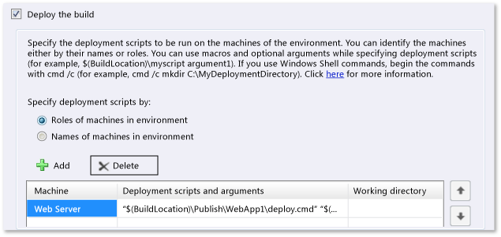
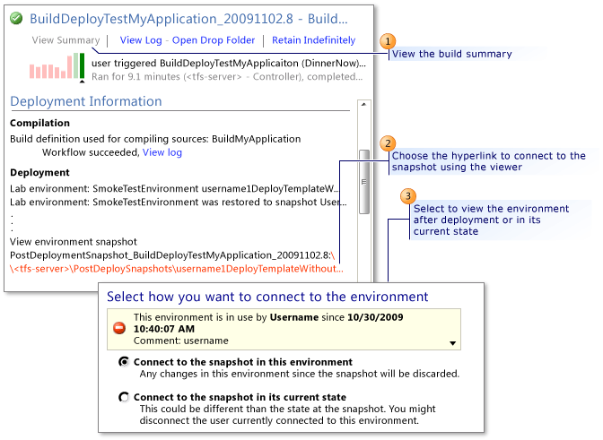

# Create a build-deploy-test workflow for an SCVMM environment
> [!NOTE]
>  This topic applies to SCVMM environments. If you want to complete this procedure using a standard environment, see [Create a build-deploy-test workflow for a standard environment](../dv_TeamTestALM/Create-a-build-deploy-test-workflow-for-a-standard-environment.md).  
  
 You can use a build, deploy, and test workflow to automatically deploy an application to your SCVMM environment and run automated tests as part of the build process. You can also configure your workflow to deploy a snapshot of your environment before your application is deployed, so your applications are deployed to a clean environment. In addition, you can configure your workflow to create a snapshot of your environment after your workflow is complete, so you can reproduce build or deployment failures. Users can then access the application in their lab environment, or they can run manual tests or automated tests separate from the build process using Microsoft Test Manager. For an overview on build-deploy-test workflows, see [Create a build-deploy-test workflow for a standard environment](../dv_TeamTestALM/Create-a-build-deploy-test-workflow-for-a-standard-environment.md).  
  
 **Requirements**  
  
-   Visual Studio Enterprise, Visual Studio Test Professional  
  
 This topic describes how to create a build-deploy-test workflow after you create deployment scripts for your workflow. For information about creating deployment scripts, see [PAVE: Guidance for Build-Deploy-Test Workflows](assetId:///b84458a5-4094-4414-8005-83544790aa63). Use the following procedures to create a build-deploy-test workflow for an SCVMM environment:  
  
-   [Check the Prerequisites](#Prerequisites)  
  
-   [Create Your Build, Deploy, and Test Workflow](#CreateBuildDefinition)  
  
-   [Add Details to Your Workflow](#AddDetails)  
  
-   [Run Your Workflow](#QueueBuild)  
  
-   [Connect to Your Lab Environment from Your Build Results](#ConnectFromResults)  
  
-   [Run Tests After Your Workflow is Complete](#RunTests)  
  
##   Prerequisites  
 Before you can set up your workflow to build and deploy your application, use this list to verify that you have completed the following tasks:  
  
#### Prerequisite tasks  
  
1.  Configure Team Foundation Build Service:  [Build server](../Topic/Deploy%20and%20configure%20a%20build%20server.md).  
  
2.  Install a test controller and register it with your team project collection: [Setting Up Test Controllers in Lab Environments](../dv_TeamTestALM/Setting-Up-Test-Controllers-in-Lab-Environments.md).  
  
3.  > [!NOTE]
    >  When you create your lab environment, choose the options to run tests and use a workflow.  
  
     Create an SCVMM environment that uses your virtual machines: [Create virtual machines for SCVMM lab environments](../dv_TeamTestALM/Create-virtual-machines-for-manual-testing.md).  
  
4.  (Recommended) Take a snapshot of your environment, so your workflow can deploy a clean environment before deploying your application. See: [Using Environment Snapshots with SCVMM Environments](../dv_TeamTestALM/Using-Environment-Snapshots-with-SCVMM-Environments.md).  
  
5.  If you are going to run automated tests in your lab environment, you must add your tests to a test plan and create a test setting using Microsoft Test Manager. See [Test on a lab environment](../dv_TeamTestALM/Test-on-a-lab-environment.md).  
  
6.  Create deployment scripts that your build-deploy-test workflow can use to install your application. See [Creating deployment scripts for build-deploy-test workflows](../dv_TeamTestALM/Creating-deployment-scripts-for-build-deploy-test-workflows.md).  
  
##   Configure your build  
 Your build-deploy-test workflow can either deploy an existing build of your application, or it can run a build definition, and then deploy the new build. To create a new build during your workflow, you must create a separate build definition that your workflow can use to build your application. When you add the build details to your workflow, you will either choose the drop location of an existing build or the build definition for creating a new build.  
  
> [!IMPORTANT]
>  If you add a build definition instead of a build drop location to your build-deploy-test workflow, you must disable tests in the build definition that will be used to build your application.  
  
   
  
#### To create a build definition for your application  
  
1.  On the **Build** menu, choose **New Build Definition**.  
  
2.  On the **General** tab, in the **Build definition name** box, specify a name and in the **Description** text box, add an appropriate description.  
  
3.  Follow the steps as described in the topic [Define the build](../Topic/Create%20or%20edit%20a%20build%20definition.md).  
  
##   Create your build-deploy-test workflow  
 In this section you will create your build-deploy-test workflow.  
  
###   Create the build definition for your workflow  
 Next, create another build definition for your build-deploy-test workflow, as shown in the following illustration:  
  
   
  
##### To create a build definition for your workflow  
  
1.  On the **Build** menu, choose **New Build Definition**.  
  
2.  On the **General** tab, in the **Build definition name** box, specify a name. In the **Description** box, add an appropriate description.  
  
3.  Choose settings on the **Trigger** and **Workspace**, **Build Defaults**, and **Retention Policy** tabs as described in the topic [Define the build](../Topic/Create%20or%20edit%20a%20build%20definition.md).  
  
    > [!NOTE]
    >  You do not have to enter a build drop path on the **Build Defaults** tab for this build workflow because you do not create build output when you use the lab template. Clear **My builds copy outputs** and no drop folder is required.  
  
4.  To be able to select the Lab Template for the build definition, on the **Process** tab, under **Build process template**, choose **Show details**.  
  
     A drop-down list appears.  
  
5.  Select a template. This is the build process file that defines your workflow.  
  
6.  To create a workflow for your build definition to deploy your application to a virtual environment, select **LabDefaultTemplate.11.xaml** from the drop-down list for **Build process file**.  
  
###   Add the details for your workflow  
 Now you can add details to your workflow using the **Lab Workflow Parameters** wizard.  
  
 After you add these details to your workflow and save the build definition, you can queue the build to run your workflow:  
  
##### To add the details for your workflow  
  
1.  To enter the data for your workflow, under **Build process parameters**, choose **Lab process settings** and then choose the ellipsis (…).  
  
     This opens the Lab Workflow Parameters wizard where you enter the information for the workflow.  
  
2.  **Select a lab environment:** On the **Environment** tab, select the SCVMM environment to which you want to deploy your application.  
  
    > [!NOTE]
    >  This environment must be active. If you are using an environment that is stored in the library, you must deploy the environment to make it active.  
  
3.  **Select a clean environment snapshot:** (Recommended) If you want your build definition to revert your lab environment to a known state, select **Revert to a specific snapshot of the environment** and then choose the ellipsis (…) to select a specific snapshot.  
  
     The **Select environment snapshot** dialog box is displayed. Select the snapshot and then choose **OK**.  
  
4.  Choose **Next**.  
  
5.  **Select a build definition or a build drop location:** If you want your workflow to build your application every time it is run, follow these steps:  
  
    1.  Select **Use a Team Foundation build**, and select the definition that you created earlier.  
  
    2.  Select **Queue a new build**.  
  
6.  If you want your workflow to use an existing build and not rebuild your application, follow these steps:  
  
    1.  Select **Use a Team Foundation build**, and select the definition that you created earlier.  
  
    2.  Select **Select an existing build**. Then select a build from the drop-down list. The existing builds created by the build definition that you selected are displayed in the list.  
  
    3.  Select a build configuration from **Select build configuration**.  
  
        > [!NOTE]
        >  The build configurations are specified when you create your build definition for your application. If there is more than one build configuration, you can select one from this list.  
  
7.  If you want to define the location of a build, select **Use a build from a specified location** and then specify the UNC path of the existing build.  
  
8.  Choose **Next**.  
  
9. **Details for deployment scripts and commands:**  
  
    > [!IMPORTANT]
    >  Before you complete the next few steps, you must create deployment scripts and commands for your workflow. See [Creating deployment scripts for build-deploy-test workflows](../dv_TeamTestALM/Creating-deployment-scripts-for-build-deploy-test-workflows.md).  
  
       
  
     To deploy the application as part of your workflow, from the **Deploy** tab, select **Deploy the build**.  
  
10. To add the scripts or commands required to deploy your application, choose **Add**. Select the virtual machine, or virtual machine role that you want to add the script or command for.  
  
     You can now add scripts or commands for each virtual machine in your lab environment. For example, if you have a Windows client as part of your application, you might have a script that copies the executable to the location that your coded UI test will use to start the tests on your virtual machine. If you have a Web server then you will have to run the script or command to deploy that part of your application. For more details about completing this step, see [Creating deployment scripts for build-deploy-test workflows](../dv_TeamTestALM/Creating-deployment-scripts-for-build-deploy-test-workflows.md).  
  
11. **Select a post-deployment snapshot:** (Recommended) To take a snapshot of your environment after the application has been deployed, but before any tests are run, you must do the following:  
  
    > [!NOTE]
    >  You can use this snapshot to connect to the environment and rerun a test whenever you want to investigate an issue.  
  
    1.  Select **After deploying the build, take a snapshot of the environment**.  
  
        > [!IMPORTANT]
        >  If you run this build definition as part of your nightly build process, each virtual machine in the environment will eventually have many snapshots associated with it. This deteriorates the performance of the virtual machine. In addition, there is a limit of 50 snapshots that can be stored for each virtual environment. Therefore, you must delete the old snapshots regularly.  
  
    2.  In **Enter the snapshot name**, type a name for this snapshot.  
  
12. Choose **Next**.  
  
13. **Add details for automated tests:**  
  
     To run automated tests from your workflow after you deploy your application, follow these steps:  
  
    1.  Select **Run these tests in the environment**.  
  
    2.  Under **Select the test plan**, select the test plan that you want to use. The test results will be saved as part of this test plan.  
  
    3.  Under **Select the test suites** choose the ellipses (…), and in the **Select test suites** dialog box, select the test suites you want to run.  
  
        > [!NOTE]
        >  By default, the root test suite is selected. If you do not want to run tests in this test suite, you must clear this field.  
  
    4.  Under **Select the test configuration**, select the configuration that you plan to use to run your tests.  
  
        > [!NOTE]
        >  The test results for each test case in each selected test suite will be saved as a pairing of each test case in the suite and the test configuration that you selected. See [Test configurations: specifying test platforms](../dv_TeamTestALM/Test-configurations--specifying-test-platforms.md).  
  
    5.  Under **Select the automated test settings**, select the test settings that you created earlier to match the roles in your lab environment in step 9 of the overall process for this topic. See [Create Test Settings for Automated System Tests Using Microsoft Test Manager](../Topic/Create%20Test%20Settings%20for%20Automated%20System%20Tests%20Using%20Microsoft%20Test%20Manager.md).  
  
14. Choose **Finish**.  
  
15. Choose **Save** to save your build definition.  
  
     The created build definition appears in the **Builds** folder in Team Explorer.  
  
###   Run your Workflow  
 You can run your workflow by running the build definition that contains your workflow.  
  
1.  To start your workflow, go to the **Builds** folder, then open the shortcut menu for the build definition that contains your workflow.  
  
     Choose **Queue New Build**.  
  
     The **Queue Build** dialog box is displayed.  
  
2.  Verify the information for your workflow and then choose **Queue**.  
  
     The **Build Explorer** view is displayed.  
  
3.  To see the **Build Summary** view as the build progresses, double-click your build.  
  
     You can see the status as the build progresses.  
  
4.  (Optional) If you want to view the environment as the build progresses, open Microsoft Test Manager, locate the **Lab Center**, choose **Lab**, and then choose your SCVMM environment in the list. You can view the progress of the build and the details of your lab environment as follows:  
  
    -   The snapshot is restored if you selected this option.  
  
    -   The post-deployment snapshot is taken if you selected this option.  
  
    -   The status of the capabilities (a green arrow is displayed when a capability is ready).  
  
    -   The tests as they run, if the tests interact with the user interface.  
  
     If your workflow completes successfully, you will see a green check mark. If there are errors, you can choose **View Log** to see details.  
  
##   Connect to your lab environment from your build results  
 When you view your build results, you can connect to your SCVMM environment to view your application. You can either connect to the post deployment snapshot of your environment if you selected this option in your workflow, or you can connect to the environment in its current state, as shown in the following illustration.  
  
   
  
#### To connect to your lab environment from your build results  
  
1.  From the **Builds** folder in Team Explorer, open the shortcut menu for your workflow and choose **View Builds**.  
  
     The **Build Explorer** view is displayed.  
  
2.  To view your completed build, choose the **Completed** tab.  
  
3.  Double-click the build that you want to view.  
  
     The Build Summary view is displayed.  
  
4.  Choose the link next to **View environment snapshot<Build name and number\>**.  
  
     The **Connect to environment** dialog box is displayed.  
  
5.  If you want to connect to the snapshot that was taken after your application was deployed, choose **Connect to the snapshot in this environment**.  
  
    > [!NOTE]
    >  By connecting to this snapshot, any changes that were made after this post-deployment snapshot will be discarded. If you want to keep any changes, connect to the environment in its current state and take a snapshot first, before reverting to the post-deployment snapshot. For information about how to take a snapshot, see [Using Environment Snapshots with SCVMM Environments](../dv_TeamTestALM/Using-Environment-Snapshots-with-SCVMM-Environments.md).  
  
6.  If you want to connect to the environment in its current state, choose **Connect to the environment in its current state**.  
  
7.  Choose **Connect**.  
  
     The Microsoft Environment Viewer is displayed and you are connected to the lab environment. You can now use the application that you deployed.  
  
##   Test your application after your workflow is complete  
 After your workflow is complete and your application is deployed to your lab environment, you can run tests on your application separate from your workflow. View these topics if you want to run tests on your application separate from your workflow, after your application is deployed to an SCVMM environment:  
  
1.  [How to: Run Manual Tests and Create Reproducible Bugs in SCVMM Environments](assetId:///116f8808-b8a1-48dd-bcd4-22312f408abf)  
  
2.  [Automated build-deploy-test workflows](../dv_TeamTestALM/Automated-build-deploy-test-workflows.md)  
  
## See Also  
 [Create a build-deploy-test workflow for a standard environment](../dv_TeamTestALM/Create-a-build-deploy-test-workflow-for-a-standard-environment.md)   
 [Running Tests in Lab Environments](assetId:///f32d85ef-9a80-4cb8-9ad4-6601e20ba1e7)