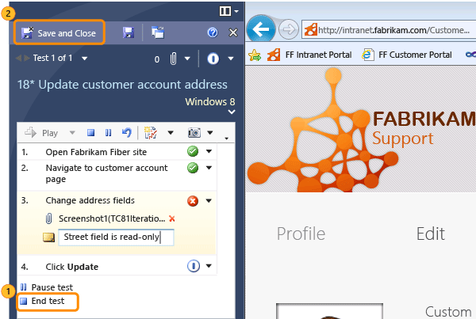

# Run manual tests with Microsoft Test Manager
Microsoft Test Runner sits at the side of the screen while you test your application. It displays the steps you planned and the results you expected, and you check them off as you work. It can record your actions along with comments, screenshots, and other data, so that if you find a bug, it’s easy to reproduce.  
  
> [!NOTE]
>  **The web portal or Microsoft Test Runner?** There are two ways of running manual tests in Visual Studio. You’ll probably find it more convenient to [run tests with the web portal](../dv_TeamTestALM/Planning-manual-tests-using-the-web-portal.md), unless you want these additional features of Microsoft Test Runner:  
>   
>  -   If you create a bug, the bug description automatically includes:  
>   
>      1.  Screenshots taken as you work.  
>     2.  A record of the actual actions you performed – not just the test steps that you checked off.  
>     3.  System information such as the operating system version and machine id.  
> -   [Replay your actions](../dv_TeamTestALM/Record-and-play-back-manual-tests.md) so that you can repeat a test quickly and accurately.  
> -   [Collect additional diagnostic data](../dv_TeamTestALM/Collect-more-diagnostic-data-in-manual-tests.md) during your tests  
  
### Running test cases with Microsoft Test Runner  
  
1.  **Get ready to test.** Here are a few things you might need to do before running your tests:  
  
    1.  Install the latest version of your app.  
  
    2.  [Create some test cases.](../dv_TeamTestALM/Plan-manual-tests-with-Microsoft-Test-Manager.md) Typically you create them at the start of a sprint, and aim to have them all pass by the end of the sprint. You can create them either with the web portal or Microsoft Test Manager.  
  
    3.  Install Microsoft Test Manager (MTM) on the machine where you want to run your tests. To get MTM, install Visual Studio Test Professional or Visual Studio Enterprise.  
  
    4.  [Connect MTM to your test plan](../dv_TeamTestALM/Connect-Microsoft-Test-Manager-to-your-team-project-and-test-plan.md)  
  
2.  Run a test case.  
  
       
  
    > [!TIP]
    >  If you are already looking at a test case in the web portal, you can start Test Runner directly from there by choosing **Run in Client**.  
  
     Test Runner appears at the side of the screen. It will stay there while you work with your application.  
  
3.  Create an action recording so that you can quickly repeat the test later.  
  
       
  
4.  Follow the steps in the test. Mark each step as either Passed or Failed. When a step fails, add a comment to describe what was wrong. You can attach screenshots, too.  
  
       
  
     If you have to attend to something else, Pause the test. You don’t want your emails or password included in the recording.  
  
5.  Create a bug if you find a problem.  
  
       
  
6.  Name the bug and describe the failure.  
  
       
  
     You can assign the bug if you know who'll fix it.  
  
7.  End the test and save the results.  
  
       
  
     Now the results are stored in TFS.  
  
## Replay previous tests  
 If you ran a test before, you can repeat it quickly by replaying the same actions.  
  
 (This works with most applications, [though not all](assetId:///1b9c1e78-b088-47e9-b57d-da7ce1a6b635).)  
  
1.  Start the test. Don’t overwrite the recording.  
  
       
  
2.  **Play** your recorded actions. You have to verify the results of each step.  
  
       
  
## Track the progress of your tests  
 Monitor the progress of your project by seeing how many tests have passed.  
  
 Tests begin in the Active state, meaning that they are ready to run. When a bug has been fixed, you can set the state of a failed test back to Active.  
  
   
  
## See Also  
 [Repeat a test with different data](../dv_TeamTestALM/Repeat-a-test-with-different-data.md)   
 [Test configurations: specifying test platforms](../dv_TeamTestALM/Test-configurations--specifying-test-platforms.md)   
 [Test on a lab environment](../dv_TeamTestALM/Test-on-a-lab-environment.md)   
 [Record and play back manual tests](../dv_TeamTestALM/Record-and-play-back-manual-tests.md)   
 [Collect more diagnostic data](../dv_TeamTestALM/Collect-more-diagnostic-data-in-manual-tests.md)   
 [Testing Windows Store apps](../dv_TeamTestALM/Testing-Windows-Store-apps.md)