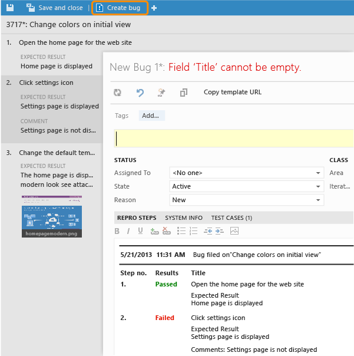
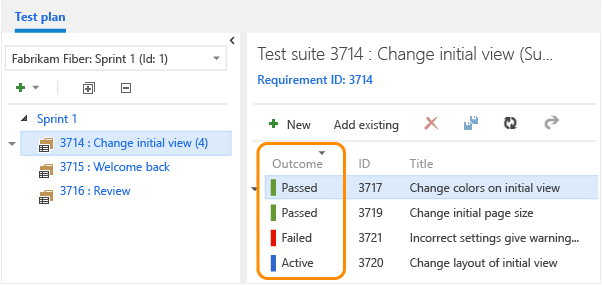

# Running manual tests using the web portal
Run your manual tests and record the test results for each test step using Microsoft Test Runner. If you find an issue when testing, use Test Runner to create a bug. Test steps, screenshots and comments are automatically included in the bug.  
  
## Run your manual tests  
  
1.  If you haven't already, [create tests](../dv_TeamTestALM/Creating-manual-tests-using-the-web-portal.md).  
  
2.  Select a test from a test suite and run it.  
  
       
  
     Microsoft Test Runner starts in a new browser instance.  
  
3.  Start the app that you want to test. Your app does not need to run on the same machine as Test Runner. You simply use Test Runner to record whether test steps pass or fail as you run a test manually. For example, you might run Test Runner on a desktop machine and run your Windows 8 store app that you are testing on a Windows 8 tablet.  
  
       
  
4.  Mark each test step as either passed or failed based on the expected results. If a test step fails, you can enter a comment on why it failed.  
  
       
  
5.  Create a bug to describe what failed.  
  
       
  
     The steps and your comments are automatically added to the bug. Also, the test case is linked to the bug.  
  
6.  You can see any bugs that you have reported during your test session.  
  
       
  
7.  When you've run all your tests, save the results and close Test Runner. Now, all the test results are stored in TFS.  
  
8.  View the testing status for your test suite.  
  
       
  
     The most recent results for each test are displayed.  
  
## Q&A  
 **Q: How do I rerun a test?**  
  
 **A:** Simply select any test and choose Run.  
  
 **Q: Can I run all the tests in a test suite together?**  
  
 **A:** Yes. Select a test suite and choose Run. This runs all the active tests in the test suite. If you haven't run a test yet, its state is active. You can reset the state of a test to active if you want to rerun it.  
  
   
  
 **Q: I want to do some exploratory testing before I create manual test cases. Can Test Runner help with this?**  
  
 **A:** Not from the test hub. But if you use Microsoft Test Manager, it will record your actions, screenshots and other data while you're [exploring your app](../dv_TeamTestALM/Exploratory-testing-using-Microsoft-Test-Manager.md). If you create a bug, all this data is included automatically.  
  
 **Q: Can I add a screenshot to the test results when I am running a test?**  
  
 **A:**Yes. Take a screenshot, save it to a file and add the attachment. The file is stored with the test results.  
  
   
  
 **Q: Can I add a screenshot to a bug when I am running a test?**  
  
 **A:**Yes. If Test Runner is running in an Internet Explorer 11 or a Chrome window, you can copy a screenshot from the clipboard directly.  
  
 **Q: Can I fix my test steps while I'm running a test?**  
  
 **A:** Yes. You can insert, move or delete steps. Or you can edit the text itself.  
  
   
  
 Double-click a test step to display the tool to edit the test steps.  
  
 **Q: Can I collect additional data while I'm running a test?**  
  
 **A:** If you use Microsoft Test Manager to run your tests, you can [collect user actions, system logs, screen and audio recordings and other additional data](../dv_TeamTestALM/Collect-more-diagnostic-data-in-manual-tests.md).  
  
   
  
## Try this next  
 [Track your test results](../dv_TeamTestALM/Track-your-test-results.md)  
  
## Or, dig deeper:  
 [Explore your app](../dv_TeamTestALM/Exploratory-testing-using-Microsoft-Test-Manager.md) without planning in advance