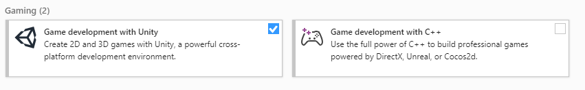
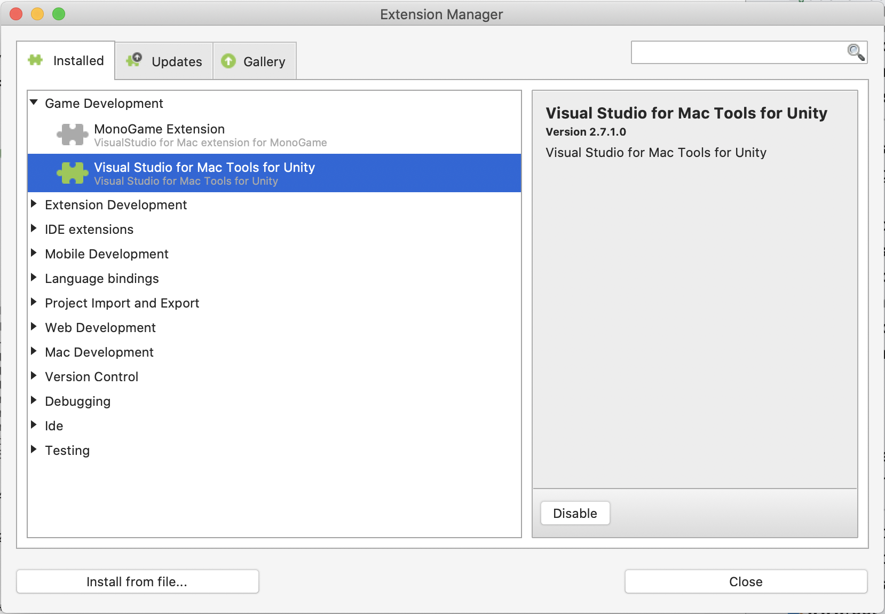
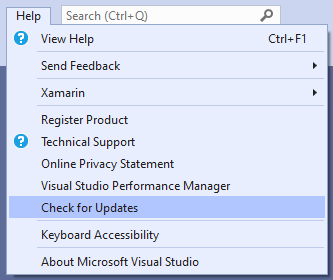
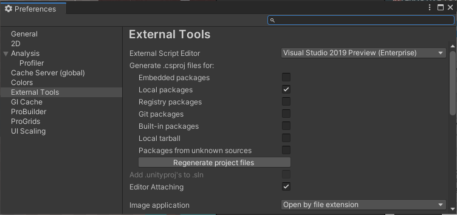
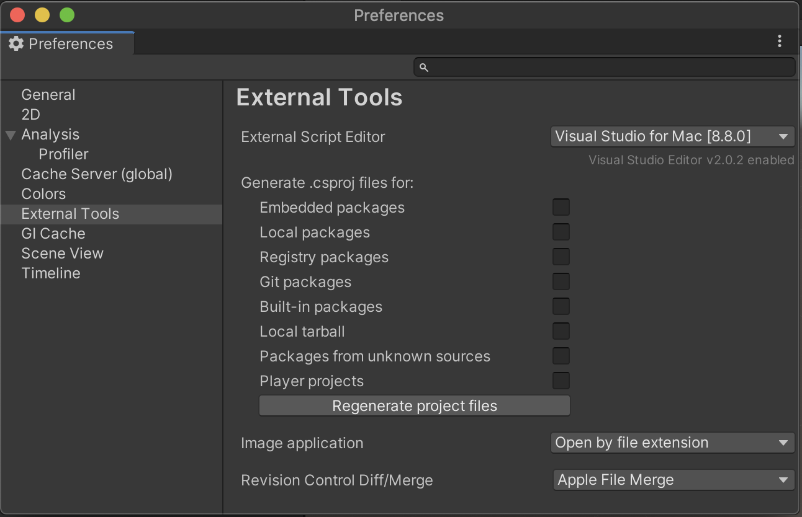

# Quickstart: Configure Visual Studio for cross-platform development with Unity

In this quickstart, you'll learn how to install the Visual Studio Tools for Unity extension and configure it for developing cross-platform games and apps with Unity.  The Visual Studio Tools for Unity extension is free and provides support for writing and debugging C# and more. Visit the [Tools for Unity overview](./visual-studio-tools-for-unity.md) for a complete list of what the extensions includes.

> [!NOTE]
> For Visual Studio Code & Unity, visit the [Unity Development with VS Code documentation](https://code.visualstudio.com/docs/other/unity).

## Prerequisites

+ This guide assumes you already have installed Unity using the Unity Hub program. If you are new to Unity, complete the [Unity Essentials learning path](https://learn.unity.com/pathway/unity-essentials) first.

## Install Visual Studio Tools for Unity

:::zone pivot="windows"

1. [Download the Visual Studio installer](/visualstudio/install/install-visual-studio), or run it if already installed.
2. Click **Modify** (if already installed) or **Install** (for new installations) for your desired version of Visual Studio.
3. On the **Workloads** tab, scroll to the **Gaming** section and select the **Game development with Unity** workload.

    

:::zone-end
:::zone pivot="macos"

Tools for Unity is included with the installation of Visual Studio for Mac and no separate installation steps are required. You can verify this in the **Visual Studio for Mac > Extensions > Game Development** menu. **Visual Studio for Mac Tools for Unity** should be enabled.

:::zone-end

## Check for updates

It's recommended to keep Visual Studio and Visual Studio for Mac updated so you have the latest bug fixes, features, and Unity support. This doesn't require an update of Unity versions.

:::zone pivot="windows"

1. Click the **Help > Check for Updates** menu.

    

2. If there is an update available, the Visual Studio Installer will show a new version. Click the **Update** button.

:::zone-end
:::zone pivot="macos"

1. Click the **Visual Studio for Mac > Check for Updates...** menu to open the **Visual Studio Update** dialog.
2. If there is an update available, click the **Install** button.

:::zone-end

## Configure Unity to use Visual Studio

By default, Unity should already be configured to use Visual Studio or Visual Studio for Mac as a script editor. You can confirm this or change the external script editor to a specific version of Visual Studio from the Unity Editor.

:::zone pivot="windows"

1. In the Unity Editor, select the **Edit > Preferences** menu..
2. Select the **External Tools** tab on the left.
3. The **External Script Editor** dropdown list provides a way to choose different installations of Visual Studio. You can also click **Browse...** from the dropdown list to add an unlisted version.

    

4. If **Browse...** was selected, navigate to the **Common7/IDE** directory inside your Visual Studio installation directory and select **devenv.exe**. Then, click **Open**.
5. Once Visual Studio is selected in the **External Script Editor** list, confirm that the **Editor Attaching** checkbox is selected.
6. Close the **Preferences** dialog to complete the configuration process.

:::zone-end
:::zone pivot="macos"

1. In the Unity Editor, select the **Unity > Preferences** menu..
2. Select the **External Tools** tab on the left.
3. The **External Script Editor** dropdown list provides a way to choose different installations of Visual Studio. You can also click **Browse...** from the dropdown list to add an unlisted version.

    

4. Close the **Preferences** dialog to complete the configuration process.

:::zone-end

## Next steps

Learn about this extension's [integration and productivity features, and how to use the Visual Studio debugger for Unity development](using-visual-studio-tools-for-unity.md).
