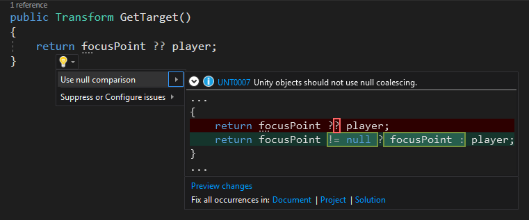

# Visual Studio Tools for Unity

## Overview
Visual Studio Tools for Unity is a free Visual Studio extension that turns Visual Studio into a powerful tool for developing cross-platform games and apps with Unity.

While the Unity editor is great for putting your game world together, you can't write your code in it. With Visual Studio Tools for Unity, you can use the familiar code editing, debugging and productivity features of Visual Studio to create editor and game scripts for your Unity project using C#, and you can debug them using Visual Studio's powerful debugging capabilities.

But Visual Studio Tools for Unity is more than that; it also has deep integration with Unity editor so that you'll spend less time switching back and forth to do simple tasks, provides Unity-specific productivity enhancements, and puts the Unity documentation at your fingertips.

### Compatible with Visual Studio Community on Windows and macOS and bundled with Unity
Visual Studio and Visual Studio for Mac Community is available for free, and is bundled with Unity installs. Visit the Visual Studio Tools for Unity [getting started documentation](getting-started-with-visual-studio-tools-for-unity.md) for more information about installation and setup.

## IntelliSense for Unity messages
IntelliSense code-completion makes it fast and easy to [implement Unity API messages](using-visual-studio-tools-for-unity.md#intellisense-for-unity-api-messages) like `OnCollisionEnter`, including their parameters.

## Superior debugging
Visual Studio Tools for Unity supports the robust [debugging](using-visual-studio-tools-for-unity.md#unity-debugging) features that you expect from Visual Studio:

* Set breakpoints, including conditional breakpoints.
* Evaluate complex expressions in the Watch window.
* Inspect and modify the value of variables and arguments.
* Drill down into complex objects and data structures.

## Integrated suggestions for best practices and performance insights
Write better code that captures the best practices with Visual Studio's deep understanding of Unity projects.

## CodeLens support for Unity scripts and messages
Unity scripts and message functions are decorated with hints to make it easier to recognize what's provided by Unity and what's your code.

 

> [!NOTE]
> CodeLens support is available in Visual Studio 2019.

## Optimized view of all your scripts to match Unity
The Unity Project Explorer (UPE) is an alternative way to view you project files over the standard Solution Explorer. The UPE filters the files shown and presents them in a hierarchy that matches Unity (**View > Unity Project Explorer** in Visual Studio 2019).

> [!NOTE]
> The Unity Project Explorer is available in Visual Studio 2019. In Visual Studio for Mac, the Solution Pad has similar behaviour by default for Unity projects - no additional views are required.

* [Get started with Visual Studio Tools for Unity](getting-started-with-visual-studio-tools-for-unity.md)
