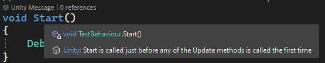

# Visual Studio Tools for Unity

Visual Studio Tools for Unity includes a rich set of features that enhances writing and debugging Unity C# scripts and working with Unity projects.

* Troubleshoot, inspect, and explore code using a debugger that's tuned for Unity projects.
* Discover and write Unity scripts quickly with Unity-specific IntelliSense code-completion.
* Learn more about the code your writing by quickly accessing Unity documentation.
* Write better code with refactoring options that follow best practices for Unity scripts.
* Identify how the Unity engine is calling your code with CodeLens hints for message functions and asset usages.
* Much, [much more](#features).

## Available for Windows and macOS
:::zone pivot="windows"
Visual Studio Tools for Unity is available for free and supports Visual Studio 2017 Community, Professional, and Enterprise and newer. We recommend [downloading and using the latest version of Visual Studio.](https://visualstudio.microsoft.com/downloads/?cid=learn-onpage-download-cta).
:::zone-end
:::zone pivot="macos"
Visual Studio Tools for Unity is available for free and included in every installation of Visual Studio for Mac 2017 and newer. We recommend [downloading and using the latest version of Visual Studio for Mac.](https://visualstudio.microsoft.com/downloads/?cid=learn-onpage-download-cta).
:::zone-end

Visit the Visual Studio Tools for Unity [getting started with Tools For Unity.](getting-started-with-visual-studio-tools-for-unity.md) for more information about installation and setup.

### Supported Unity versions
#### Visual Studio Editor Unity package
Unity 2020.1 and newer require a Unity Package for external editor tools like Visual Studio and Visual Studio for Mac. [Documentation to Learn more about these changes in the Unity blog post.](https://unity.com/developer-tools#verified-ide-packages-now-include-visual-studio).

The [getting started section](getting-started-with-visual-studio-tools-for-unity.md) includes more information on the configuration of the Visual Studio Editor package.

The latest version of the Visual Studio Editor package is recommended.

:::zone pivot="windows"

|Visual Studio  |Minimum Unity version|Minimum package version|
|---------------|---------------------|-----------------------|
|2022           |Unity 2019.4         |Visual Studio Editor 2.0.11|
|2019           |Unity 2017.4         |Visual Studio Editor 2.0.0|
|2017           |Not recommended      |N/A
:::zone-end
:::zone pivot="macos"

|Visual Studio for Mac |Minimum Unity version|Minimum package version|
|---------------|---------------------|-----------------------|
|2022           |Unity 2019.4         |Visual Studio Editor 2.0.11|
|2019           |Unity 2017.4         |Visual Studio Editor 2.0.0|
|2017           |Not recommended      |N/A
:::zone-end

## Features
### Unity Event Functions
Quickly and accurately add Unity Event Functions, like `Start`, `Update`, and `OnCollisionEnter` to C# scripts with a few keystrokes using auto-complete suggestions powered by IntelliSense. 

:::zone pivot="windows"

:::zone-end
:::zone pivot="macos"
Generate code for multiple Unity Event Functions and their comments using ⌘+Shift+M.
:::zone-end

Quickly fix any parameter mistakes in Event Functions that were added manually with quick-fix suggestions.

:::zone pivot="windows"
:::zone-end
:::zone pivot="macos"
:::zone-end

### High-performance debugger
Visual Studio Tools for Unity supports the robust [debugging](using-visual-studio-tools-for-unity.md#unity-debugging) features that you expect from Visual Studio:

* Set breakpoints, including conditional breakpoints.
* Evaluate complex expressions in the Watch window.
* Inspect and modify the value of variables and arguments.
* Drill down into complex objects and data structures.

### Quick fixes and refactoring suggestions
Write better code that captures the best practices with Visual Studio's deep understanding of Unity projects.

:::zone pivot="windows"
### CodeLens hints
Identify where code is called from using CodeLens hints that show implicit calls from Unity assets. Select the hint to see a list of implicit calls. Selecting a specific call will navigate directly to the object in the Unity Editor.

Quickly distinguish your code from Unity methods with hints for every Unity Event Function.

 
:::zone-end

:::zone pivot="windows"
### Unity Project Explorer
Display project files in a way that matches the Hierarchy Window in the Unity Editor.

:::zone-end
:::zone pivot="macos"
### Unity project view
Visual Studio for Mac automatically displays project files in a way that match the Hierarchy Window in the Unity Editor.

:::zone-end

### Unity documentation
View Unity documentation directly in tooltips when inspecting code.

:::zone pivot="windows"

:::zone-end
:::zone pivot="macos"

:::zone-end

Quickly search Unity documentation by highlighting a class or method name, then selecting the Help > Unity API Reference menu item.

### Support for shaders
Syntax highlighting and auto-complete for shader files. 

### Support for assembly definition files
Edit Unity Assembly Definition (.asmdef) files directly in Visual Studio with keyword coloring and completions.

:::zone pivot="macos"
### Run and debug unit tests
Write, run, and debug unit tests directly in Visual Studio for Mac.

:::zone-end

### Automatically refresh Unity assets
Spend less time switching back and forth between Unity and Visual Studio. Changes to code are automatically updated in Unity when files are saved.
