# Tutorial: Getting started with Azure Functions

In this lab, you'll learn how to get started building Azure Functions using Visual Studio for Mac. You'll also integrate with Azure storage tables, which represent one of the many kinds of bindings and triggers available to Azure Functions developers.

## Objectives

> [!div class="checklist"]
> * Create and debug local Azure Functions
> * Integrate with web and Azure storage resources
> * Orchestrate a workflow involving multiple Azure Functions

## Requirements

- Visual Studio for Mac 7.5 or higher.
- An Azure subscription (available free from [https://azure.com/free](https://azure.com/free)).

## Exercise 1: Creating an Azure Functions project

1. Launch **Visual Studio for Mac**.

2. Select **File > New Solution**.

3. From the **Cloud > General** category, select the **Azure Functions** template. You will use C# to create a .NET class library that hosts Azure Functions. Click **Next**.

    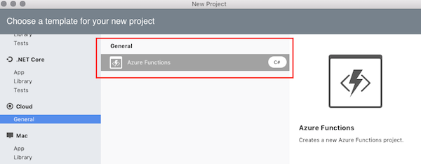

4. Set the **Project Name** to **"AzureFunctionsLab"** and click **Create**.

    

5. Expand the nodes in **Solution Pad**. The default project template includes NuGet references to a variety of Azure WebJobs packages, as well as the Newtonsoft.Json package.

     There are also three files:
        - **host.json** for describing the global configuration options for the host
        - **local.settings.json** for configuring service settings.
        - The project template also creates a default HttpTrigger. For the sake of this lab, you should delete the **HttpTrigger.cs** file from the project.

    Open **local.settings.json**. It defaults to having two empty connection string settings.

    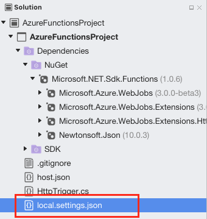

## Exercise 2: Creating an Azure storage account

1. Log on to your Azure account at [https://portal.azure.com](https://portal.azure.com).

1. Under the **Favorites** section, located on the left of the screen, select **Storage Accounts**:

    

1. Select **Add** to create a new storage account:

    

1. Enter a globally unique name for the **Name** and reuse it for the **Resource group**. You can keep all the other items as their default.

    

1. Click **Create**. It might take a few minutes to create the storage account. You'll get a notification once it has been successfully created.

    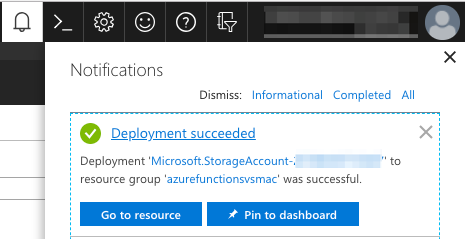

1. Select the **Go to resource** button from the notification.

1. Select the **Access keys** tab.

    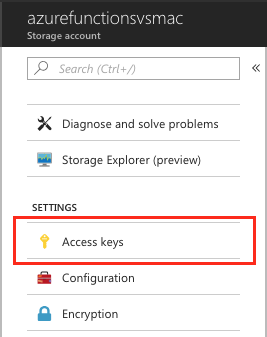

1. Copy the first **Connection String**. This string is used to integrate Azure storage with your Azure Functions later on.

    

1. Return to **Visual Studio for Mac** and paste the full connection string in as the **AzureWebJobsStorage** setting in **local.settings.json**. Now you can reference the name of the setting in attributes for functions that need access to its resources.

    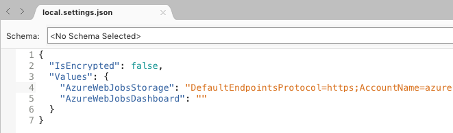

## Example 3: Creating and debugging an Azure Function

1. You're now ready to start adding some code. When working with a .NET class library, Azure Functions are added as static methods. From **Solution Pad**, right-click the **AzureFunctions** project node and select **Add > Add Function**:

    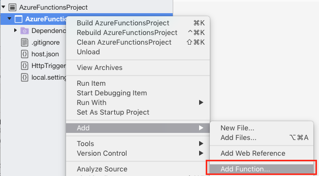

1. In the New Azure Functions dialog, select the Generic webhook template. Set the **Name** to **Add** and click **Ok** to create your function:

    

1. At the top of the new file, add the **using** directives below:

    ```csharp
    using Microsoft.Azure.WebJobs.Extensions.Http;
    using System.Web;
    using Microsoft.WindowsAzure.Storage.Table;
    ```

1. Remove the existing `Run` method and add the method below to the class as your Azure Function:

    ```csharp
    [FunctionName("Add")]
    public static int Run(
    [HttpTrigger(AuthorizationLevel.Function, "get", Route = null)]
    HttpRequestMessage req,
    TraceWriter log)
    {
        int x = 1;
        int y = 2;

        return x + y;
    }
    ```

1. Let's walk through the method definition piece by piece.

    The first thing you'll see is the **FunctionName** attribute that marks this method as an Azure Function. The attribute designates the public name of the function. The attribute name doesn't need to match the actual method name.

    

1. Next, the method is marked as a **public static** method, which is required. You'll also notice that the return value is an **int**. Unless otherwise specified using method attributes, any non-void return value of an Azure Function is returned to the client as text. By default it's returned as **XML**, but can be changed to **JSON**, which you'll do later on in the lab.

    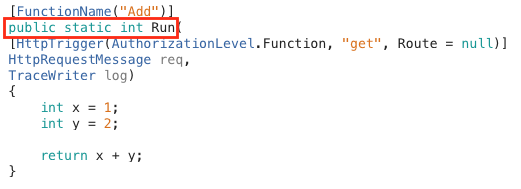

1. The first parameter is marked with the **HttpTrigger** attribute, which indicates that this method is invoked by an HTTP request. The attribute also specifies the authorization level of the method, as well as the verbs it supports (only **"GET"** in this case). You may also optionally define a **Route** that overrides the path to the method and offers a way to automatically extract variables from the path. Since the **Route** is null here, the path to this method will default to **/api/Add**.

    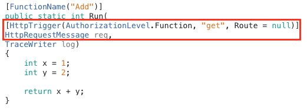

1. The final parameter to the method is a **TraceWriter** that can be used to log messages for diagnostics and errors.

    

1. Set a breakpoint on the **return** line of the method by clicking in the margin of the line:

    

1. Build and run the project in a debug session by pressing **F5** or selecting **Run > Start Debugging**. You could alternatively click the **Run** button. These options all perform the same task. The rest of this lab references **F5**, but you can use the method you find most comfortable.

    

1. Running the project will automatically open the Terminal application.

1. The project goes through a process of detecting Azure Functions based on method attributes and a file convention that is covered later in this article. In this case, it detects a single Azure Function and "generates" 1 job function.

    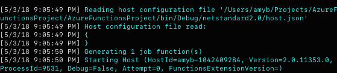

1. At the bottom of the startup messages, the Azure Functions host prints the URLs of any HTTP trigger APIs. There should only be one. Copy that URL and paste it in a new browser tab.

    

1. The breakpoint should trigger immediately. The web request has been routed to the function and can now be debugged. Mouse over the **x** variable to see its value.

    

1. Remove the breakpoint using the same method used to add it earlier (click on the margin or select the line and press **F9**).

1. Press **F5** to continue running.

1. In the browser, the XML result of the method will be rendered. As expected, the hardcoded addition operation produces a plausible sum. Note, if you only see "3" in Safari, go to **Safari > Preferences > Advanced** and tick the "**Show Develop menu in menu bar**" checkbox and reload the page.

1. In **Visual Studio for Mac**, click the **Stop** button to end the debug session. To ensure that new changes are picked up, don't forget to restart (stop and then run) the debugging session.

    

1. In the **Run** method, replace the **x** and **y** definitions with the code below. This code extracts values from the URL's query string so that the addition operation can be performed dynamically based on the provided parameters.

    ```csharp
    var query = HttpUtility.ParseQueryString(req.RequestUri.Query);

    int x = int.Parse(query["x"]);

    int y = int.Parse(query["y"]);

    return x + y;
    ```

1. Run the application.

1. Return to the browser window and append the string `/?x=2&y=3` to the URL. The whole URL should now be `http://localhost:7071/api/Add?x=2&y=3`. Navigate to the new URL.

1. This time the result should reflect the new parameters. Feel free to run the project with different values. Note that there isn't any error checking, so invalid or missing parameters will throw an error.

1. Stop the debugging session.

## Exercise 4: Working with function.json

1. In an earlier exercise, it was mentioned that Visual Studio for Mac "generated" a job function for the Azure Function defined in the library. This is because Azure Functions doesn't actually use the method attributes at runtime, but rather uses a compile-time file system convention to configure where and how Azure Functions are made available. From **Solution Pad**, right-click on your project node and select **Reveal in Finder**.

     

1. Navigate down the file system until you reach **bin/Debug/netstandard2.0**. There should be a folder named **Add**. This folder was created to correspond with the function name attribute in the C# code. Expand the Add folder to reveal a single **function.json** file. This file is used by the runtime to host and manage the Azure Function. For other language models without compile-time support (such as C# script or JavaScript), these folders must be manually created and maintained. For C# developers, they are automatically generated from attribute metadata upon build. Right-click on **function.json** and select to open it in Visual Studio.

    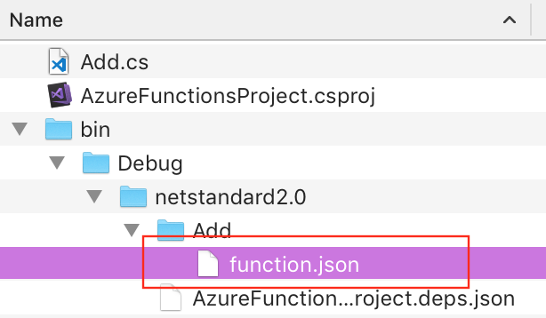

1. Given the previous steps of this tutorial, you should have a basic understanding of C# attributes. Taking that into account, this JSON should look familiar. However, there are a few items that were not covered in earlier exercises. For example, each **binding** must have its **direction** set. As you might infer, **"in"** means that the parameter is input, whereas **"out"** indicates that the parameter is either a return value (via **$return**) or an **out** parameter to the method. You also need to specify the **scriptFile** (relative to this final location) and the **entryPoint** method (public and static) within the assembly. In the next few steps you'll add a custom function path using this model, so copy the contents of this file to the clipboard.

    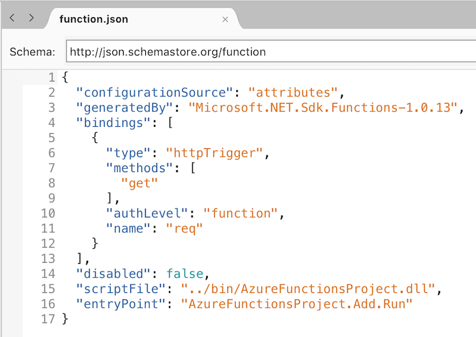

1. In **Solution Pad**, right-click the **AzureFunctionsLab** project node and select **Add > New Folder**. Name the new folder **Adder**. By default convention, the name of this folder will define the path to the API, such as **api/Adder**.

    

1. Right-click the **Adder** folder and select **Add > New File**.

    

1. Select the **Web** category and the **Empty JSON File** template. Set the **Name** to **function** and click **New**.

    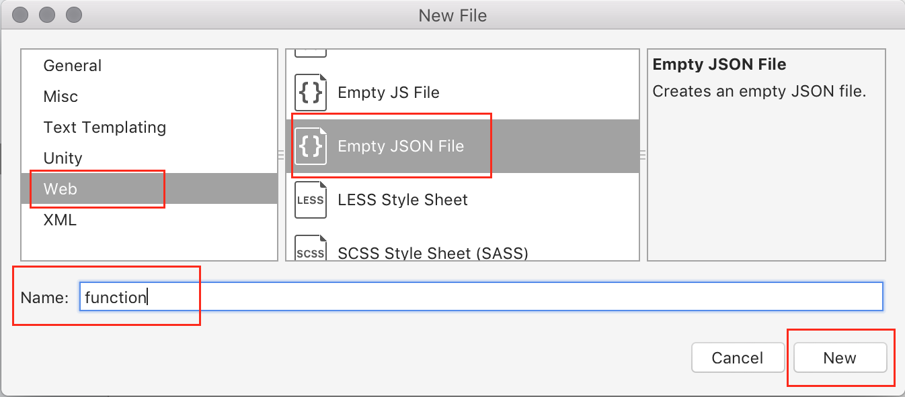

1. Paste the contents of the other **function.json** (from step 3) in to replace the default contents of the newly created file.

1. Remove the following lines from the top of the json file:

    ```json
    "configurationSource":"attributes",
    "generatedBy":"Microsoft.NET.Sdk.Functions-1.0.13",
    ```

1. At the end of the first binding (after the **"name": "req"** line), add the properties below. Don't forget to include a comma on the previous line. This property overrides the default root such that it will now extract **int** parameters from the path and place them into method parameters that are named **x** and **y**.

    ```json
    "direction": "in",
    "route": "Adder/{x:int?}/{y:int?}"
    ```

1. Add another binding underneath the first. This binding handles the return value of the function. Don't forget to include a comma on the previous line:

    ```json
    {
    "name": "$return",
    "type": "http",
    "direction": "out"
    }
    ```

1. Also update the **entryPoint** property at the bottom of the file to use a method called **"Add2"**, such as shown below. This is to illustrate that the path **api/Adder...** could map to an appropriate method with any name (**Add2** here).

    ```json
    "entryPoint": "<project-name>.<function-class-name>.Add2"
    ```

1. Your final **function.json** file should look like the following json:

    ```json
    {
    "bindings": [
        {
        "type": "httpTrigger",
        "methods": [
            "get"
        ],
        "authLevel": "function",
        "direction": "in",
        "name": "req",
        "route": "Adder/{x:int?}/{y:int?}"
        },
        {
        "name": "$return",
        "type": "http",
        "direction": "out"
        }
    ],
    "disabled": false,
    "scriptFile": "../bin/AzureFunctionsProject.dll",
    "entryPoint": "AzureFunctionsProject.Add.Add2"
    }
    ```

1. The one final step required to make this all work is to instruct Visual Studio for Mac to copy this file to the same relative path in the output directory every time it changes. With the file selected, choose the properties tab from the right-hand bar, and for **Copy to output directory** select **Copy if newer**:

    

1. In **Add.cs**, replace the `Run` method (including the attribute) with the following method to fulfill the expected function. It's very similar to `Run`, except that it uses no attributes and has explicit parameters for **x** and **y**.

    ```csharp
    public static int Add2(
        HttpRequestMessage req,
        int x,
        int y,
        TraceWriter log)
    {
        return x + y;
    }
    ```

1. Press **F5** to build and run the project.

1. As the build completes and platform spins up, it will now indicate that there is a second route available for requests that maps to the newly added method:

    

1. Return the browser window and navigate to **http://localhost:7071/api/Adder/3/5**.

1. This time the method works once again, pulling parameters from the path and producing a sum.

1. Return to **Visual Studio for Mac** and end the debugging session.

## Exercise 5: Working with Azure storage tables

Often, the service you build might be much more complex than what we have built so far and require a significant amount of time and/or infrastructure to execute. In that case, you might find it effective to accept requests that are queued for processing when the resources become available, which Azure Functions provides support for. In other cases, you’ll want to store data centrally. Azure Storage tables let you do that quickly.

1. Add the class below to **Add.cs**. It should go inside the namespace, but outside the existing class.

    ```csharp
    public class TableRow : TableEntity
    {
        public int X { get; set; }
        public int Y { get; set; }
        public int Sum { get; set; }
    }
    ```

1. Within the **Add** class, add the code below to introduce another function. Note that this one is unique so far in that it doesn't involve an HTTP response. The final line returns a new **TableRow** populated with some key information that will make it easy to retrieve later on (**PartitionKey** and **RowKey**), as well as its parameters and sum. The code within the method also uses the **TraceWriter** to make it easier to know when the function runs.

    ```csharp
    [FunctionName("Process")]
    [return: Table("Results")]
    public static TableRow Process(
        [HttpTrigger(AuthorizationLevel.Function, "get",
            Route = "Process/{x:int}/{y:int}")]
        HttpRequestMessage req,
        int x,
        int y,
        TraceWriter log)
    {
        log.Info($"Processing {x} + {y}");

        return new TableRow()
        {
            PartitionKey = "sums",
            RowKey = $"{x}_{y}",
            X = x,
            Y = y,
            Sum = x + y
        };
    }
    ```

1. Press **F5** to build and run the project.

1. In the browser tab, navigate to **http://localhost:7071/api/Process/4/6**. This will put another message into the queue, which should eventually result in another row being added to the table.

1. Return to **Terminal** and watch for the incoming request for **4 + 6**.

    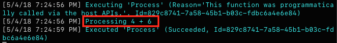

1. Return to the browser to refresh the request to the same URL. This time you'll see an error after the **Process** method. This is because the code is attempting to add a row to the Azure Table Storage table using a partition and row key combination that already exists.

    ```
    System.Private.CoreLib: Exception while executing function: Process. Microsoft.Azure.WebJobs.Host: Error while handling parameter $return after function returned:. Microsoft.Azure.WebJobs.Host: The specified entity already exists.
    ```

1. End the debugging session.

1. To mitigate the error, add the following parameter to the method definition immediately before the **TraceWriter** parameter. This parameter instructs the Azure Functions platform to attempt to retrieve a **TableRow** from the **Results** table on the **PartitionKey** we've been using to store results. However, some of the real magic comes into play when you notice that the **RowKey** is being dynamically generated based on the other **x** and **y** parameters for the very same method. If that row already exists, then **tableRow** will have it when the method begins with no extra work required by the developer. If the row doesn't exist, then it'll just be null. This sort of efficiency enables developers to focus on the important business logic and not the infrastructure.

    ```csharp
    [Table("Results", "sums", "{x}_{y}")]
    TableRow tableRow,
    ```

1. Add the code below to the beginning of the method. If **tableRow** isn't null, then we already have the results for the operation being requested and can return it immediately. Otherwise, the function continues as before. While this may not be the most robust way to return the data, it illustrates the point that you can orchestrate incredibly sophisticated operations across multiple scalable tiers with very little code.

    ```csharp
    if (tableRow != null)
    {
        log.Info($"{x} + {y} already exists");
        return null;
    }
    ```

1. Press **F5** to build and run the project.

1. In the browser tab, refresh the URL at **http://localhost:7071/api/Process/4/6**. Since the table row for this record exists, it should return immediately and without error. Since there is no HTTP output, you can see the output in Terminal.

    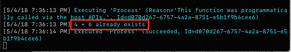

1. Update the URL to reflect a combination not yet tested, such as **http://localhost:7071/api/Process/5/7**. Note the message in Terminal, which indicates that the table row was not found (as expected).

    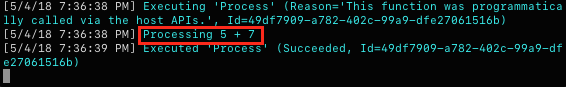

1. Return to **Visual Studio for Mac** and end the debugging session.

<!--
1. Finally, let's take a look at what it's like to work with multiple input records. Rather than specify a specific **TableRow**, you can request an **IQueryable<TableRow>** using the same attributes, and the runtime will fill it with the appropriate resource you need. Add the code below to create a **List** function that lists all items that currently exist in the Azure table we've been working with. Also note that we're specifying that the MIME type of the response is **application/json**, so the runtime will automatically render as JSON.

    ```csharp
    [FunctionName("List")]
    public static HttpResponseMessage List(
        [HttpTrigger(AuthorizationLevel.Function, "get", Route = null)]
        HttpRequestMessage req,
        [Table("Results", "sums")]
        IQueryable<TableRow> table,
        TraceWriter log)
    {
        return req.CreateResponse(HttpStatusCode.OK, table, "application/json");
    }
    ```
1. Press **F5** to build and run the project.

1. In the browser tab, navigate to **http://localhost:7071/api/List**. This should pull down the list of all items in the Azure table and render it as JSON.

    
-->

## Summary

In this lab, you've learned how to get started building Azure Functions with Visual Studio for Mac.
