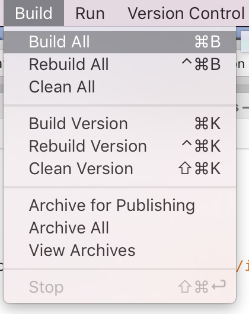

# Building and cleaning projects and solutions

Follow the steps in this article to learn how to build, rebuild, and clean your solution and project.

## To build, rebuild, or clean an entire solution

To build, rebuild, or clean an entire solution:

1. Select the Solution node in the Solution Pad:

    

2. Select Build Menu in the Menu bar and select one of the following options:

    

    * **Build All** - Attempts to build all files within project that have changed within the project since the most recent build.
    * **Rebuild All** - Cleans the solution and then builds it.
    * **Clean All** - Removes all build products from your solution.

## To build or rebuild a single project

1. In the Solution Pad, select the project.

2. On the menu bar, choose Build, and then choose either Build[ProjectName], Rebuild[ProjectName], or Clean[ProjectName].

## To stop a build

To stop a build, press the red square in the status area:

## See also

- [Build and clean projects and solutions (Visual Studio on Windows)](/visualstudio/ide/building-and-cleaning-projects-and-solutions-in-visual-studio)