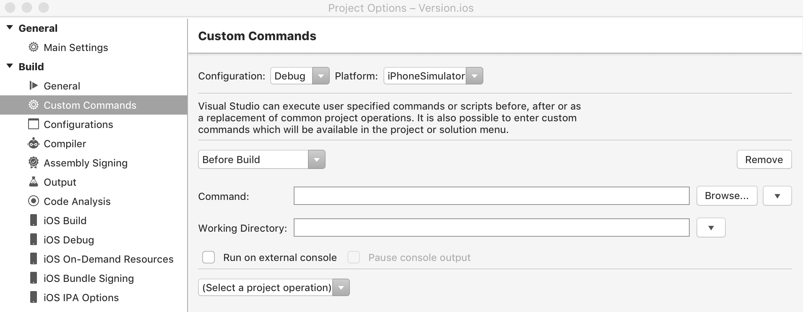

# Compiling and building in Visual Studio for Mac

Visual Studio for Mac can be used to build applications and create assemblies during the development of your project. It's important to compile and build your code early and often so that you can identify type mismatches and other compile-time errors.

## Building from the IDE

Using Visual Studio for Mac lets you create and run builds instantly, while still giving you control over build functionality. Visual Studio for Mac uses MSBuild as the underlying build system.

All Projects and Solutions created in the IDE will have a default build configuration, which define the context for builds. These configurations can be edited or you can create your own. Creating or modifying these configurations will automatically update the project file, which is then used by MSBuild to build your project.

For more information regarding how to build projects and solutions in the IDE, see the [Building and cleaning Projects and Solutions](building-and-cleaning-projects-and-solutions.md) guide.

Visual Studio for Mac can also be used to do the following:

* Change the output path. This is edited in your Project's options:

    

* Change the verbosity of the build output:

    

* Add Custom Commands before, during, or after Building or Cleaning:

    

## Building from command line

You can use MSBuild Build Engine to build applications via the command line.

See the [MSBuild](/visualstudio/msbuild/msbuild) content for more information on using MSBuild.

## Building from Azure Pipelines

* [Build your Xamarin App](/vsts/pipelines/apps/mobile/xamarin?view=vsts&tabs=vsts)
* [Continuous Integration with Xamarin](https://developer.xamarin.com/guides/cross-platform/ci/)

## See also

- [Compile and build (Visual Studio on Windows)](/visualstudio/ide/compiling-and-building-in-visual-studio)