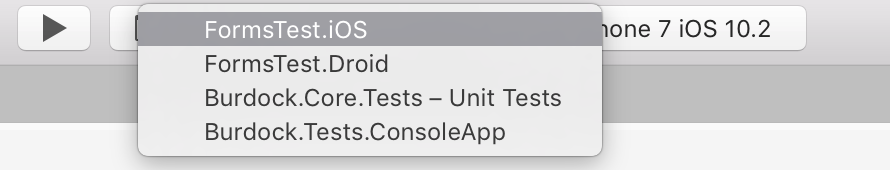

# Understanding build configurations

## Project build configurations

Projects tend to have multiple configurations and switching between them allows for different outputs at build time. For example, a Debug configuration will output debugging symbols, allowing the debugger to resolve function names, parameters, or variables from a crashed application's stack trace. While this additional information is useful during development, it leads to an inflated file size and isn't ideal for distribution.

Each platform has specific configurations for its build.

## Solution configurations

Akin to project configurations, solution configurations are used to create custom configurations for an entire project. By using the **Configuration Mappings** tab under the **Build > Configurations** item, you can assign a target configuration for each solution item, as illustrated in the following image:

For more information about configurations, see the [Configuration Manager](https://www.youtube.com/watch?v=tjSdkqYh5Vg) video by James Montemagno.

## Run configuration

In previous versions of Xamarin Studio, you could select the option to set a project as a **Startup Project**, which is the project that is run/debugged when using the global run/debug command. This was indicated by a bold typeface for the project's name in the project pad.

In Visual Studio for Mac, instead of setting a startup project, you can set a _run configuration_. The run configurations are presented in a drop-down list in the toolbar, next to the build configuration selector as illustrated below:

A run configuration is a set of execution options with a name and several configurations that are defined in a project for different purposes. Run configurations are defined at the project level, and a default will be created automatically for each executable project, although it is possible to add as many as needed. Certain project types automatically generate additional run configurations. For example, watchOS projects may generate  _Glance and Notification configurations._

Configurations can be shared with other developers (in which case the configurations will be stored in the .csproj file) or kept locally (in which case they will be stored in a .user file).

### Android run configurations

Run configurations for Android projects allow you to specify which activity, service, or broadcast receiver to launch when running or debugging the project. You can pass intent extra data and set intent flags to be able to test your components under different launch conditions.

Activities other than the `MainLauncher` will need to have `Exported=true` added to the Activity attribute for debugging on a physical device, or have Intent filters defined.

## Examples of data that might be included in run configurations

The following list provides some examples of data that could be included in run configurations:

* Regular .NET project
  * Alternative startup app
  * Start arguments
  * Working directory
  * Environment variables
  * Mono runtime options (to be used only when running on Mono)
* Android project
  * Entry point (activity, service, receiver)
  * Intent arguments and data
* iOS project
  * Mode (Normal, Background Fetch)
* iOS extension project
  * Startup app: default or custom
* WatchKit project
  * Mode (Glance, Notification)
  * Notification payload

## See also

- [Understand build configurations (Visual Studio on Windows)](/visualstudio/ide/understanding-build-configurations)
