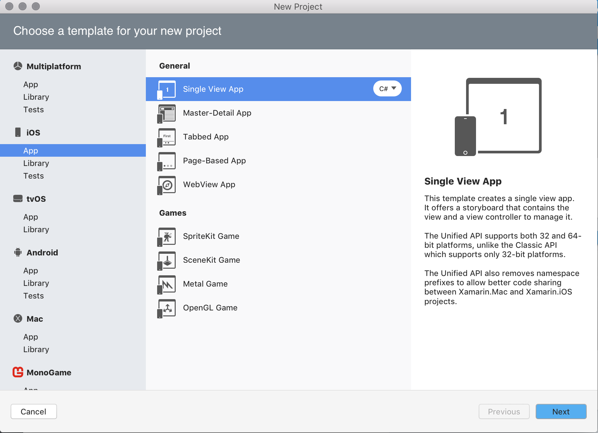
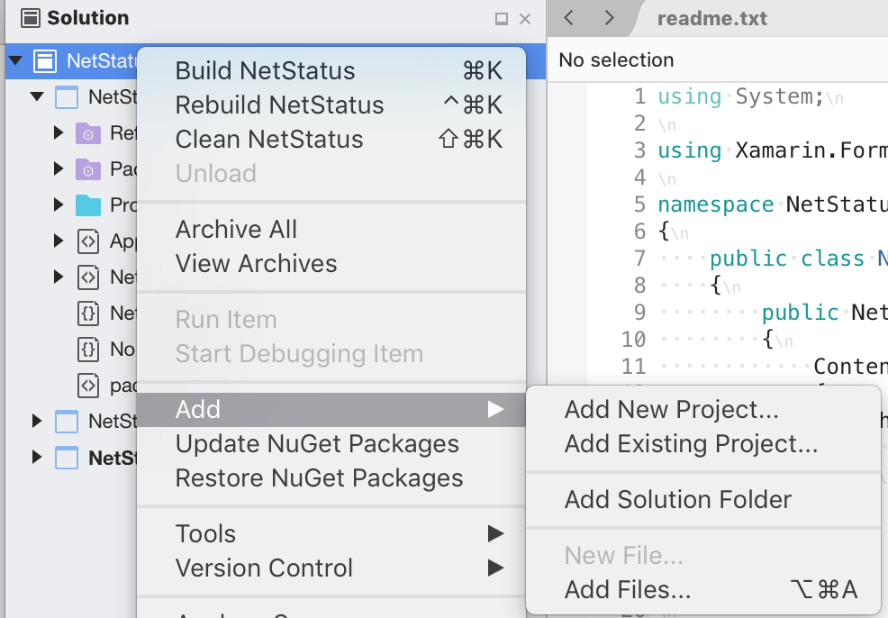

# Creating new Projects and Solutions

## Creating new Projects and Solutions from a template

Solutions can be created at any time by using a predefined template. To create a solution this way, browse to **File > New Solution**, select the required platform(s), and then the required template:

This will create a solution, which can contain one or many projects, depending on the type of template chosen.

The solution explorer can be navigated by using the context actions or the menu bar.

To add a new Project to the solution, right-click on the Solution name and select **Add > Add New Project** to display the New Project dialog:

This method of adding new projects can be used to take advantage of Xamarin code-sharing capabilities. Adding a Shared Project or a Portable Library template to an existing Solution provides a way to contain any cross-platform logic that can be used within all other projects in a solution. For more information on building cross-platform applications, refer to the [relevant guide](https://developer.xamarin.com/guides/cross-platform/application_fundamentals/code-sharing/).

## Opening Recent Solutions.

The landing page of Visual Studio displays a list of recent projects that you have been working on:

You can filter this list using the Filter box or remove individual items from the list.

## See also

- [Create solutions and projects (Visual Studio on Windows)](/visualstudio/ide/creating-solutions-and-projects)