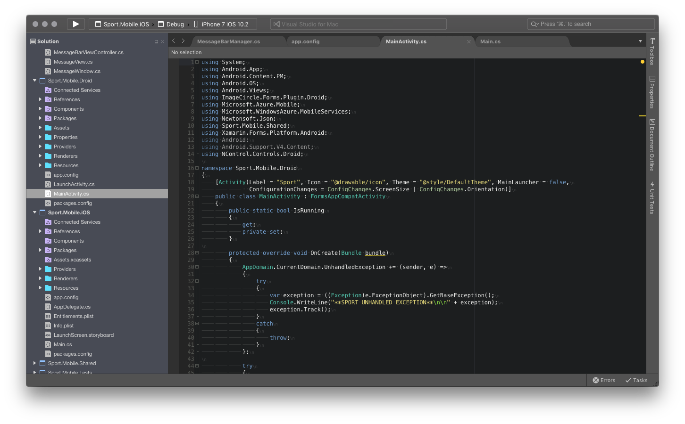
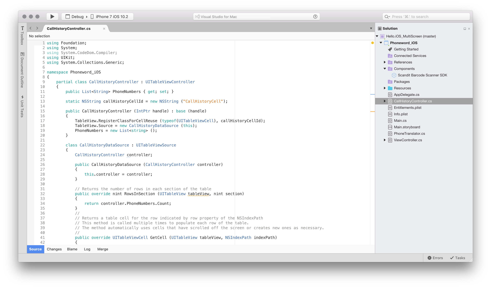
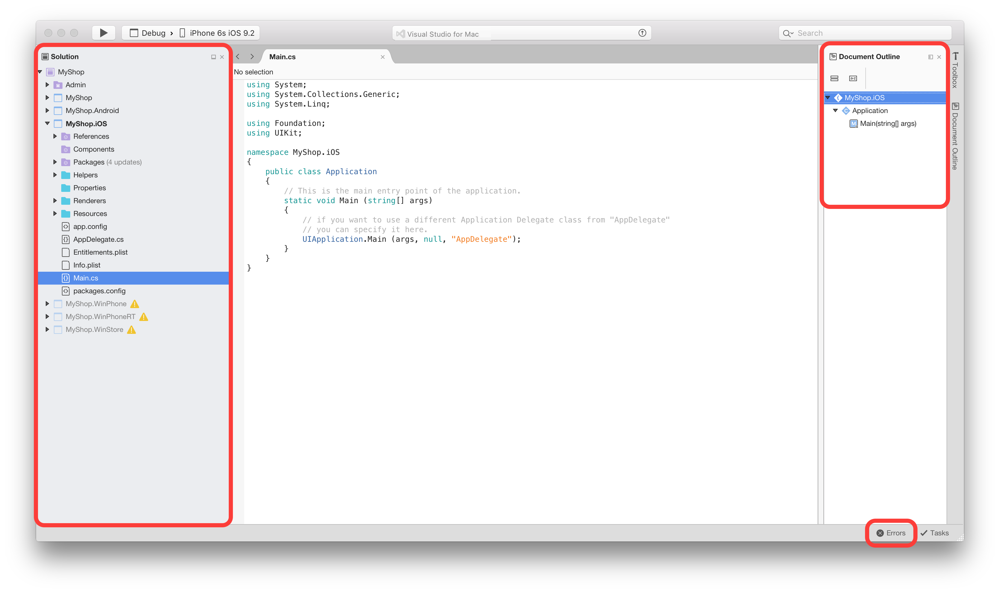
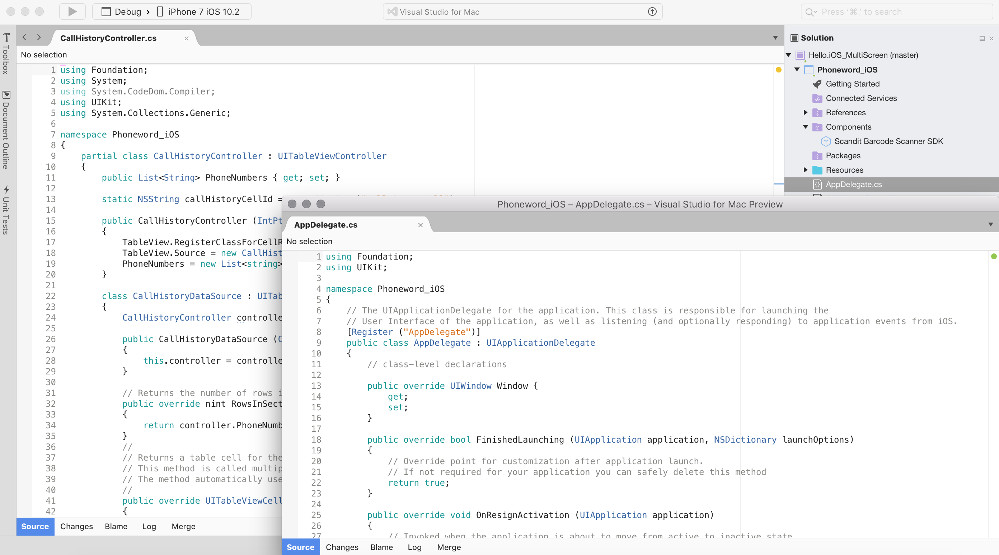
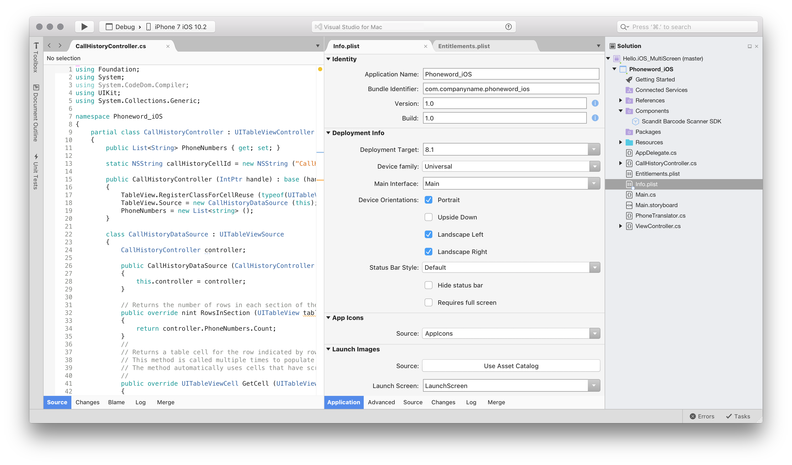

# Customizing the IDE

Visual Studio for Mac can be customized in a variety of ways, allowing users to develop apps in an environment that meets their needs for both efficiency and aesthetics. This article explores the variety of ways that Visual Studio for Mac can be adapted to suit your needs.

## Dark theme

You can switch themes in Visual Studio for Mac by browsing to **Visual Studio > Preferences > Environment > Visual Style** and selecting your desired theme from the **User Interface Theme** drop-down, as illustrated in the following image:

## Localization

Visual Studio for Mac is localized in the following 14 languages, enabling it to be accessible to more developers:

* Chinese - China
* Chinese - Taiwan
* Czech
* French
* German
* English
* Italian
* Japanese
* Korean
* Polish
* Portuguese - Brazil
* Russian
* Spanish
* Turkish

To change the language displayed by Visual Studio for Mac, browse to  **Visual Studio > Preferences > Environment > Visual Style** and select your desired language from the **User Interface Language** drop-down, as illustrated in the following image:

## Author information

The author information panel allows you to add relevant information about yourself such as your name, email address, the copyright owner for your work, your company, and trademark:

This information is used to populate standard file headers, such as a license, that you might add to new files:

Populated **Name** and **Email** fields will be used in any commit that is made through Version Control in Visual Studio for Mac. If you have not populated these fields, Visual Studio for Mac will prompt you to do so when you try to use Version Control.

## Key bindings

Key bindings allow you to adapt your development environment so that you can move more efficiently throughout Visual Studio for Mac. It provides familiar key bindings for many popular IDEs, such as Visual Studio (on Windows), ReSharper, Visual Studio Code, and Xcode.

Key bindings can be set by browsing to **Visual Studio > Preferences > Environment > Key Bindings**, as illustrated by the following image:

From here you can search for key binding combinations, view conflicting bindings, add new bindings, and edit the existing bindings.

## Workspace layout

Visual Studio for Mac's workspace consists of a main document area (normally the editor, designer surface, or options file), surrounded by complimentary *pads* that contain useful information for accessing and managing application files, testing, and debugging.

 

### Viewing and arranging pads

When you open any new solution or file in Visual Studio for Mac, you should notice some *pads* in the workspace, including the Solution Pad, Document Outline, and Errors:

Visual Studio for Mac provides pads containing additional information, tools, and navigation aids, all of which can be accessed by browsing to the **View > Pads** menu item and selecting a pad to add it:

Pads may also be opened automatically by various commands, such as the **Find in Files** (Shift + Cmd + F) command, which opens a detached pad of search results.

Pads can be moved and arranged throughout your workflow in whatever way is most useful to you. For example, they can be docked on any side of the document editor, adjacent to another pad, above or below another pad, or as a set of tabbed pads enabling you to quickly switch between them.

For frequently used pads, you can also completely detach a pad from the Visual Studio for Mac window, and create a separate window for that pad.

Pads can be hidden and closed by the toggles in the top-right corner of each pad:

Autohidden pads are docked to the sides of the workspace making them easily accessible when they are required. Hovering over the pad displays it again, and it will be hidden when the mouse and keyboard focus leaves it.

### Organizing layouts

The pads that are displayed at any time are dependent on the current context. For example, when using the visual designer, the toolbox and property grid pads are most important; when debugging, it is useful to have the debugger pads for viewing the stack and locals.

The state of the open pads is represented by a *layout*. The layouts can be  switched manually through the View menu, as illustrated in the following image, or it is switched automatically when you carry out an action, such as debugging, or opening a Storyboard:

There is always one active layout and any change you make in a layout, such as adding or repositioning a pad, will only change the active layout. Once you close Visual Studio for Mac, the changes you have made will not be saved.

However, it is possible to create a new layout by using the **View > Save Current Layout** menu item. This will add your current layout to the menu so that you can select it at any time:

### Side-by-side editing support

Visual Studio for Mac allows you to open text editors side by side, or to have an editor as a detached floating window.

2-column mode can be enabled through the View menu item by selecting **View > Editor Columns > 2 columns**, or by dragging an editor tab to one of the edges of the editor area:

Editor tabs can be dragged out of the document area to create a floating editor window. This floating window also supports side-by-side editors, and can contain several editor tabs:

To revert to a single open editor, select **View > Editor Columns > 1 column**.

## Related Video

> [!Video https://channel9.msdn.com/Shows/Visual-Studio-Toolbox/Visual-Studio-for-Mac-Customize-the-Look-and-Feel/player]

## See also

- [Personalize the Visual Studio IDE (on Windows)](/visualstudio/ide/personalizing-the-visual-studio-ide)