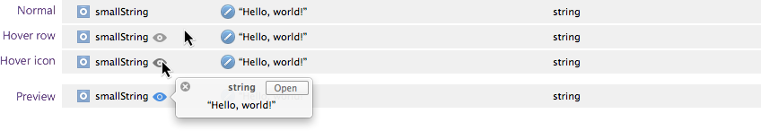
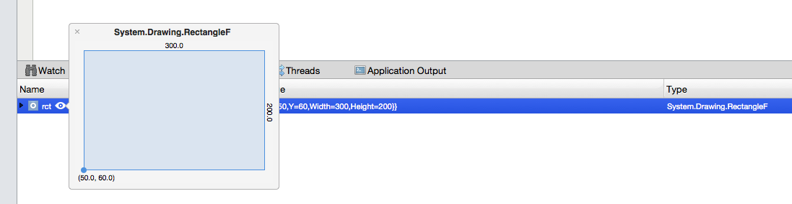
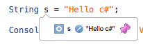
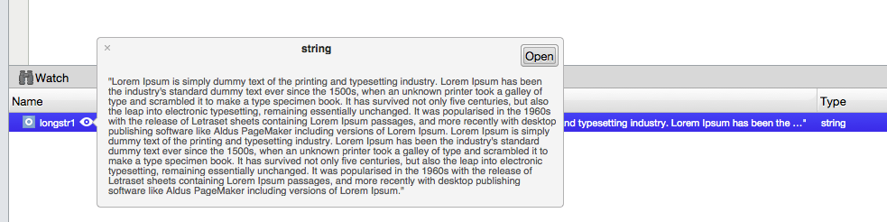
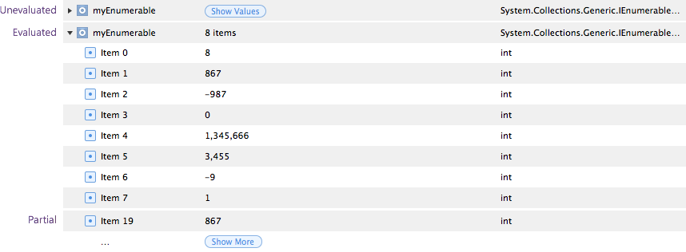

# Data visualizations

Visual Studio for Mac includes UI support for the debugger, allowing visualizations of the values of a variable, field, or property while debugging. These data visualizers show an extended version of the data and allow developers to inspect known structures, for example showing the color of a color struct.

Visualizers in the debug  **Local** pad can be displayed by clicking on the preview icon that appears to the right of the value, when the user hovers over the row:

The list below looks at many of the new visualizations available when debugging in Visual Studio for Mac.

## Point
A Point/PointF, or CGPoint in iOS and Mac, will render as a tuple showing the X and Y values in the debug pad:

## Size
A Size/SizeF, or CGSize in iOS and Mac, will render as a rectangle. It is drawn to scale until a dimension grows past 250 px, at which point it will scale the rectangle with the largest dimension as 250 px:

[Size Visualization](media/data-visualizations-image11.png)

## Rectangle
A Rectangle/RectangleF, or CGRect in iOS and Mac, will display the dimensions and origin. Similar to Size, it is drawn to scale, until a dimension grows past 250 px:

## Coordinate
Coordinates are plotted on a map, with the location pinned to the center:

[Coordinate Visualization](media/data-visualizations-image13.png)

## Color
This will display UIColor, CGColor, and Color properties, depicting the color preview, RGBA components, Hue-Saturation-Lightness values, and the hex value of the color:

## Images

Media will be rendered to scale, up to a maximum dimension of 250 px, and will be scaled to fit when the image exceeds 250 px:

## Bezier Curves

The visualizer will display an `NSBezierPath`:

## String

A string of fewer than 100 characters is displayed in full, without a preview. Longer strings are displayed in full in the preview. Strings are editable, and the visualizer is accompanied by an edit button, allowing the string value to be edited either in the preview or in the String Value Editor, shown below:

### Small Strings:
]

### Medium-length Strings:

### Editor:

## IEnumerable

IEnumerable enumerates all values; the values of each can be viewed by clicking the **Show** Values button. The IEnumerable option will not display values for objects such as `Array`, `ArrayList`, `List<>`, `Dictionary<,>` as these have their own debugger visualizers.

## Other Visualizers

Some other types that also have their own inline visualizers are listed below:

* **Primitives**
  * This will show the raw value of the primitive type.
* **Enum**
  * This will display the field value without the enum Type qualifier.
* **Tuple**
  * Displayed in the format (,)
* **Null**
  * Shows "null" value.
* **URL**
  * This will display a clickable hyperlink.
* **IntPtr**
  * This will display a hexadecimal representation of the IntPtr.

## See also

- [Inspect variables in the Autos and Locals windows (Visual Studio on Windows)](/visualstudio/debugger/autos-and-locals-windows)
- [View strings in a visualizer (Visual Studio on Windows)](/visualstudio/debugger/string-visualizer-dialog-box)