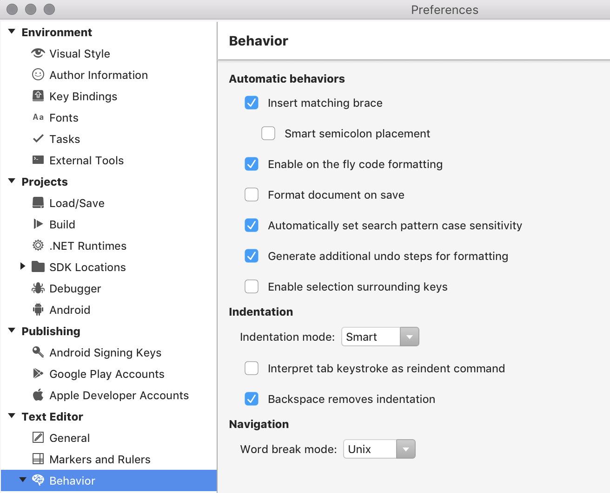

# Editor Behavior

Editor behaviors can be set to allow code to be formatted as it is written. These actions are set under **Visual Studio > Preferences > Text Editor > Behavior**, and some of the more commonly used functions are described below:

* Matching closing braces can be added automatically to code when creating new classes, methods, or properties. When this option is selected, typing `{` will automatically add `}`.
* On-the-fly code formatting is triggered by character presses, such as semi-colon or braces, which will emulate the formatting preferences that are set.
* You can also choose to format the file when saving it, which allows the writing of code as desired and leaves the IDE responsible for formatting code as set by existing preferences.
* Indentation can be set to None, Auto, or Smart. These do the following:
  * None - sets the caret to the start of the next line
  * Auto - sets the caret to the same column on the next line
  * Smart - indents on the following line based on the code
* Word-breaking behavior differs between OSes, and for navigation purposes, the text editor needs to know where words begin or end. The formatting can be set to Unix or Windows.

You can also set formatting rules for XML, CSS, HTML, and JSON.

## See also

- [Code style preferences (Visual Studio on Windows)](/visualstudio/ide/code-styles-and-quick-actions)
