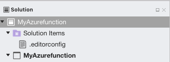
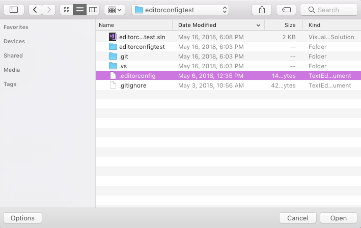
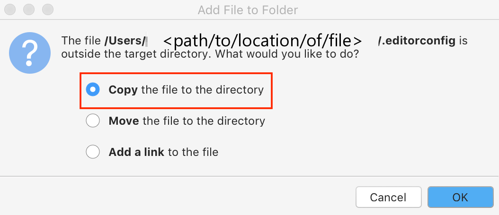
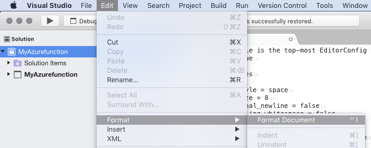
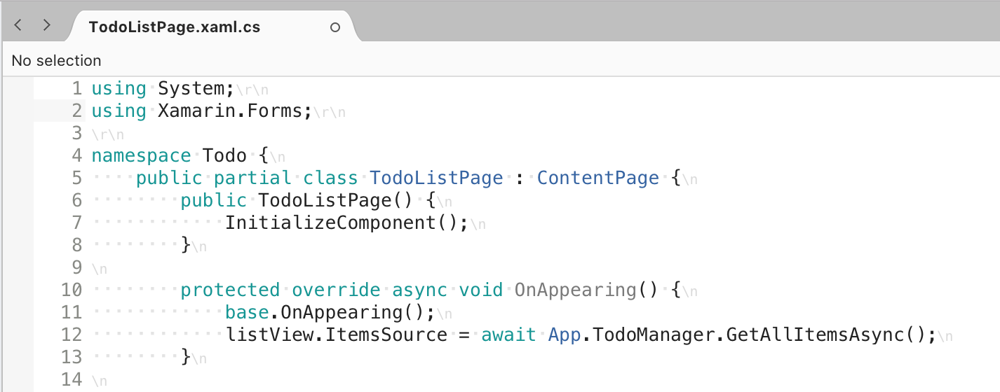

# Creating and editing a custom EditorConfig file

In Visual Studio for Mac, you can add an [EditorConfig](https://editorconfig.org/) file to your project or solution to enforce consistent coding styles for everyone that works in the codebase. The settings declared in the EditorConfig file take precedence over global Visual Studio for Mac text editor settings. Using an EditorConfig file within your project or codebase allows you to set your coding style, preferences, and warnings for your project. Because the file is part of your codebase, it makes it easier for all users to adhere to the coding practices of a project, regardless of the IDE or code editor that they use.

[EditorConfig](https://editorconfig.org/) files are supported on many IDEs and code editors, including Visual Studio 2017.

## Supported settings

The editor in Visual Studio for Mac supports the core set of [EditorConfig properties](https://editorconfig.org/#supported-properties):

- `indent_style`
- `indent_size`
- `tab_width`
- `end_of_line`
- `charset`
- `trim_trailing_whitespace`
- `insert_final_newline`
- `root`

EditorConfig also supports [Coding conventions](/visualstudio/ide/editorconfig-code-style-settings-reference) in C#.

## Add an EditorConfig file to a project

### Adding a new EditorConfig file

1. Open your project in Visual Studio for Mac. Select either the solution or project node that you wish to add the EditorConfig file to. Adding the file to the solution directory applies the .editorconfig settings to all projects in the solution.

2. Right-click on the node and select **Add > New File** to open the **New File** dialog:

    

3. Choose **Misc > Empty Text File** and give it the **Name** `.editorconfig`. Press **New** to create the file and open it in the editor:

    

    Adding the item at the solution level automatically creates and nests it in a **Solution Items** folder:

    

4. Edit the file. For example:

    ```EditorConfig
    # This file is the top-most EditorConfig file
    root = true

    # All Files
    [*]
    indent_style = space
    indent_size = 8
    insert_final_newline = false
    trim_trailing_whitespace = false

    [*.cs]
    csharp_new_line_before_open_brace = none
    ```

4. The settings from the `.editorconfig` file will apply to any new code that you write, but existing code may need to be reformatted to be consistent with the new settings. To apply the settings from the `.editorconfig` file to an existing source file, open the file and choose **Edit > Format > Format Document** from the menu bar::

    

### Adding an existing EditorConfig file

If you're working with a project or solution that already contains an `.editorconfig` file, there is nothing that you need to do to apply the settings. Any new lines of code are formatted according to the EditorConfig settings.

You may want to reuse an existing `.editorconfig` file in your project. To add an existing file, do the following:

1. Right-click on the folder you wish to add it to and select **Add > Add Files**.

2. Browse to the directory of the required file.

3. Files beginning with `.` (such as `.editorconfig`) are hidden files in macOS,  so press **Command + Shift + .** to make the `.editorconfig` file visible.

4. Select the `.editorconfig` file and click **Open**:

    

5. When you're presented with the following dialog, select the **Copy the file to the directory** option and select **OK**:

    

### Reflecting .editorconfig settings

Once you add an EditorConfig file to your codebase, any new code added is automatically formatted according to the specified settings. Existing code doesn't automatically reflect the settings unless you  format the codebase.

To reflect the settings from the `.editorconfig` file, select the solution node and choose **Edit > Format > Format Document** from the menu bar:



## Editing an EditorConfig file

EditorConfig files use a straightforward file layout to specify settings, which is explained below using a previous example:

```EditorConfig
# This file is the top-most EditorConfig file
root = true

# All Files
[*]
indent_style = space
indent_size = 4
insert_final_newline = false
trim_trailing_whitespace = false

[*.cs]
csharp_new_line_before_open_brace = none
```

Setting `root` to `true` flags this file as the top-most file of the codebase and any higher `.editorconfig` files in the project are ignored, as explained in the [Override EditorConfig Settings](#override-editorconfig-settings) section.

Each section is denoted by square (**[ ]**) braces and specifies information on the types of files the following properties should pertain to.

In the example above, some settings are applied to all files in the project and others are added only to C# files. The screenshots below show before and after the `.editorconfig` settings have been applied:

**Before**:


**After**:



For more information on available EditorConfig settings, see the [.NET coding convention settings for EditorConfig](/visualstudio/ide/editorconfig-code-style-settings-reference) article and the [Supported Properties](https://editorconfig.org/#supported-properties) section on the official documentation.

## Override EditorConfig Settings

It's possible to have more than one `.editorconfig` file in each solution. Visual Studio for Mac reads `.editorconfig` files from top to bottom in the solution, adding and overriding settings as it goes.This means that the settings in the `.editorconfig` _closest_ to the file you're editing will take precedence. Settings are taken from the `.editorconfig` file the same folder (if it exists), then the `.editorconfig` in parent folder (if that exists), etc. until it finds `root=true`.

If you want to ensure that _no_ settings from any higher-level `.editorconfig` files are applied to this part of the codebase, add the `root=true` property to the top of the lower-level `.editorconfig` file:

```EditorConfig
# top-most EditorConfig file
root = true
```

## See also

- [Create custom editor settings with EditorConfig (Visual Studio on Windows)](/visualstudio/ide/create-portable-custom-editor-options)