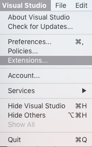
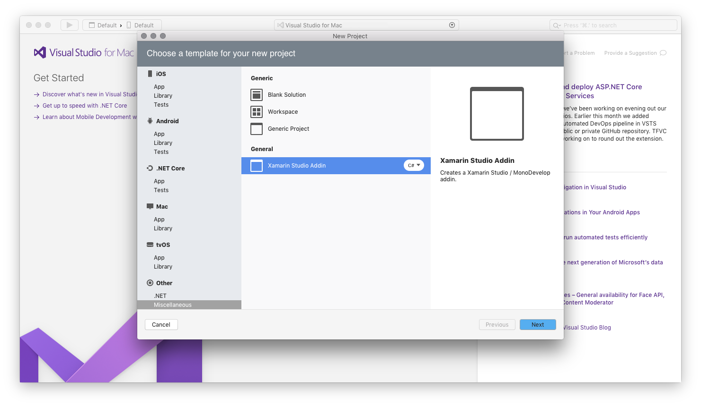
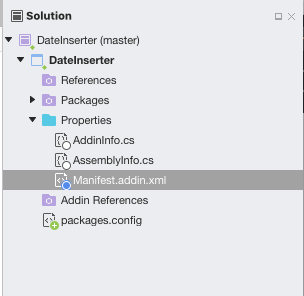
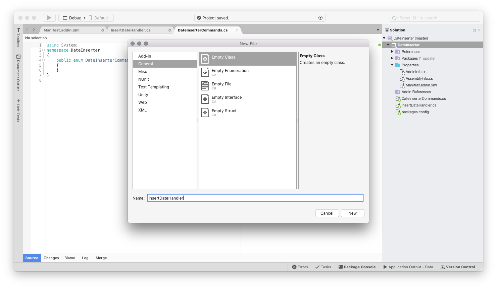
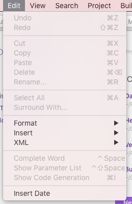

# Extending Visual Studio for Mac Walkthrough

This topic guides you through building [a simple extension package](https://github.com/mjh4/AddIns/tree/master/DateInserter). The extension package will create a new Command in Visual Studio for Mac's Edit menu that allows the user to insert the current date and time into an open text document.

This example uses the Add-in Maker. The Add-In Maker creates a new Project template and populates it with the required files for our custom extension package.

1. Begin by launching Visual Studio for Mac if it's not already open:

   

2. Install the _Add-in Maker extension package_ using the Extension Manager. From the Visual Studio menu, choose **Extensions...**:

   

3. Navigate to the Gallery tab and type `Addin Maker` into the top-right search bar. Select Addin Maker from the Add-in Development category and click <kbd>Install</kbd>. If nothing shows up, hit Refresh and search again:

   

4. Now that the Addin Maker is installed, you can start building an extension package. Start by creating a new solution.

5. From the **New Solution dialog**, choose **Other > Miscellaneous > General > Xamarin Studio Addin > C#** template and on the following screen name the new Solution `DateInserter`:

   

6. Visual Studio for Mac will populate a new Solution:

   

7. Remove the template code in `Manifest.addin.xml` and replace it with the following:

   ```xml
   <?xml version="1.0" encoding="UTF-8"?>
      <ExtensionModel>
          <Extension path = "/MonoDevelop/Ide/Commands/Edit">
              <Command id = "DateInserter.DateInserterCommands.InsertDate"
                  _label = "Insert Date"
                  defaultHandler = "DateInserter.InsertDateHandler" />
          </Extension>

          <Extension path = "/MonoDevelop/Ide/MainMenu/Edit">
              <CommandItem id="DateInserter.DateInserterCommands.InsertDate" />
          </Extension>
      </ExtensionModel>
   ```

8. Now you need to set up the files that will eventually handle inserting the date and time into the text editor. Right-Click on the project node and add a new file. Select **General > Empty Class** and name the new file *InsertDateHandler*:

   

9. Let's remove the template code from `InsertDateHandler.cs` and replace it with the following code:

   ```cs
   using MonoDevelop.Components.Commands;
   using MonoDevelop.Ide;
   using MonoDevelop.Ide.Gui;
   using System;

   namespace DateInserter
   {
      class InsertDateHandler : CommandHandler
      {
          protected override void Run()
          {

          }

          protected override void Update(CommandInfo info)
          {

          }
      }
   }
   ```

   We'll expand these two placeholder methods later.

10. Right-click on the **DateInserter** Project and select **Add > New File**. Select **General > Empty Enumeration**, and then name the new file *DateInserterCommands*:

    

11. Add the `InsertDate` Command as a new enumeration in the `DateInserterCommands.cs` file:

    ``` cs
    using System;

    namespace DateInserter
    {
      public enum DateInserterCommands
      {
          InsertDate,
      }
    }
    ```

12. At this point, you should have a working extension package. You can test it out by saving your work and running the application. The IDE will launch a new instance of Visual Studio for Mac with the new extension package installed. If you navigate to the **Edit menu**, you'll see that Visual Studio for Mac has a new option called **Insert Date**, as illustrated by the screenshot below:

    

    Note that selecting Insert Date from the menu has no effect as the current implementation only has placeholder methods.

13. The framework is in place for the extension package, and it's time to write the code that powers inserting the date. First, make sure that the **Insert Date Command** is only enabled when the user has a text file open by replacing the `Update` method in `InsertDateHandler.cs` with the following code:

    ```cs
    protected override void Update(CommandInfo info)
    {
      info.Enabled = IdeApp.Workbench.ActiveDocument?.Editor != null;
    }
    ```

14. Update the Command's `Run` method to insert the date and time with the following code:

    ``` cs
    protected override void Run () {
      var editor = IdeApp.Workbench.ActiveDocument.Editor;
      var date = DateTime.Now.ToString ();
      editor.InsertAtCaret (date);

    }
    ```

15. Finally, let's run our extension package to test it. In the new instance of Visual Studio for Mac, select **Edit > Insert Date**. The current date and time is inserted at our caret, as illustrated by the screenshot below:

    

## See also

- [Create your first extension (Visual Studio on Windows)](/visualstudio/extensibility/extensibility-hello-world)