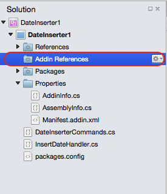

# Extending Visual Studio for Mac

Visual Studio for Mac consists of a set of modules called *Extension Packages*. You can use Extension Packages to introduce new functionality to Visual Studio for Mac, such as support for an additional language or a new Project template.

Extension packages build from the *extension* points of other extension packages. Extension points are placeholders for areas that can be expanded upon, such as a menu or the list of IDE Commands. An extension package can build from an extension point by registering a node of structured data called an extension, such as a new menu item or a new Command. Each extension point accepts certain types of extensions, such as a *Command*, *Pad*, or *FileTemplate*. A module that contains extension points is called an *add-in host*, as it can be extended by other extension packages.

To customize Visual Studio for Mac, you can create an extension package that builds from extension points contained in add-in hosts within pre-existing libraries in Visual Studio for Mac, as illustrated by the following diagram:


In order for an extension package to build from Visual Studio for Mac, it must have extensions that build from pre-existing extension points within the Visual Studio for Mac IDE. When an extension package relies on an extension point defined in an add-in host, it is said to have a _dependency_ on that extension package.

The benefit of this modular design is that Visual Studio for Mac is extensible -- there are many extension points that can be built upon with custom extension packages. Examples of current extension packages include support for C# and F#, debugger tools, and Project templates.

> [!NOTE]
> If you have an Add-in Maker project that was created before Add-in Maker 1.2, you need to migrate your project as outlined in the steps [here](https://mhut.ch/addinmaker/1.2).

<!---The [Walkthrough](~/extending-visual-studio-mac-walkthrough.md) topic explains how to build an extension package that uses a *Command* to insert the date and time into an open text document.--->

This section looks at the different files generated by the Add-in Maker and the data a command extension requires.

## Attribute files

Extension packages store metadata about their name, version, dependencies, and other information in C# attributes. The Add-in Maker creates two files, `AddinInfo.cs` and `AssemblyInfo.cs` to store and organize this information. Extension packages must have a unique id and namespace specified in their *Addin attribute*:

```csharp
[assembly:Addin (
   "DateInserter",
   Namespace = "DateInserter",
   Version = "1.0"
)]
```

Extension packages must also declare dependencies on the extension packages that own the extension points they plug into. These are automatically referenced at build time.

Furthermore, additional references can be added via the Add-in reference node in the solution pad for the project, as depicted by the following image:



They also have their corresponding `assembly:AddinDependency` attributes added at build time. Once the metadata and dependency declarations are in place, you can focus on the essential building blocks of the extension package.

## Extensions and extension points

An extension point is a placeholder that defines a data structure (a type), while an extension defines data that conforms to a structure specified by a specific extension point. Extension points specify what type of extension they can accept in their declaration. Extensions are declared using type names or extension paths. See the [Extension Point reference](https://github.com/mono/mono-addins/wiki/Extension-Points) for a more in-depth explanation on how to create the extension point that you need.

The extension/extension point architecture keeps the development of Visual Studio for Mac fast and modular.

<!--Since there are a large number of extension types, this article focuses on the ones used in the extension package that was built in the [Walkthrough](~/extending-visual-studio-mac-walkthrough.md).-->

### Command Extensions

<!--[Walkthrough](~/extending-visual-studio-mac-walkthrough.md) uses a Command Extension - an extension that points to methods that are called every time it is executed. -->

Command Extensions are extensions that point to methods that are called every time it is executed.

Command Extensions are defined by adding entries to the `/MonoDevelop/Ide/Commands` extension point. We defined our extension in `Manifest.addin.xml` with the following code:

 ```xml
<Extension path="/MonoDevelop/Ide/Commands/Edit">
  <command id="DateInserter.DateInserterCommands.InsertDate"
            _label="Insert Date"
            _description="Insert the current date"
            defaulthandler="DateInserter.InsertDateHandler" />
</Extension>
```

The extension node contains a path attribute that specifies the extension point that it is plugging into, in this case `/MonoDevelop/Ide/Commands/Edit`. Additionally, it acts as a parent node to the Command. The Command node has the following attributes:

* **id** - Specifies the identifier for this Command. Command Identifiers must be declared as enumeration members, and are used to connect Commands to CommandItems.
* **_label** - The text to be shown in menus.
* **_description** - The text to be shown as a tooltip for toolbar buttons.
* **defaultHandler** - Specifies the `CommandHandler` class that powers the Command

<!--To invoke the command from the Edit Menu, the walkthrough creates a CommandItem extension that plugs into the `/MonoDevelop/Ide/MainMenu/Edit` extension point:-->

A CommandItem extension that plugs into the `/MonoDevelop/Ide/MainMenu/Edit` extension point is demonstrated in the following code snippet:

```xml
<Extension path="/MonoDevelop/Ide/MainMenu/Edit">
  <commanditem id="DateInserter.DateInserterCommands.InsertDate" />
</Extension>
```

A CommandItem places a Command specified in its id attribute into a menu. This CommandItem is extending the `/MonoDevelop/Ide/MainMenu/Edit` extension point, which makes the Command's label appear in the **Edit Menu**. Note that the **id** in the CommandItem corresponds to the id of the Command node, `InsertDate`. If you were to remove the CommandItem, the **Insert Date** option would disappear from the Edit Menu.

### Command Handlers

The `InsertDateHandler` is an extension of the `CommandHandler` class. It overrides two methods, `Update` and `Run`. The `Update` method is queried whenever a Command is shown in a menu or executed via key bindings. By changing the info object, you can disable the Command or make it invisible, populate array commands, and more. This `Update` method disables the command if it can't find an active *Document* with a *TextEditor* to insert text into:

```csharp
protected override void Update (CommandInfo info)
{
    info.Enabled = IdeApp.Workbench.ActiveDocument?.Editor != null;
}
```

You only need to override the `Update` method when you have special logic for enabling or hiding the Command. The `Run` method executes whenever a user executes a Command, which in this case occurs when a user selects the Command from the Edit Menu. This method inserts the date and time at the caret in the text editor:

```csharp
protected override void Run ()
{
  var editor = IdeApp.Workbench.ActiveDocument.Editor;
  var date = DateTime.Now.ToString ();
  editor.InsertAtCaret (date);
}
```

Declare the Command type as an enumeration member within `DateInserterCommands`:

```csharp
public enum DateInserterCommands
{
  InsertDate,
}
```

This ties together the Command and CommandItem - the CommandItem calls the Command when the CommandItem is selected from the **Edit Menu**.

## IDE APIs

<!--The extension package detailed in the [Walkthrough](~/extending-visual-studio-mac-walkthrough.md) deals with the Text Editor in Visual Studio for Mac, but this is only one of many possible areas for customization. -->

For information on the scope of areas that are available for development, see the [Extension Tree Reference](https://www.monodevelop.com/developers/articles/extension-tree-reference/) and the [API Overview](https://www.monodevelop.com/developers/articles/api-overview/). When building advanced extension packages, also refer to [Developer Articles](https://www.monodevelop.com/developers/articles/). Below is a partial list of areas for customization:

* Pads
* Key Binding Schemes
* Policies
* Code formatters
* Project file formats
* Preferences panels
* Options Panels
* Debugger Protocols
* Debugger visualizers
* Workspace layouts
* Solution pad tree nodes
* Source editor margins
* Unit test engines
* Code generators
* Code snippets
* Target frameworks
* Target runtime
* VCS back-ends
* Refactoring
* Execution handlers
* Syntax highlighting

## Additional Information

> [!NOTE]
> We are currently working on improving the extensibility scenarios for Visual Studio for Mac. If you are creating extensions and need additional help or information, or would like to provide feedback, please fill in the [Visual Studio for Mac Extension Authoring](https://aka.ms/vsmac-extensions-survey) form.

## See also

- [Develop Visual Studio extensions (on Windows)](/visualstudio/extensibility/starting-to-develop-visual-studio-extensions)