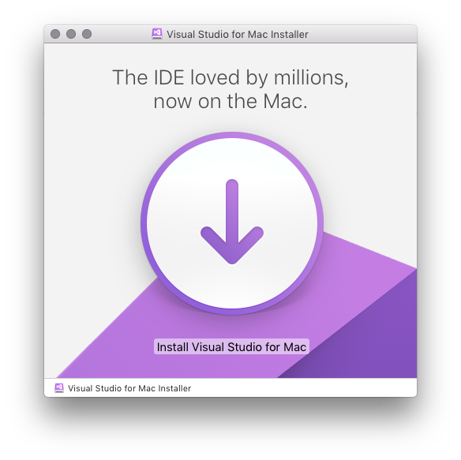
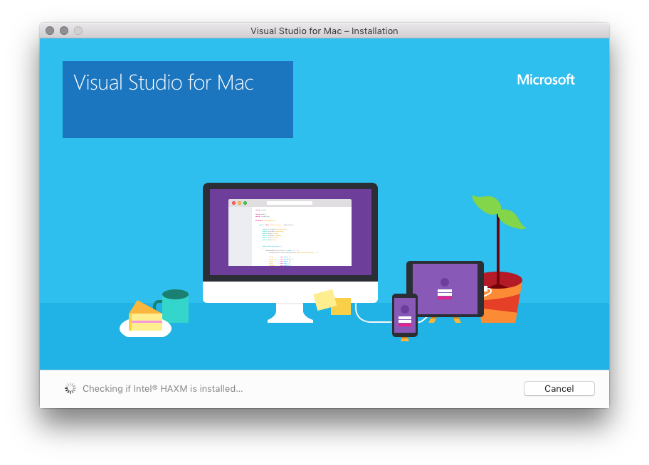
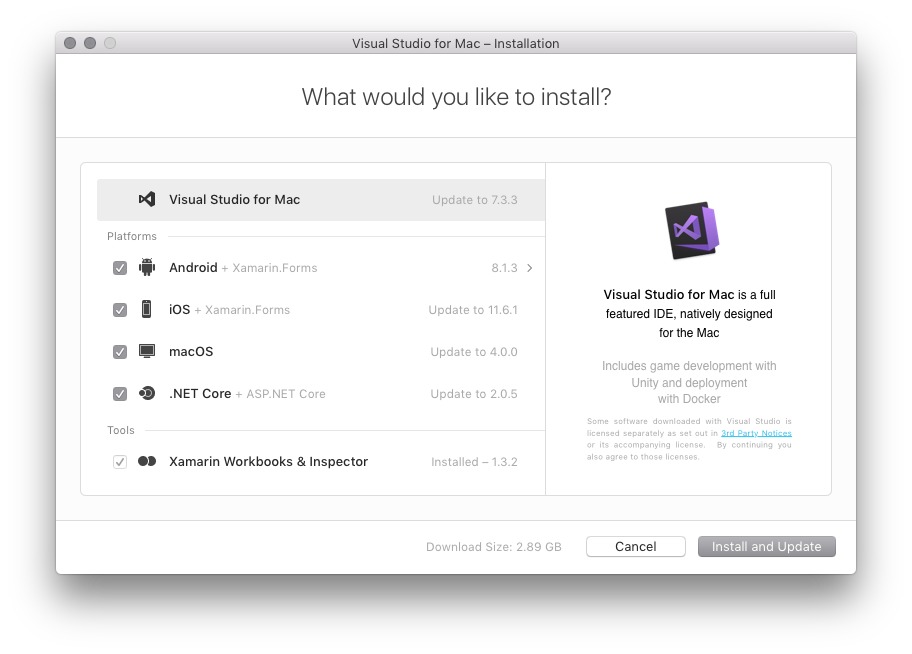
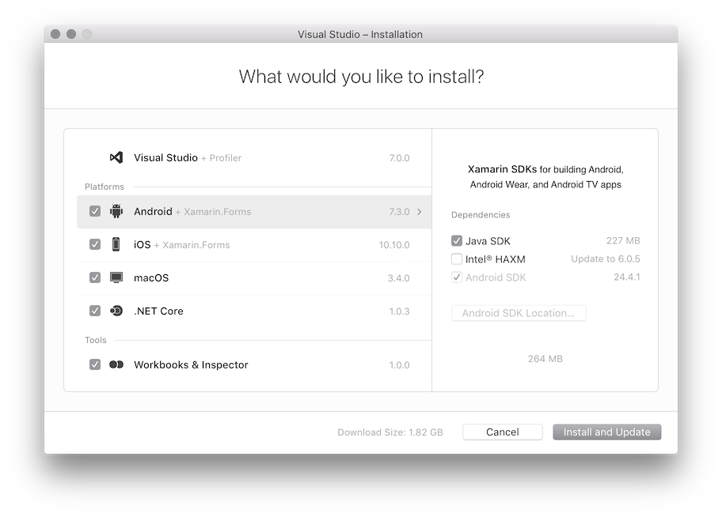
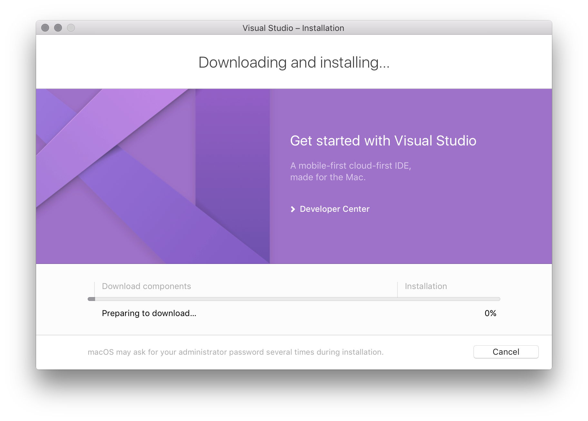
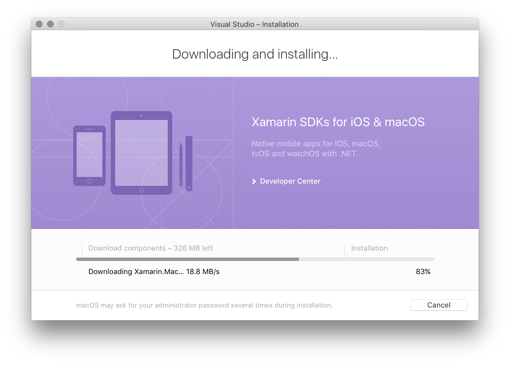
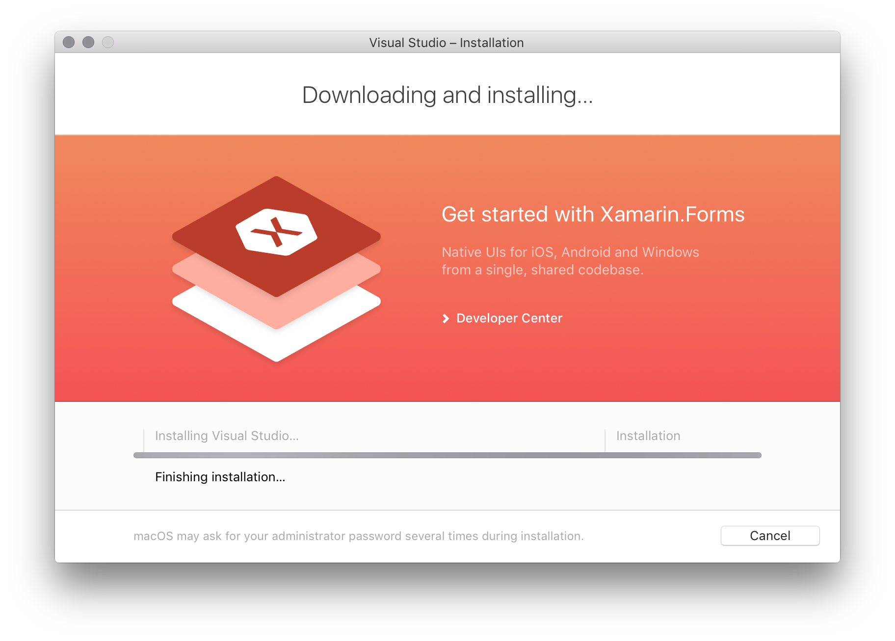
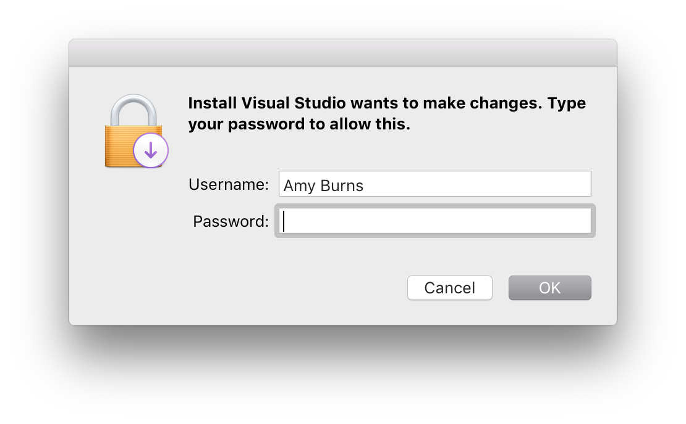
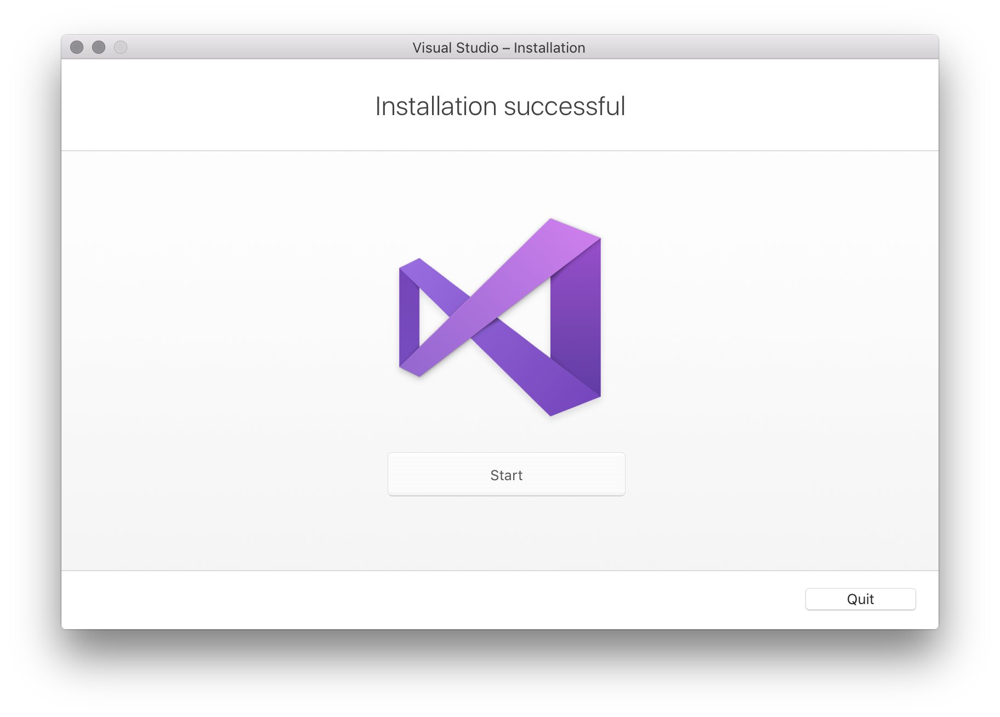

# Install Visual Studio 2017 for Mac

> [!NOTE]
> Visual Studio 2019 for Mac is [now available](installation.md?view=vsmac-2019). For older versions of Visual Studio for Mac, see the Visual Studio [downloads page](https://my.visualstudio.com/Downloads?q=Visual%20Studio%202017%20for%20Mac).

## Downgrading from Visual Studio 2019 for Mac?

For the best experience, before you downgrade you should ensure that you [uninstall](uninstall.md) Visual Studio 2019 for Mac. If you have issues that are causing you to download, make sure to let us know by [reporting a problem](report-a-problem.md).
 
## Requirements

To start developing native, cross-platform apps when you download Visual Studio for Mac there are a couple of things that you must install and set up in preparation.

For working with iOS in Visual Studio you need the following pieces:

- a Mac with macOS Sierra 10.12 or above
- Xcode 9.3 or above. The latest stable version is usually recommended.
- An Apple ID. If you don't have an Apple ID already you can create a new one at https://appleid.apple.com. It's necessary to have an Apple ID for installing and signing into Xcode.

## Install

1. Download Visual Studio for Mac from [my.visualstudio.com](https://my.visualstudio.com/Downloads?q=Visual%20Studio%202017%20for%20Mac)

2. Once the installer package is downloaded, click the **VisualStudioForMacInstaller.dmg** file to mount the installer and then run it by double-clicking the logo, as illustrated by the following image:

   

3. You might be prompted with an alert dialog similar to the following image. In this case, click **Open**:

   

4. The installer inspects your system to verify which components need to be installed or updated:

   

5. You'll then be presented with an alert dialog asking you to acknowledge the Privacy and License terms. Press the **Continue** button to acknowledge the terms:

   

6. The installer presents a list of required components that are missing and that need to be downloaded and installed. Select the products you wish to download here:

   

   If you do not wish to install all platforms, use the guide below to help you decide which platforms to install:

   * **Apps using Xamarin**:
      - Xamarin.Forms – Select **Android** and **iOS** platforms.
      - iOS only – Select **iOS** platform (Note that you will need to install [**Xcode**](https://developer.apple.com/xcode/)).
      - Android only – Select **Android** platform (Note that you should also select the relevant dependencies).
      - Mac only – Select **macOS** platform (Note that you will need to install [**Xcode**](https://developer.apple.com/xcode/)).
      - Fully cross-platform Xamarin apps – Select **Android**, **iOS**, and **macOS** platforms.
   * **.NET Core applications** – Select **.NET Core** platform.
   * **ASP.NET Core Web Applications** – Select **.NET Core** platform.
   * **Cross-platform Unity Game Development** – No additional platforms need to be installed beyond Visual Studio for Mac. Refer to the [Unity setup guide](/visualstudio/mac/setup-vsmac-tools-unity) for more information on installing the Unity extension.

   This installation screen displays the version and size of each individual component. You can click each component to display a list of dependencies for that component (for Android), see additional packages that it downloads (for .NET Core), or view any additional applications required (for iOS and macOS):

   

7. Once you are happy with your selection, select the **Install and Update** button to start the installation process.

8. The installer starts the download and install process of the selected items:

   

   

   

9. You might be prompted to elevate the permissions necessary for individual components that are needed to complete installation. Enter your administrator credentials here to continue the installation process:

   

10. Once the installation is successful, you can start developing apps in Visual Studio by pressing **Start**:

    

> [!NOTE]
> If you chose not install a platform or tool during the original installation (by unselecting it in step #6), you must run the [installer](https://visualstudio.microsoft.com/vs/) again if you wish to add the components later.

## Install Visual Studio for Mac behind a firewall or proxy server

To install Visual Studio for Mac behind a firewall, certain endpoints must be made accessible in order to allow downloads of the required tools and updates for your software.

Configure your network to allow access to the following locations:

- [Visual Studio endpoints](/visualstudio/install/install-visual-studio-behind-a-firewall-or-proxy-server)

## Next steps

Installing Visual Studio for Mac allows you to start writing code for your apps. The following guides are provided to guide you through the next steps of writing and deploying your projects.

### iOS

1. [Hello, iOS](https://developer.xamarin.com/guides/ios/getting_started/hello,_iOS/)
2. [Device Provisioning](https://developer.xamarin.com/guides/ios/getting_started/installation/device_provisioning)(To run your application on device).

### Android

1. [Using the Xamarin Android SDK Manager](https://developer.xamarin.com/guides/android/getting_started/installation/android-sdk/?ide=xs)
2. [Android SDK Emulator](https://developer.xamarin.com/guides/android/getting_started/installation/android-emulator/)
4. [Set Up Device for Development](https://developer.xamarin.com/guides/android/getting_started/installation/set_up_device_for_development/)

### .NET Core apps, ASP.NET Core web apps, Unity game development

For other Workloads, refer to the [Workloads](/visualstudio/mac/workloads) page.

## Related Video

> [!Video https://channel9.msdn.com/Shows/Visual-Studio-Toolbox/Visual-Studio-for-Mac-Acquisition/player]

## See also

- [Install Visual Studio 2017 (on Windows)](/visualstudio/install/install-visual-studio)
