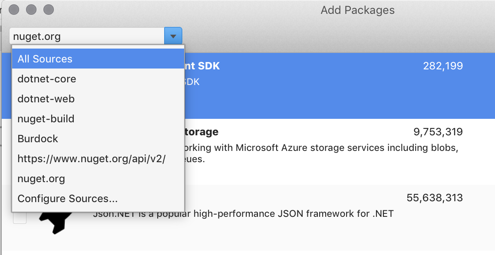

# Include a NuGet package in your project

NuGet is the most popular package manager for .NET development and is built in to Visual Studio for Mac and Visual Studio on Windows. You can search for and add packages to your Xamarin.iOS and Xamarin.Android projects using either IDE.

This article describes how to include a NuGet package in a project and demonstrates the tool chain that makes the process seamless.

## NuGet in Visual Studio for Mac

To demonstrate the NuGet package functionality, we'll first walk through creating a new application and adding a package to it. Then we'll discuss the IDE features that help manage packages.

## Create a new project

First, create a project named `HelloNuget` as illustrated below. This example shows the iOS Single View Application template, but any supported project type would work:


## Adding a Package

With the project open in Visual Studio for Mac, right-click on the **Packages** folder in the **Solution Pad** and select **Add Packages**:


This launches the **Add Packages** window. Ensure that the Source drop-down, is set to `nuget.org`:


When the window opens it loads a list of packages from the default package source: nuget.org. The initial results look like this:


Use the search box in the top-right corner to find a specific package, for example `azure`. When you've found a package that you wish to use, select it and click the **Add Package** button to begin installation.

[Add Azure NuGet Package](media/nuget-walkthrough-AddPackages2.png)

Once the package has been downloaded, it will be added to your project. The solution will change as follows:

* The **References** node will contain a list of all the assemblies that are part of a NuGet package.
* The **Packages** node displays each NuGet package that you have downloaded. You can update or remove a package from this list.
* A **packages.config** file will be added to the project. This XML file is used by the IDE to track which package versions are referenced in this project. This file should not be hand-edited, but you should keep it in version control. Note that a project.json file can be used instead of a packages.config file. The project.json file is a new package file format introduced with NuGet 3, which supports transitive restore. More detailed information on project.json can be found in the [NuGet documentation](/NuGet/Schema/Project-Json). The project.json file needs to be added manually and the project closed and re-opened before the project.json file is used in Visual Studio for Mac.

## Using NuGet Packages

Once the NuGet package has been added and the project references updated, you can program against the APIs as you would with any project reference.

Ensure that you add any required `using` directives to the top of your file:

```csharp
using Newtonsoft.Json;
```

Most NuGet provide additional information, such as a README or Project page link to the Nuget source. You can normally find a link to this in the package blurb on the Add Packages page:

[View Project Page link](media/nuget-walkthrough-project-page.png)

<a name="Package_Updates" class="injected"></a>

## Package Updates

Package updates can be done either all at once, by right-clicking on the **Packages** node, or individually on each component.

Right-click on **Packages** to access the context menu:


* **Add Packages** - Opens the window to add more packages to the project.
* **Update** - Checks the source server for each package and downloads any newer versions.
* **Restore** - Downloads any missing packages (without updating existing packages to newer versions).

Update and Restore options are also available at the Solution level, and affect all the projects in the solution.

You can also right-click on individual packages to access a context menu:


* **Version Number** - The version number is a disabled menu item - it is provided for informational purposes only.
* **Update** - Checks the source server and downloads a newer version (if it exists).
* **Remove** - Removes the package from this project and removes the relevant assemblies from the project's References.

## Adding Package Sources

Packages available for installation are initially retrieved from nuget.org. However, you can add other package locations to Visual Studio for Mac. This can be useful for testing your own NuGet packages under development, or to use a private NuGet server inside your company or organization.

In Visual Studio for Mac, navigate to **Visual Studio > Preferences > NuGet > Sources** to view and edit the list of package sources. Note that sources can be a remote server (specified by a URL) or a local directory.


Click **Add** to set-up a new source. Enter a friendly name and the URL (or file path) to the package source. If the source is a secure web server, enter the username and password as well, otherwise leave these entries blank:


Different sources can then be selected when searching for packages:



## Version Control

The NuGet documentation discusses [using NuGet without committing packages to source control](/nuget/consume-packages/packages-and-source-control). If you prefer not to store binaries and unused information in source control, you can configure Visual Studio for Mac to automatically restore packages from the server. This means that when a developer retrieves the project from source control for the first time, Visual Studio for Mac will automatically download and install the required packages.


Refer to your particular source control documentation for details on how to exclude the `packages` directory from being tracked.

## Related Video

> [!Video https://channel9.msdn.com/Shows/Visual-Studio-Toolbox/Visual-Studio-for-Mac-Using-NuGet/player]

## See also

* [Install and use a package in Visual Studio (on Windows)](/nuget/quickstart/install-and-use-a-package-in-visual-studio)
