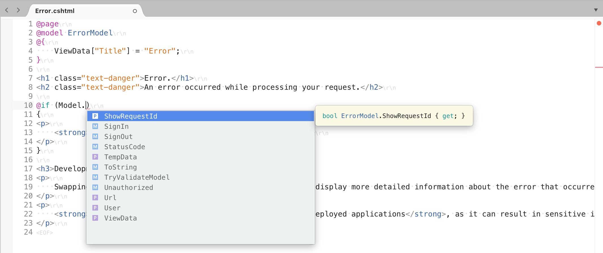

# Razor support

Visual Studio for Mac supports Razor editing, including IntelliSense and syntax highlighting in *.cshtml* files.

## Getting Started with Razor in Visual Studio for Mac

There are two options to consider when getting started with Razor in Visual Studio for Mac: Razor Pages in ASP.NET Core and ASP.NET Core MVC. For tutorials and more information on both options, visit one of the guides below:

- [Get started with Razor Pages in ASP.NET Core on macOS with Visual Studio for Mac](/aspnet/core/tutorials/razor-pages-mac/razor-pages-start?view=aspnetcore-2.1)
- [Get started with ASP.NET Core MVC and Visual Studio for Mac](/aspnet/core/tutorials/first-mvc-app-mac/start-mvc?view=aspnetcore-2.1)

## See also

- [Get started with C# and ASP.NET Core in Visual Studio (on Windows)](/visualstudio/ide/tutorial-csharp-aspnet-core)