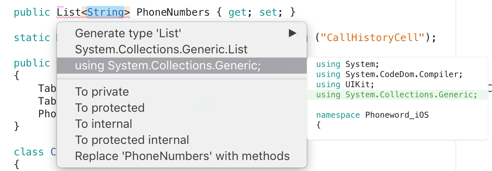

# Refactoring

Refactoring code is a way to rearrange, restructure, and clarify existing code while ensuring that the overall behavior of the code doesn't change.

Refactoring produces a healthier code base, making it more useable, readable, and maintainable for you or any other developer or user that might refer to the code.

Visual Studio for Mac's integration with Roslyn, Microsoft's open-source .NET compiler platform, allows for more refactoring operations.

## Renaming

The *Rename* refactoring command can be used on any code identifier (for example, a class name, property name etc.) to find all occurrences of that identifier and change them. To rename a symbol, right-click on it and choose **Refactor > Rename**, or the **Cmd + R** key binding:


This highlights the symbol and any references to it. When you start typing a new name it automatically changes all references in your code, and you can signal your completion of the rename by pressing **Enter**:


## Context actions

Context actions allow you to inspect any C# code, and see all possible refactoring options.

The **Resolve** and **Refactor** context items are combined into a single *Quick Fix...* item that will provide you with all the available Context actions:



Hovering over any of the context actions provides you with a preview of what will be added or removed from your code.

Alternatively, you can press **Option + Enter** anywhere in your code:


To enable these options, you must select *Enable source analysis of open files* in the options **Visual Studio for Mac > Preferences > Text Editor > Source Analysis**:


There are over 100 possible actions that can be suggested, which are enabled or disabled by browsing to **Visual Studio for Mac > Preferences > Source Analysis > C# > Code Actions** and selecting or unselecting the box next to the action:


### Common context actions

Some of the mostly commonly used context actions are explained below.

#### Extract method

The extract method refactoring operation allows you to create a new method by extracting a selection of code in an existing member. This action will do two things:

* Creates a new method containing the selected code
* Calls the new method in the place where the selected code was.

##### Example

1. Add the following code:

```csharp
    class MainClass
    {

        double CalculatePyramidVolume(double baseArea, double height)
        {

            double volume = (baseArea * height) / 3;

            return volume;
        }
    }
```

2. Highlight the line `double volume = (baseArea * height) / 3;`, right click on it, and select **Refactor > Extract Method**.

3. Use the arrow keys to select where the new method should be placed in your code.

#### Encapsulate field

The Encapsulate Field operation allows you to create a property from an existing field, and updates your code to reference the newly created property. By creating a property that encapsulates your field, you are disallowing direct access to your public field, meaning that other objects can't modify it.

This action will do the following:

* Changes the access modifier to private.
* Generates a getter and setter for the field (unless the field is read-only, in which case it will only create a getter).

## Source analysis

Source analysis analyzes your code on the fly by underlining potential errors and style violations, and providing auto fixes as context actions.

You can view all results of the source analysis for any file, at any time, by viewing the scroll bar on the right side of the text editor:


If you click on the circle at the top, you can iterate through each suggestion, with the highest severity issues showing first. Hovering over an individual result or line displays the issue, which can be fixed through context actions:


## Related Video

> [!Video https://channel9.msdn.com/Shows/Visual-Studio-Toolbox/Visual-Studio-for-Mac-Refactoring-Code/player]

## See also

- [Quick Actions (Visual Studio on Windows)](/visualstudio/ide/quick-actions)
- [Refactor code (Visual Studio on Windows)](/visualstudio/ide/refactoring-in-visual-studio)