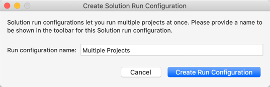
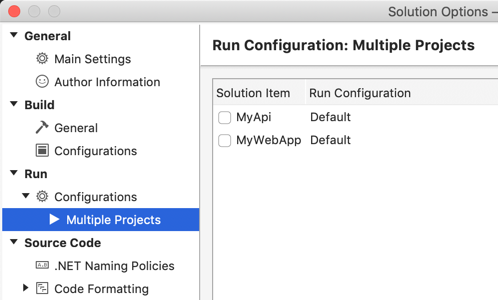
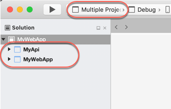

# Set multiple startup projects

Visual Studio for Mac allows you to specify that more than one project should be started when you debug or run your solution.

## To set multiple startup projects

1. In Solution Pad, select the solution (the top node).

2. Right-click the solution node and then select **Set Startup Projects**:

   

3. The **Create Solution Run Configuration** dialog box opens. This dialog box allows you to create a new named Solution Run Configuration for your solution. You can use any name you like. The default name is `Multiple Projects`.

   

4. Select **Create Run Configuration**. The **Solution Options** dialog box opens with the new Solution Run Configuration selected:

   

5. Select the projects that you want to start when you debug or run your app from Visual Studio for Mac:

   

6. Select **OK**. The new Solution Run Configuration is set as the active run configuration:

   

   You can see that two projects are configured to start because both projects are **bold** in Solution Pad. In the toolbar, the new run configuration is set as the current Solution Run Configuration.

## Next steps

- [Compiling and building in Visual Studio for Mac](compiling-and-building.md)
- [Understanding build configurations](configurations.md)
