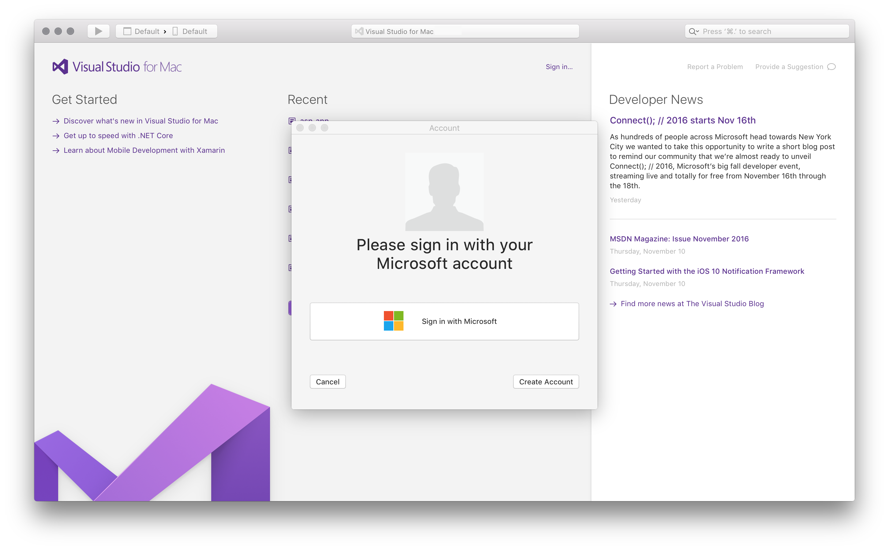
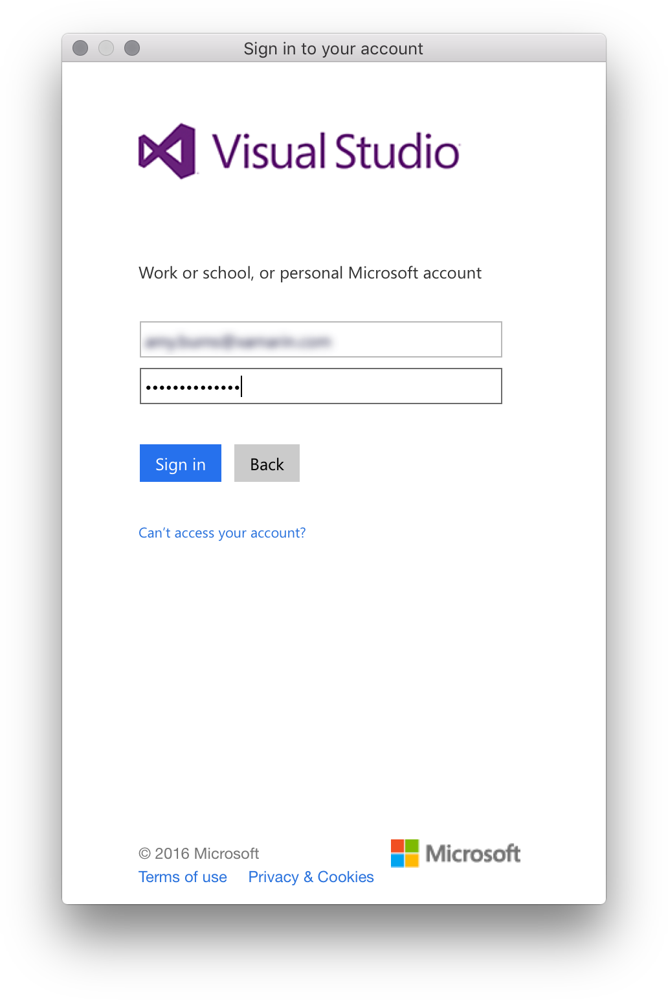

# Sign in to Visual Studio for Mac

When you launch Visual Studio for Mac for the first time, you're prompted to log in using a Microsoft account. Use a Microsoft account that is connected to the license that you wish to use. If you do not have a Microsoft account, see [How do I sign up for an account](https://support.microsoft.com/instantanswers/d18cc497-d839-cf50-dea8-f99c95f2bd16/sign-up-for-a-microsoft-account).

If you do decide not to log in straight away, you'll be able to use an evaluation copy for 30 days. After 30 days you must log in to continue using your copy of Visual Studio for Mac.

## How to sign in to Visual Studio for Mac

Make sure that you're connected to the internet before signing in to Visual Studio for Mac. Subscriptions can only be activated online.

To sign in to Visual Studio for Mac, do the following steps:

1. Click the **Sign in** link on the Welcome page to display the Accounts Dialog, and press the **Sign In** button:

    

2. Enter your Microsoft Credentials:

    

    You cannot use Xamarin credentials to log into Visual Studio for Mac.

3. After you've logged in, you'll see your license type. From this dialog, you can add additional Microsoft accounts that you might wish you use:

    

## Adding multiple user accounts

Visual Studio for Mac supports adding multiple accounts to your personalization account. These additional accounts will allow you to access resources, such as Azure, from any added account.

To add additional user accounts, follow the steps in the [How to sign in to Visual Studio for Mac](#how-to-sign-in-to-visual-studio-for-mac) section.

## See also

- [Sign in to Visual Studio (on Windows)](/visualstudio/ide/signing-in-to-visual-studio)
- [Work with multiple user accounts (Visual Studio on Windows)](/visualstudio/ide/work-with-multiple-user-accounts)