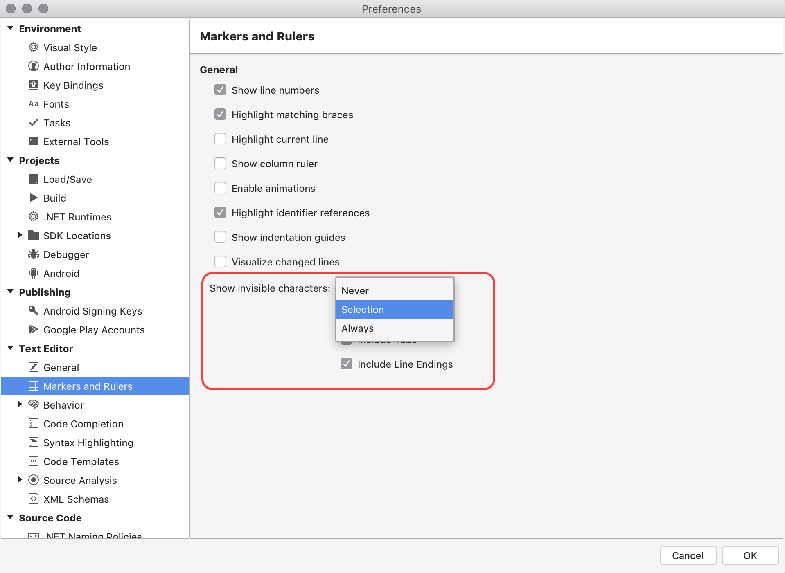
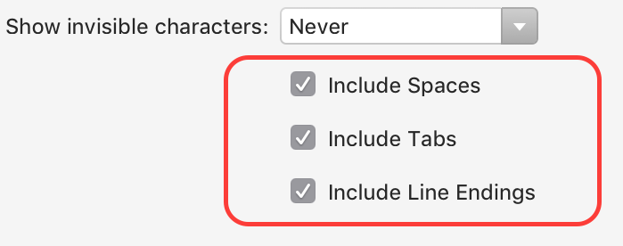
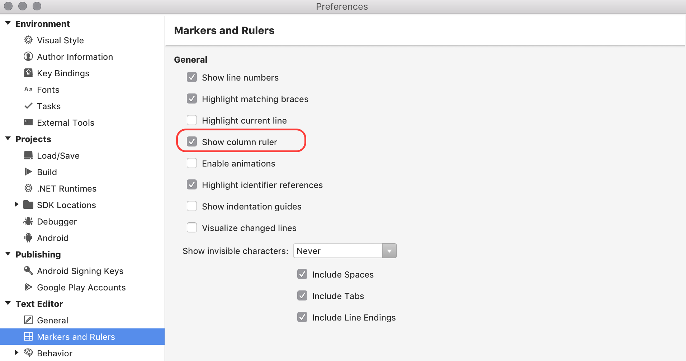

# Source editor

A reliable source editor is essential for writing code succinctly and efficiently. Visual Studio for Mac provides a sophisticated source editor that is at the center of your interactions with the IDE. The source editor provides features that you might expect and need to do your work with ease: From the basics such a syntax highlighting, code snippets, and code folding, to the benefits of its Roslyn compiler integration, such as fully functional IntelliSense code completion.

The source editor in Visual Studio for Mac allows for a seamless experience with all the other functionality in the IDE such as debugging, refactoring, and version control integration.

This article introduces some of the key features of the source editor and explores how you can use Visual Studio for Mac to be as productive as possible.

## The Source Editor Experience

Viewing and moving efficiently throughout code is an integral part of the development workflow. Exactly how you decide to view and maintain code is a personal decision, which varies between developers - and often between projects.

Visual Studio for Mac offers many powerful features to make cross-platform development as accessible and as useful as possible. The following sections describe some of the highlights.

## Code folding

Code folding makes it easier to manage large source code files by allowing developers to show or hide complete sections of code, such as using directives, boilerplate code and comments, and #region statements. Code folding is turned off by default in Visual Studio for Mac

To turn on code folding, navigate to **Visual Studio > Preferences > Text Editor > General > Code Folding**:

This menu also includes the option to fold #regions and comments by default, displaying a named hint, in place of code.

To show or hide sections, use the disclosure widget next to the line number:

You can also switch between showing and hiding the folds by using the **View > Folding > Toggle Fold / Toggle All Folds** menu item:

This menu item can also be used to enable or disable code folding.

## White space

It may be necessary for you to view invisible characters in source code. It's a visible way to make sure that you're adhering to coding standards and not needlessly wasting space. It's also useful when writing F#, which depends on precisely indented lines for evaluating code.

Set options to show whitespace by navigating to **Visual Studio > Preferences > Text Editor > Markers and Rulers**. Selecting this option allows setting _when_ invisible characters will be shown: Never, On Selection, or Always:

The option to show tabs, spaces, and line endings is also available:

Invisible characters are displayed as gray dots, as illustrated in the following image:

## Ruler

The column ruler is useful for determining line lengths, particularly when working on a team that has line length guidelines. The column ruler can be turned on or off by navigating to **Visual Studio > Preferences > Text Editor > Markers and Rulers** and selecting (or deselecting) **Show Column ruler**, as illustrated in the following image:

 This displays as a vertical light gray line in the source editor.

## Highlight identifier references

With the "Highlight identifier references" option is enabled, you can select any symbol in the source code and the source editor will provide a visual guide to all other references in that file. To turn on this option, go to **Visual Studio > Preferences > Text Editor > Markers and Rulers** and select _Highlight identifier references_, as illustrated in the following image:

The color of the highlight is also useful for denoting that something is being assigned or referenced. If something is assigned, it is highlighted in red; if it is referenced, it is highlighted in blue:

## See also

- [Features of the code editor (Visual Studio on Windows)](/visualstudio/ide/writing-code-in-the-code-and-text-editor)
- [Outlining (Visual Studio on Windows)](/visualstudio/ide/outlining)