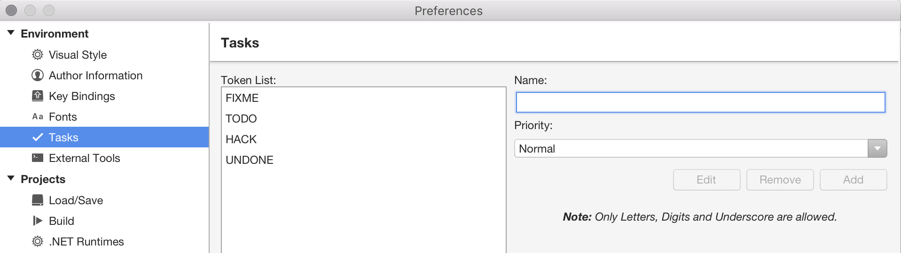
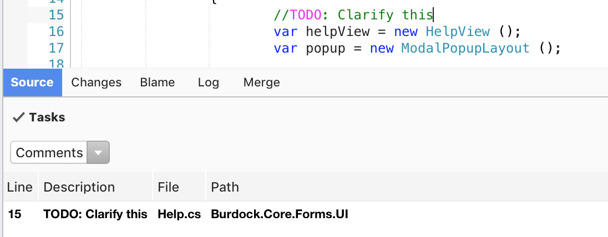

# Task Comments

When writing code, it's standard practice to explicitly comment unfinished or questionable code or quick workarounds with warnings. The default signal tokens provided by Visual Studio for Mac are TODO, HACK, FIXME, and UNDONE. Personalized tokens can be defined under **Visual Studio > Preferences > Environment > Tasks**, as illustrated in the following image:



To add a new task comment, add a comment that includes the task keyword. For example:

```csharp
//TODO: Finish this for all properties.
```

Visual Studio for Mac draws attention to these markers by highlighting them in the **Task List** pad, which can be displayed by navigating to **View > Pads > Task**:



## See also

- [Use the Task List (Visual Studio on Windows)](/visualstudio/ide/using-the-task-list)