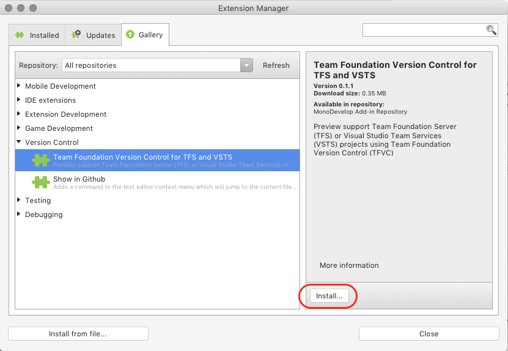
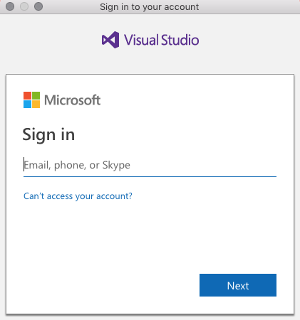
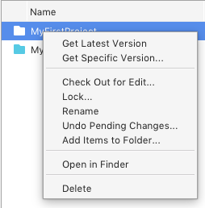
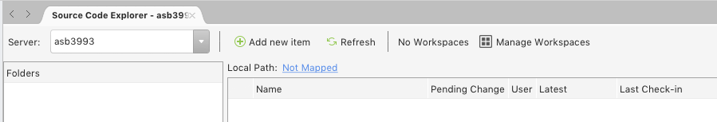
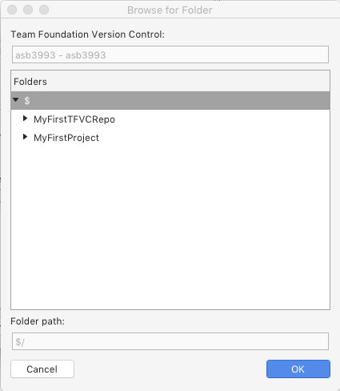
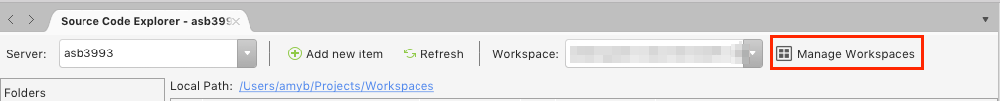
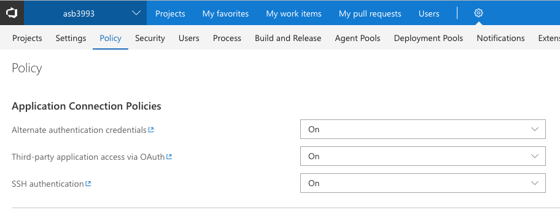

# Connecting to Team Foundation Version Control

> [!NOTE]
> For the best version control experience on macOS, we recommend using Git instead of Team Foundation Version Control (TFVC). 
Git is supported in Visual Studio for Mac and is the default option for repositories hosted in Team Foundation Server (TFS)/Azure DevOps. To learn more about using Git with TFS/Azure DevOps, see the [Setting up a Git Repository](/visualstudio/mac/set-up-git-repository) article.
>
> If you previously used the preview release of the TFVC extension for Visual Studio for Mac, it is no longer supported when upgrading to Visual Studio 2019 for Mac.

Azure Repos provides two models of version control: [Git](/azure/devops/repos/git/?view=azure-devops), a distributed version control system, and [Team Foundation Version Control](/azure/devops/repos/tfvc/index?view=azure-devops) (TFVC), a centralized version control system.

Visual Studio for Mac provides full support for Git repositories, but requires some workarounds to work with TFVC. If you're using TFVC for version control today, here are some solutions you can use to access your source code hosted in TFVC:

* [Use Visual Studio Code and the Azure Repos extension, for a graphical UI](#use-visual-studio-code-and-the-azure-repos-extension)
* [Connect to your repo using the Team Explorer Everywhere Command Line Client (TEE-CLC)](#connecting-using-the-team-explorer-everywhere-command-line-client)
* [Connect to TFVC using the (unsupported) Team Foundation Version Control extension for Visual Studio for Mac](#connect-to-tfvc-using-the-team-foundation-version-control-extension)

The rest of this article walks you through the options listed above.

## Requirements

* Visual Studio Community, Professional, or Enterprise for Mac version 7.8 and later.
* Azure DevOps Services, Team Foundation Server 2013 and later, or Azure DevOps Server 2018 and later.
* A project in Azure DevOps Services or Team Foundation Server/Azure DevOps Server, configured to use Team Foundation Version Control.

## Use Visual Studio Code and the Azure Repos extension

If you like to work with a graphical interface to manage your files in version control, then the Azure Repos extension for Visual Studio Code provides a supported solution from Microsoft. To get started, download [Visual Studio Code](https://code.visualstudio.com) and then learn how to [configure the Azure Repos extension](https://marketplace.visualstudio.com/items?itemName=ms-vsts.team).

## Connecting using the Team Explorer Everywhere Command Line Client

If you're comfortable using the macOS Terminal, then the Team Explorer Everywhere Command Line Client (TEE-CLC) provides a supported way to connect to your source in TFVC.

You can follow the steps below to set up your connection to TFVC and commit changes.

### Setting up the TEE-CLC

There are two ways to get setup with the TEE-CLC.

* Use Homebrew to install the client, or
* Download and manually install the client

The easiest solution is **using HomeBrew**, which is a package manager for macOS. To install using this method:

1. Launch the macOS Terminal application.
1. Install Homebrew using the Terminal and the instructions on the [Homebrew home page](https://brew.sh/).
1. Once Homebrew is installed, run the following command from your Terminal: `brew install tee-clc`

To **setup the TEE-CLC manually**:

1. [Download the latest version of the tee-clc](https://github.com/Microsoft/team-explorer-everywhere/releases) from the releases page of the Team Explorer Everywhere GitHub repo (e.g. tee-clc-14.134.0.zip at the time of this writing).
1. Extract the content of the .zip to a folder on disk.
1. Open the macOS Terminal app and use the `cd` command to switch to the folder you used in the previous step.
1. From within the folder, run the command `./tf` to test that the command line client can run, you may be prompted to install Java or other dependencies.

Once the TEE-CLC is installed, you can run the command `tf eula` to view and accept the license agreement for the client.

Finally, to authenticate with your TFS/Azure DevOps environment, you'll need to create a personal access token on the server. Learn more about [authenticating with personal access tokens](/azure/devops/integrate/get-started/authentication/pats?view=azure-devops). When creating a personal access token to use with TFVC, be sure to provide Full Access when configuring the token.

### Using the TEE-CLC to connect to your repo

To connect to your source code, you first need to create a workspace using the `tf workspace` command. For example, the following commands connect to an Organization in Azure DevOps Services called "MyOrganization": 

```bash
export TF_AUTO_SAVE_CREDENTIALS=1
tf workspace -new MyWorkspace -collection:https://dev.azure.com/MyOrganization
```

The `TF_AUTO_SAVE_CREDENTIALS` environment setting is used to save your credentials so you aren't prompted to enter them multiple times. When prompted for a user name, use the personal access token you created in the previous section and use a blank password.

To create a mapping of your source files to a local folder, you'll use the `tf workfold` command. The following example will map a folder named "WebApp.Services" from the "MyRepository" TFVC project and set it up to be copied into the local ~/Projects/ folder (i.e. a "Projects" folder in the current users's home folder).

```bash
tf workfold -map $/MyRepository/WebApp.Services -workspace:MyWorkspace ~/Projects/
```

Finally, you use the following command to get the source files from the server and copy them locally:

```bash
tf get
```

### Committing changes using the TEE-CLC

After you've made changes to your files in Visual Studio for Mac, you can switch back to the Terminal to check in your edits. The `tf add` command is used to add files to the list of pending changes to be checked-in and the `tf checkin` command performs the actual check-in to the server. The `checkin` command includes parameters to add a comment or associate a related work item. In the following code snippet, all files in a `WebApp.Services` folder are added, recursively, to the checkin. Then, the code is checked in with a comment and associated with a work item with the ID "42".

```bash
cd WebApp.Services
tf add * /recursive
tf checkin -comment:"Replaced 'Northwand' typos with the correct word Northwind" -associate:42
```

To learn more about the commands mentioned here, or others, you can use the following command from the Terminal:

`tf help`

## Connect to TFVC using the Team Foundation Version Control extension

> [!NOTE]
> For the best version control experience on macOS, we recommend using Git instead of Team Foundation Version Control (TFVC). 
Git is supported in Visual Studio for Mac and is the default option for repositories hosted in Team Foundation Server (TFS)/Azure DevOps. To learn more about using Git with TFS/Azure DevOps, see the [Setting up a Git Repository](/visualstudio/mac/set-up-git-repository) article.
>
> If you previously used the preview release of the TFVC extension for Visual Studio for Mac, it is no longer supported when upgrading to Visual Studio 2019 for Mac.

In the Visual Studio for Mac Extension gallery, there is a Team Foundation Version control extension that offers limited support to connect to TFVC. The extension is not supported and has several known issues, so your experience may vary when using it.

To install the extension, launch Visual Studio for Mac and choose the **Visual Studio > Extensions** menu. In the **Gallery** tab, select **Version Control > Team Foundation Version Control for TFS and Azure DevOps** and click **Install...**:



Follow the prompts to install the extension. Once it's installed, restart the IDE.

### Updating the extension

Updates to the TFVC extension are made periodically. To access updates, choose **Visual Studio > Extensions...** from the menu and select the **Updates** tab. Select the extension in the list and press the **Update** button:

Press **Install** on the next dialog to uninstall the old package and install the new one.

### Using the extension

Once the extension is installed, select the **Version Control > TFS/Azure DevOps > Open from Remote Repository...** menu item.


Choose either VSTS or Team Foundation Server to get started and press **Continue**:


#### Azure Repos Authentication

When you select a project that is hosted on Azure Repos, you're prompted to enter your Microsoft account details:



#### TFS Authentication

To connect to TFS, enter the server details and your account credentials. Enter a domain to use NTLM authentication, otherwise leave blank to use basic authentication. Select **Add Server**:


### Selecting a project

Once you've successfully authenticated, you can see a list of repositories that are associated with the account in the **Open from Source Control** dialog:


This dialog is organized with the following nodes:

- Azure DevOps organization or collection – This displays all organizations connected to the Microsoft account you logged in with.
- Projects - In each organization or collection, you can have a number of projects. A project is where source code, work items, and automated builds are hosted.

At this point, you can search and filter by the name of a project or organization.

#### Adding a new server

To add a new server to the list, press the **Add Host** button on the **Open from Source Control** dialog:


Select the provider from the list, and enter your credentials:


### Creating a new workspace

To start working with a project, you need to have a _workspace_. If you don't already have a workspace, you can create one from the **Workspace** combobox in the **Open from Source Control** dialog:


Set the name and local path for your new workspace and select **Create Workspace**:


### Using the Source Code Explorer

Once you've created a workspace and mapped your project, you can start working with the _Source Code Explorer_.

To open the Source Code Explorer, select the **Version Control > TFS/Azure DevOps > Source Control Explorer** menu item.

The Source Code Explorer enables you to navigate through all the mapped projects, their files, and  folders. It also allows you to perform all the basic source control actions such as:

- Get the latest version
- Get a specific version
- Check files in and out
- Lock and unlock files
- Add, delete, and rename files
- View history
- Compare changes.

Many of these actions are available through context actions on the project:



### Managing workspaces

If you haven't already created a workspace, as described in the [Creating a workspace](#creating-a-new-workspace) section, you'll notice that the Source Code Explorer is empty:



To set up your remote project with a local workspace, use the following steps:

1. Select the **Server** from the combobox.
1. Note that there are "no workspaces" and that the Local Path is "Not Mapped". Select the **Not Mapped** link to display the **Create new Workspace** dialog.
1. Provide a name for the workspace and then click **Add Working Folder** to map the project to a local folder on your computer:

    

1. Select the "$" folder to map all projects on your server to the same workspace, or select an individual project, and click **OK**:

    

1. Select the location on your local machine that you wish to map the project(s) to and click **Select Folder**.
1. Confirm the details of the new workspace by pressing **OK**

    

Once your workspace is set up, it can be changed or removed by clicking the **Manage Workspaces** button in the Source Code Explorer.



## Troubleshooting and Known Issues

#### Problems using basic authentication

The following options can be used to authenticate with a server:

- Oauth
- Basic
- Ntlm

To use basic authentication it is necessary to enable **Alternative authentication credentials** in Azure DevOps Services, by following the steps below:

1. Sign in to your Azure DevOps organization as the owner (https:\//dev.azure.com/{organization}/{project}).

2. From your organization toolbar, select the gear icon and select **Policy**:

    

3. Review your application connection settings. Change these settings, based on your security policies:

    

#### I do not see anything in TFVC

To set up Team Foundation Version Control (TFVC) on your dev machine, you **must** create a workspace, as described in the [Managing workspaces](#managing-workspaces) section.

In Source Control Explorer, press the **Manage Workspaces** Button. Follow the steps to map the project to a folder on your dev machine.

#### I do not see any / all of my projects

After authenticating you should see the list of projects. By default, only TFS projects are shown. To see other types of projects, check the "See all projects" box.

Keep in mind that projects that are on the server will not appear if you don't have the correct privileges.

##### I am getting the error "Cannot create the workspace. Please, try again"

When trying to [create a new workspace](#creating-a-new-workspace), you should make sure the following conditions are met:

- No use of invalid characters in the workspace name.
- The name must be less than 64 characters.
- The local path cannot be used by any other workspaces.

### See also

- [Develop and share your code in TFVC using Visual Studio (on Windows)](/azure/devops/repos/tfvc/share-your-code-in-tfvc-vs)