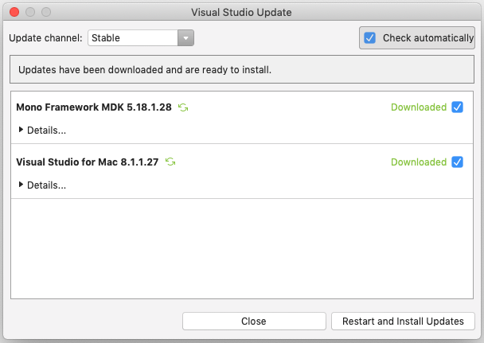
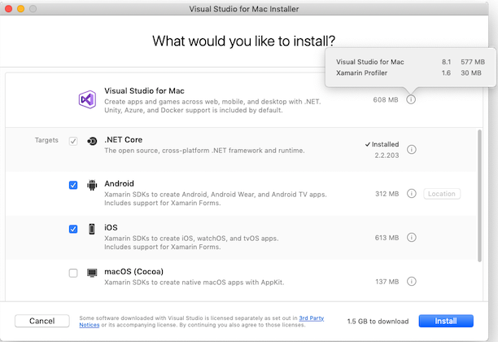

# Update Visual Studio 2017 for Mac (version 7) to Visual Studio 2019 for Mac (version 8.0)

Visual Studio 2019 for Mac brings lots of new improvements: a brand new C# editor, a new start up experience, support for multiple instances, and a host of new improvements for Xamarin, Unity, and .NET Core developers. For more information on everything included in Visual Studio for Mac 2019, check out the following blog posts:

- [Visual Studio 2019 for Mac is now available](https://devblogs.microsoft.com/visualstudio/visual-studio-2019-for-mac-is-now-available/)
- [Visual Studio 2019 for Mac version 8.1 is now available (and a Preview for 8.2)](https://devblogs.microsoft.com/visualstudio/visual-studio-2019-for-mac-version-8-1-is-now-available-and-a-preview-for-8-2/)

> [!IMPORTANT]
> There is a known issue with Visual Studio 2017 for Mac **version 7.7.3**, where the updater will continually show "Error retrieving update information". If this happens, [Download Visual Studio for Mac](https://visualstudio.microsoft.com/vs/mac/) and follow the steps to [install](/visualstudio/mac/installation?view=vsmac-2019) Visual Studio 2019 for Mac. Note that this will overwrite your existing instance of Visual Studio 2017 for Mac.

To get the latest version you can either use the [updater](/visualstudio/mac/update?view=vsmac-2017) by browsing to **Visual Studio > Check for Updates…**:

Or, if you’d prefer or are having issues with the updater, [download](https://visualstudio.microsoft.com/vs/mac/) the brand new 2019 installer and get up and running quickly:

