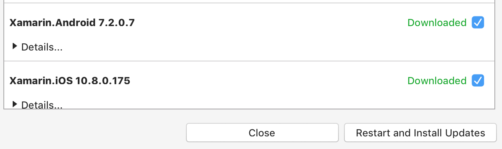

# Update Visual Studio for Mac

Visual Studio for Mac distributes updates for the IDE and supported frameworks on a regular basis. These updates can be in the form of new features, improvements, and bug fixes.

Visual Studio for Mac provides three channels to get these latest versions:

* **Stable** - Provides thoroughly tested updates. This channel is recommended for the best development experience.
* **Beta** / **Alpha** - Provides early access to updates that are candidates for release in the Stable Channel. These releases may not be reliable for everyday use.

## Checking for updates

You can use the **Visual Studio Updater** box to check for new updates, change channels, and download and install updates.

To open the **Visual Studio Updater**, browse to **Visual Studio > Check for Updates**:

This displays the updater box:

## Changing the Updater channel

To change the channel select it from the channel drop down and press the **Switch Channel button**:

## Downloading and installing updates

Switching channels automatically starts the download process of new updates.

If you have selected the option to **Check Automatically**, the updater box will pop up when Visual Studio for Mac is open to let you know that new updates are available. It will also give you the option to start downloading them.

To start installing updates, select the **Restart and Install Updates** button:

Depending on the components that need to be installed, you may need to accept additional licenses or enter your machine's administrator username and password.

## See also

- [Update Visual Studio (on Windows)](/visualstudio/install/update-visual-studio)