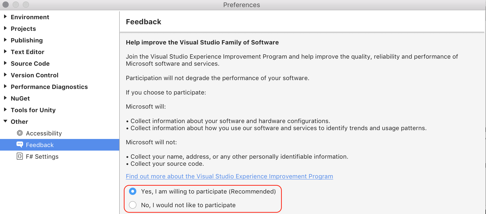

# Visual Studio Customer Experience Improvement Program

The Visual Studio Customer Experience Improvement Program (VSCEIP) is a program designed to help Microsoft improve Visual Studio for Mac over time. This program collects information about computer hardware and how people use Visual Studio for Mac, without interrupting the users in their tasks at the computer. The information that is collected helps Microsoft identify which features to improve. This article describes how to opt in or out of the VSCEIP.

For more information about the information collected, processed, or transmitted by the VSCEIP, see the [Microsoft Privacy Statement](https://privacy.microsoft.com/privacystatement).

## Choice and control over the Visual Studio Customer Experience Improvement Program

The VSCEIP is turned on by default. You can turn it off, or back on again, by following the instructions below.

1. Open Visual Studio for Mac.

1. From the menu bar, choose **Visual Studio > Preferences > Other > Feedback**.

1. Select your preference for participation:

    

[!INCLUDE [GDPR-related guidance](../../docs/misc/includes/gdpr-hybrid-note.md)]

## See also

* [Customer Experience Improvement Program (Visual Studio on Windows)](/visualstudio/ide/visual-studio-experience-improvement-program)
* [System-generated logs collected by Visual Studio (on Windows)](/visualstudio/ide/diagnostic-data-collection)
* [How to report a problem with Visual Studio for Mac](report-a-problem.md)
* [Visual Studio for Mac Developer Community](https://developercommunity.visualstudio.com/spaces/41/index.html)
* [Microsoft Privacy Statement](https://privacy.microsoft.com/privacystatement)
