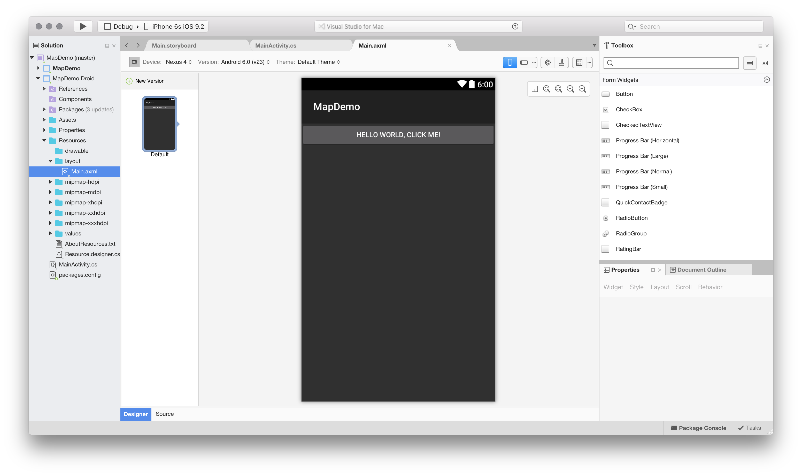
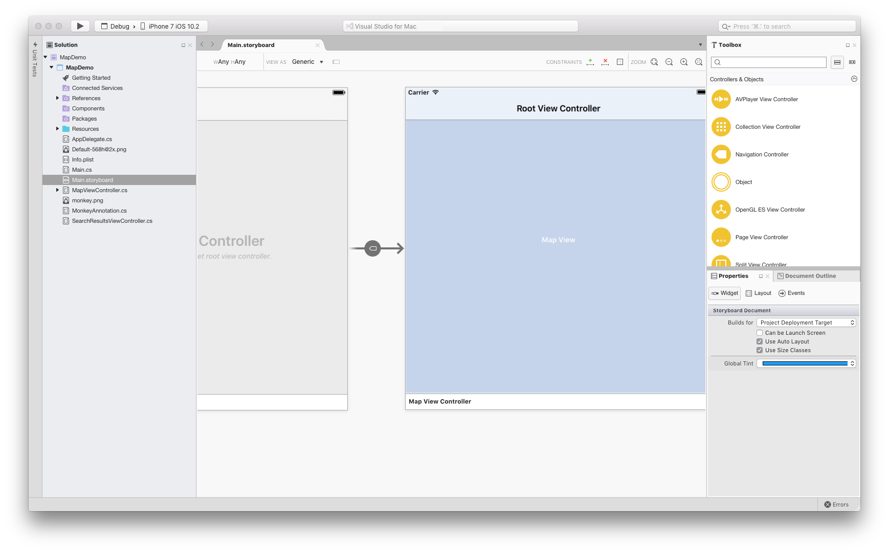

# Xamarin mobile app development

First-class support for [Xamarin](/xamarin) allows you to develop rich native experiences for Android, macOS, iOS, tvOS, and watchOS. Xamarin.Forms cross-platform applications help you share XAML-based UI code between Android, iOS, and macOS without limiting access to native functionality.

## Android

Visual Studio for Mac has its own integrated Android SDK manager, allowing you access to the SDKs you want your app to target.

For Android applications, Visual Studio for Mac includes its own designer, which works with Android `.axml` files to
visually construct user interfaces. Visual Studio for Mac will open these files in its Android Designer, as illustrated in the following image:

For more information on the Android Designer, see the [Xamarin.Android Designer Overview](/xamarin/android/user-interface/android-designer/index) guide.

## iOS

The iOS Designer is fully integrated with Visual Studio for Mac and enables visual editing of .xib and Storyboard files to create iOS, tvOS, and WatchOS UIs and transitions. The entire user interface can be built using drag-and-drop functionality between the Toolbox and Design Surface, while using an intuitive approach to handling events. The iOS Designer also supports [custom controls](/xamarin/ios/user-interface/designer/ios-designable-controls-overview) with the added benefit of design-time rendering.

For more information on using the iOS Designer, see the [Designer](/xamarin/ios/user-interface/designer/?tabs=macos) guides.

### Mac

Xamarin provides native Mac API bindings that allow you to create beautiful Mac applications.

For more information on writing Mac applications with Visual Studio for Mac, refer to the [Xamarin.Mac](/xamarin/mac/get-started/index) guides.

## Xamarin Enterprise features

> [!Note]
> These products can only be used with a Visual Studio Enterprise subscription.

### Profiler

The Xamarin Profiler has three instruments available for profiling. The [Introduction to the Xamarin Profiler](/xamarin/tools/profiler/index?tabs=macos) guide explores what these instruments measure and how they analyze your application, and clarifies the meaning of the data presented on each screen.

### Inspector

The Xamarin Inspector provides an interactive C# console with user tools. It can be used as a debugging or diagnostics aid when inspecting live applications, as a teaching tool, as a documentation tool, or an experimentation tool.

It consists of a standalone application that provides a rich C# console that can target various programming platforms (Android, iOS, Mac, and Windows) and integrate into your IDEs debugging workflow.

For more information, see the [Xamarin Inspector](/xamarin/tools/inspector/) guide.