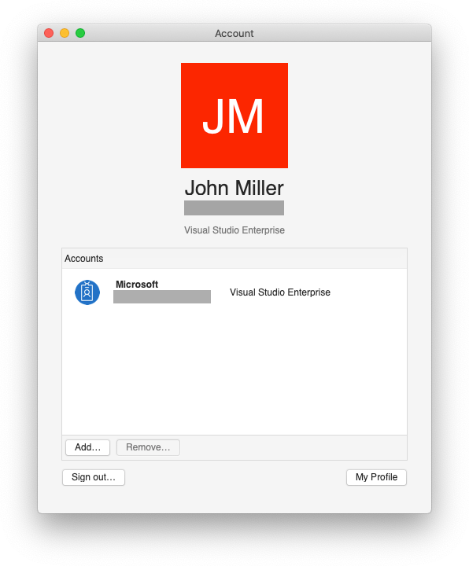

# Activation

Visual Studio for Mac provides you with three different subscription levels to choose from, all accessible from one download:

* Visual Studio Enterprise for Mac
* Visual Studio Professional for Mac
* Visual Studio Community for Mac

To start using a subscription, log in to Visual Studio for Mac by following the steps in the [Signing in to Visual Studio for Mac](~/signing-in.md) guide. This will automatically activate your license, and display it in the accounts dialog:

## Update expired licenses 

If your subscription has expired, you have two options:

1. Renew your subscription. You can renew your subscription by browsing to [https://www.visualstudio.com/vs/pricing/](https://www.visualstudio.com/vs/pricing/).

2. If you have another account with an active subscription, you can add it to Visual Studio for Mac as detailed in the [Adding multiple user accounts](~/signing-in.md) topic. Visual Studio for Mac will detect the best available license from all accounts that you have added. 

## Product key usage

Currently, there is no way to utilize a product key to enable Professional or Enterprise entitlements for Visual Studio for Mac. To use Visual Studio Enterprise for Mac or Visual Studio Professional for Mac you must have a relevant [subscription](https://www.visualstudio.com/subscriptions/) and be [signed in](~/signing-in.md) to the IDE.

## Offline activation

> [!NOTE]
> There is currently no offline activation for Visual Studio for Mac. 
> To activate your subscription, you must be connected to the internet when signing in.

To activate your Visual Studio 2017 for Mac Professional or Enterprise subscription, you must be connected to the internet when signing in.  

**Note**: Currently there is no offline activation for Visual Studio Professional for Mac or Visual Studio Enterprise for Mac. However, Visual Studio 2017 for Mac can be used in environments without an internet connection in accordance with the license.

If you have purchased Visual Studio Enterprise 2017 for Mac for machines without an internet connection, you may continue to use Visual Studio for Mac without activation, but Xamarin Inspector, Xamarin Profiler, and embedded assemblies features will not be available.