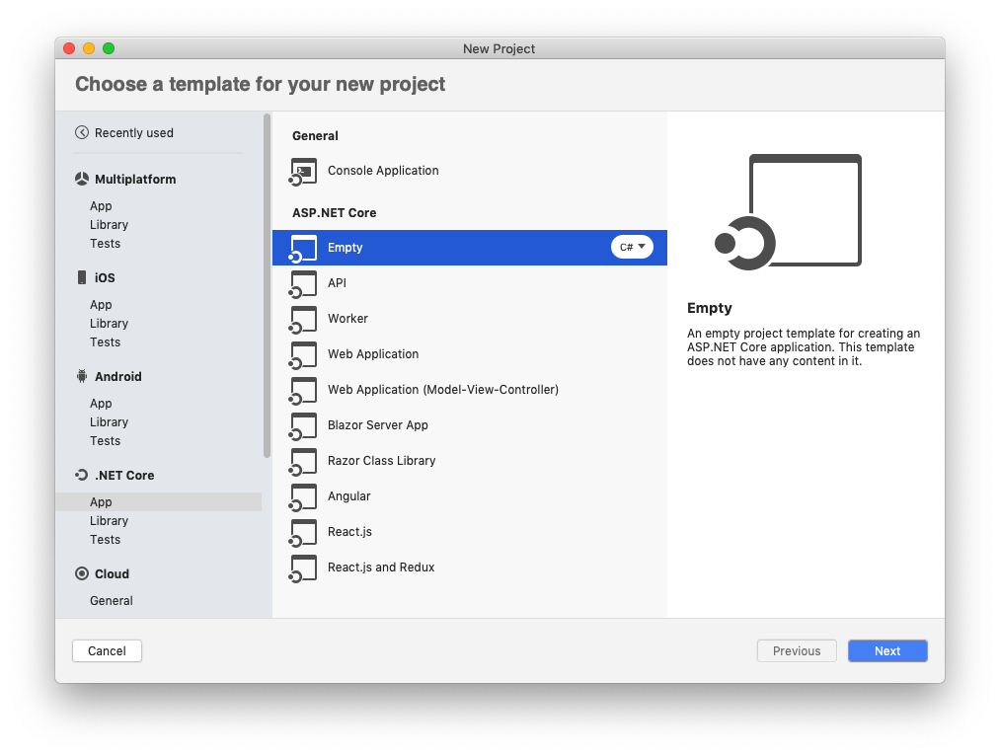
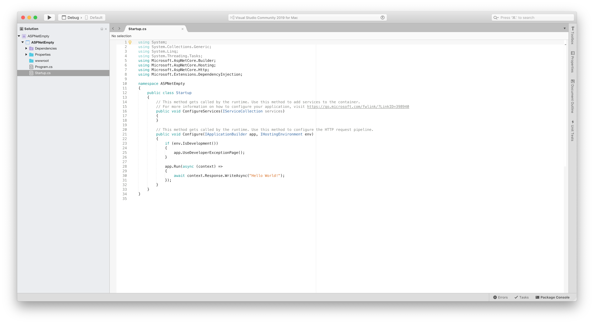
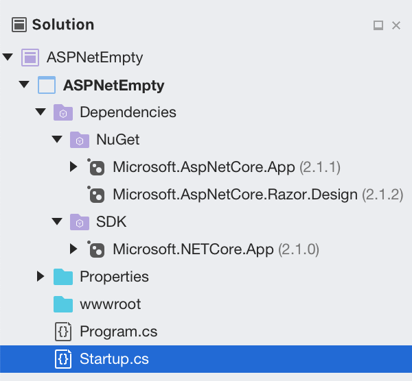
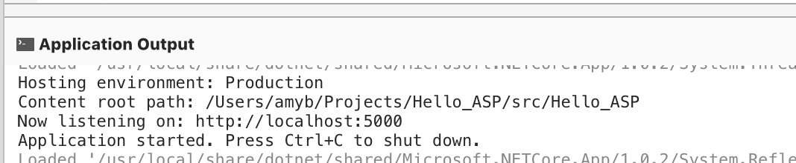
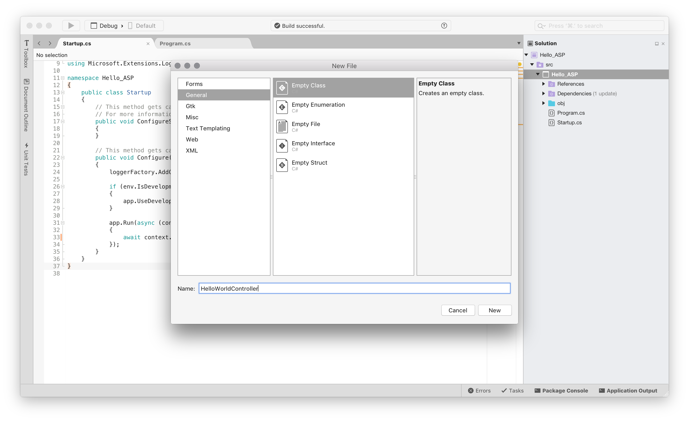
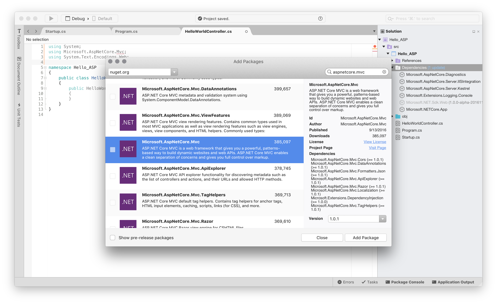
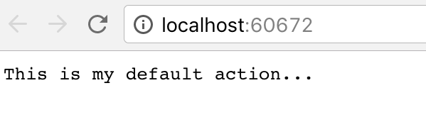
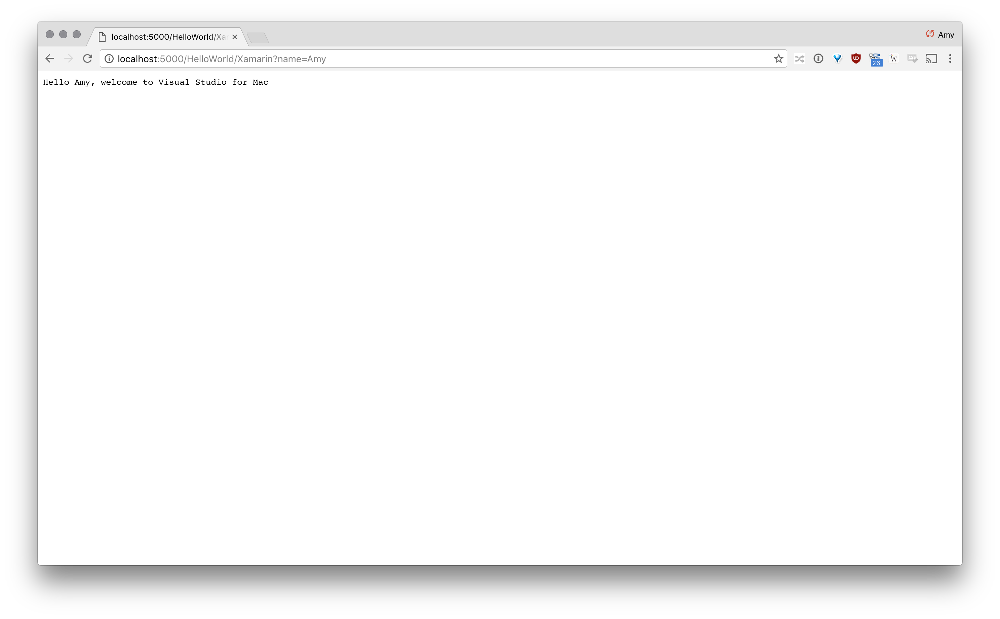

# Getting Started with ASP.NET Core

 Visual Studio for Mac makes it easy to develop your app’s service with its support for the latest ASP.NET Core Web development platform. ASP.NET Core runs on .NET Core, the latest evolution of the .NET Framework and runtime. It’s been tuned for fast performance, factored for small install sizes, and reimagined to run on Linux and macOS, as well as Windows.

## Installing .NET Core

.NET Core 2.1 is automatically installed when you install Visual Studio for Mac.

## Creating an ASP.NET Core app in Visual Studio for Mac

Open Visual Studio for Mac. On the Start Screen, select **New Project...**



This will display the New Project dialog, allowing you to select a template to create your application.

There are a number of projects that will provide you with a pre-built template to start building your ASP.NET Core Application. These are:

- **.NET Core > Empty**
- **.NET Core > API**
- **.NET Core > Web Application**
- **.NET Core > Web Application (Model-View-Controller)**


Select the **ASP.NET Core Empty Web Application** and press **Next**. Give the Project a Name and press **Create**. This creates a new ASP.NET Core app. In the solution pad's left pane, expand the second arrow and then select **Startup.cs**. It should look similar to the image below:



The ASP.NET Core Empty template creates a web application with two default files: **Program.cs** and **Startup.cs**, which are explained below. It also creates a Dependencies folder, which contains your project’s NuGet package dependencies such as ASP.NET Core, the .NET Core framework, and the MSBuild targets that build the project:



### Program.cs

Open and inspect the **Program.cs** file in your project. Notice that several things are happening in the `Main` method – the entry into your app:

```csharp
    public class Program
    {
        public static void Main(string[] args)
        {
            CreateWebHostBuilder(args).Build().Run();
        }

        public static IWebHostBuilder CreateWebHostBuilder(string[] args) =>
            WebHost.CreateDefaultBuilder(args)
                .UseStartup<Startup>();
    }
```

An ASP.NET Core app creates a web server in its main method by configuring and launching a host via an instance of [`WebHostBuilder`](/aspnet/core/fundamentals/hosting). This builder provides methods to allow the host to be configured. In the template app the following configurations are used:

* `.UseStartup<Startup>()`: Specifies the Startup class.

However, you can also add additional configurations, such as:

* `UseKestrel`: Specifies the Kestrel server will be used by the app
* `UseContentRoot(Directory.GetCurrentDirectory())`: Uses the web project's root folder as the app's content root when the app is started from this folder
* `.UseIISIntegration()`: Specifies that the app should work with IIS. To use IIS with ASP.NET Core both `UseKestrel` and `UseIISIntegration` need to be specified.

### Startup.cs

The Startup class for your app is specified in the `UseStartup()` method on the `CreateWebHostBuilder`. It is in this class that you will specify the request handling pipeline, and where you configure any services.

Open and inspect the **Startup.cs** file in your project:

```csharp
    public class Startup
    {
        // This method gets called by the runtime. Use this method to add services to the container.
        // For more information on how to configure your application, visit https://go.microsoft.com/fwlink/?LinkID=398940
        public void ConfigureServices(IServiceCollection services)
        {
        }

        // This method gets called by the runtime. Use this method to configure the HTTP request pipeline.
        public void Configure(IApplicationBuilder app, IHostingEnvironment env)
        {
            if (env.IsDevelopment())
            {
                app.UseDeveloperExceptionPage();
            }

            app.Run(async (context) =>
            {
                await context.Response.WriteAsync("Hello World!");
            });
        }
    }
```

This Startup class must always adhere to the following rules:

- It must always be public
- It must contain the two public methods: `ConfigureServices` and `Configure`

The `ConfigureServices` method defines the services that will be used by your app.

The `Configure` allows you to compose your request pipeline using [Middleware](/aspnet/core/fundamentals/middleware). These are components used within an ASP.NET application pipeline to handle requests and responses. The HTTP pipeline consists of a number of request delegates, called in sequence. Each delegate can choose to either handle the request itself, or pass it to the next delegate.

You can configure delegates by using the `Run`,`Map`, and `Use` methods on `IApplicationBuilder`, but the `Run` method will never call a next delegate and should always be used at the end of your pipeline.

The `Configure` method of the pre-built template is built to do a few things. First, it configures an exception handling page for use during development. Then, it sends a response to the requesting web page with a simple "Hello World".

This simple Hello, World project can run now without any additional code being added. To run the app, and view it in your browser, press the Play (Triangular) button in the toolbar:


Visual Studio for Mac uses a random port to launch your web project. To find out what port this is, open the Application Output, which is listed under **View > Pads**. You should find output similar to that shown below:



Once the project is running, your default web browser should launch and connect to the URL listed in the Application Output. Alternatively, you can open any browser of your choice, and enter `http://localhost:5000/`, replacing the `5000` with the port that Visual Studio output in the Application Output. You should see the text `Hello World!`:


## Adding a Controller

ASP.NET Core Apps use the Model-View-Controller (MVC) design pattern to provide a logical separation of responsibilities for each part of the app. MVC consists of the following:

- **Model**: A class that represents the data of the app.
- **View**: Displays the app's user interface (which is often the model data).
- **Controller**: A class which handles browser requests, responds to user input and interaction.

For more information on using MVC refer to [Overview of ASP.NET Core MVC](/aspnet/core/mvc/overview) guide.

To add a controller, do the following:

1. Right-click on the Project name and select **Add > New Files**. Select **General > Empty Class**, and enter a controller name:

    

2. Add the following code to the new controller:

    ```csharp
    using System;
    using Microsoft.AspNetCore.Mvc;
    using System.Text.Encodings.Web;

    namespace Hello_ASP
    {
        public class HelloWorldController : Controller
        {
            //
            // GET: /HelloWorld/

            public string Index()
            {
                return "This is my default action...";
            }

        }
    }
    ```

3. Add the `Microsoft.AspNetCore.Mvc` dependency to the project by right-clicking the **Dependency** folder, and selecting **Add Package...**.

4. Use the Search box to browse the NuGet library for `Microsoft.AspNetCore.Mvc`, and select **Add Package**. This may take a few minutes to install and you may be prompted to accept various licenses for the required dependencies:

    

5. In the Startup class, remove the `app.Run` lambda and set the URL routing logic used by MVC to determine which code it should invoke to the following:

    ```csharp
    app.UseMvc(routes =>
    {
        routes.MapRoute(
        name: "default",
        template: "{controller=HelloWorld}/{action=Index}/{id?}");
    });
    ```

    Make sure to remove the `app.Run` lambda, as this will override the routing logic.

    MVC uses the following format, to determine which code to run:

    `/[Controller]/[ActionName]/[Parameters]`

    When you add the code snippet above, you are telling the app to default to the `HelloWorld` Controller, and the `Index` action method.

6. Add the `services.AddMvc();` call to the `ConfigureServices` method, as illustrated below:

    ```csharp
    public void ConfigureServices(IServiceCollection services)
    {
        services.AddMvc();
    }
    ```

    You can also pass parameter information from the URL to the controller.

7. Add another method to your HelloWorldController, as illustrated below:

    ```csharp
    public string Xamarin(string name)
    {
        return HtmlEncoder.Default.Encode($"Hello {name}, welcome to Visual Studio for Mac");
    }
    ```

8. If you run the app now, it should automatically open your browser:

    

9. Try to browse to `http://localhost:xxxx/HelloWorld/Xamarin?name=Amy` (replacing `xxxx` with the correct port), you should see the following:

    

## Troubleshooting

If you need to install .NET Core manually on Mac OS 10.12 (Sierra) and higher, do the following:

1. Before you start installing .NET Core, ensure that you have updated all OS updates to the latest stable version. You can check this by going to the App Store application, and selecting the Updates tab.

2. Follow the steps listed on the [.NET Core site](https://www.microsoft.com/net/core#macos).

Make sure to complete all steps successfully to ensure that .NET Core is installed successfully.

## Summary

This guide gave an introduction to ASP.NET Core. It describes what it is, when to use it, and provided information on using it in Visual Studio for Mac.
For more information on the next steps from here, refer to the following guides:
- [ASP.NET Core](/aspnet/core/?view=aspnetcore-2.1#build-web-apis-and-web-ui-using-aspnet-core-mvc) docs.
- [Creating Backend Services for Native Mobile Applications](/aspnet/core/mobile/native-mobile-backend), which shows how to build a REST service using ASP.NET Core for a Xamarin.Forms app.
- [ASP.NET Core hands-on lab](https://github.com/Microsoft/vs4mac-labs/tree/master/Web/Getting-Started).

## Related Video

> [!Video https://channel9.msdn.com/Shows/Visual-Studio-Toolbox/Visual-Studio-for-Mac-Build-Your-First-App/player]
