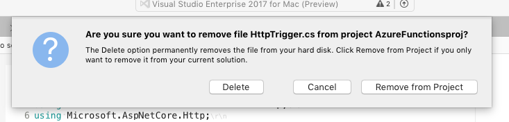
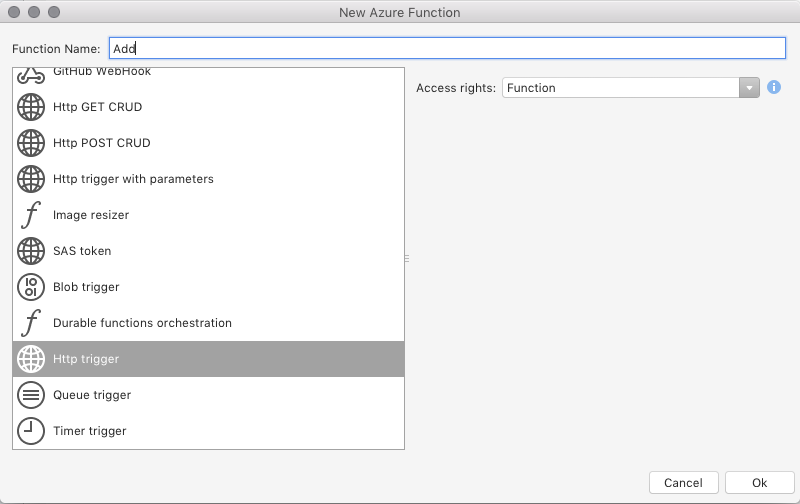

# Introduction to Azure Functions

Azure functions is a way to create and run event-driven snippets of code –– functions –– in the cloud, without having to explicitly provision or manage infrastructure. For more information about Azure Functions, see the [Azure Functions documentation](https://docs.microsoft.com/azure/azure-functions/).

## Requirements

Azure Function tools are included in **Visual Studio for Mac 7.5**.

To create and deploy functions you also need an Azure subscription, which is available for free from [https://azure.com/free](https://azure.com/free).

## Creating your first Azure Functions project

1. In Visual Studio for Mac, select **File > New Solution…** 
2. From the New Project dialog, select the Azure Functions template under **Cloud > General** and click **Next**:

    

3. Enter a **Project Name** and select **Create**.

Visual Studio for Mac creates a .NET Standard project with a default HttpTrigger function included. It also includes NuGet references to a variety of **AzureWebJobs** packages, as well as the **Newtonsoft.Json** package.

The new project contains the following files:

* **HttpTrigger.cs** – This class contains boilerplate code for a HTTP-triggered function. It contains a **FunctionName** attribute with the function name, and a trigger attribute, **HttpTrigger**, that specifies that the function is triggered by a HTTP request. For more information on the function method, refer to the [Azure Functions C# developer reference](https://docs.microsoft.com/azure/azure-functions/functions-dotnet-class-library) article.
* **host.json** – This file describes the global configuration options for Functions host. For an example file and information on the available settings for this file, see the [host.json reference for Azure Functions](https://docs.microsoft.com/azure/azure-functions/functions-host-json).
* **local.settings.json** – This file contains all the settings for running functions locally. These settings are used by the Azure Functions Core Tools. For more information, see [Local settings file](https://docs.microsoft.com/en-us/azure/azure-functions/functions-run-local#local-settings-file) in the Azure Functions Core Tools article.

Now that you've created a new Azure Functions project in Visual Studio for Mac, you can test out the default HTTP-triggered function from your local machine.

<!--
## Create an Azure storage account

[Describe why this step is necessary and what it does]

1. Log on to your account at [https://portal.azure.com](https://portal.azure.com).
2. Under the **Favorites** section, located on the left of the screen, select **Storage Accounts**:
    
3. Select **Add** to create a new storage account:
    
4. Enter a globally unique name for the **Name** and reuse it for the **Resource group**. You can keep all the other items as their default.
    
5. Click **Create**. It might take a few minutes to create the storage account. You'll get a notification once it has been successfully created.
6. Select the **Go to resource** button from the notification:
    
-->

## Testing the function locally

With Azure Functions support in Visual Studio for Mac you can test and debug your function on your local development computer.

1. To test your function locally, press the **Run** button in Visual Studio for Mac:

    

1. Running the project starts local debugging on the Azure Function and opens a new Terminal window, as illustrated in the following image: 

     

    Copy the URL from the  output.

3. Paste the URL for the HTTP request into your browser's address bar. Add the query string `?name=<yourname>` to the end of the URL and execute the request. The following image shows the response in the browser to the local GET request returned by the function:

    

## Creating a new function

Function Templates enable you to quickly create new functions using the most common triggers and templates. When a new Azure Functions project is created, it automatically includes an HttpTrigger function. To create another type of function, do the following:

1. Remove the **HttpTrigger.cs** file by right-clicking on it and selecting **Remove**. From the following alert, select **Delete** to remove it from your project:

    

2. To add a new function, right-click on the project name and select **Add > Add Function...**:

    

3. From the **New Azure Function** dialog, select the function you require:

    

    A list of the Azure Function templates are provided in the following section.

## Available function templates

- **HTTP** – Trigger the execution of your code by using an HTTP request. There are explicit templates for the following HTTP triggers:
    - Http GET CRUD
    - Http POST CRUD
    - Http Trigger with parameters
    - Http Trigger
- **Timer** – Execute cleanup or other batch tasks on a predefined schedule. This template takes two fields: a Name and a schedule, which is a six field CRON expression. For more information, see the [Azure functions article on Time](https://docs.microsoft.com/azure/azure-functions/functions-create-scheduled-function)
- **GitHub Trigger** – Respond to events that occur in your GitHub repositories. For more information, see the [Azure Functions article on GitHub](https://docs.microsoft.com/azure/azure-functions/functions-create-github-webhook-triggered-function)
    - GitHub commenter – This function will be run when it receives a GitHub webhook for an issue or pull request and adds a comment.
    - GitHub WebHook – This function will be run when it receives a GitHub webhook
- **Blob Trigger** – Process Azure Storage blobs when they are added to a container. In addition to the function name, this template also takes a path and connection property. The path property is the path within your storage account that the trigger will monitor. The connection account is the name of the app setting containing your storage account connection string. For more information, see the [Azure functions Blob Storage article](https://docs.microsoft.com/azure/azure-functions/functions-create-storage-blob-triggered-function).
- **Queue Trigger** – This is a function that will respond to messages as they arrive in the Azure Storage queue. In addition to the function name, this template takes a **Path** (the name of the queue from which the message will be read) and storage account **Connection** (the name of the app setting containing your storage account connection string). For more information, see the [Azure functions article on Queue Storage](https://docs.microsoft.com/azure/azure-functions/functions-create-storage-queue-triggered-function).
- **Generic WebHook** – This is a simple function that will run whenever it receives a request from any service that supports webhooks. For more information, see the [Azure functions article on generic webhooks](https://docs.microsoft.com/azure/azure-functions/functions-create-generic-webhook-triggered-function)
- **Image Resizer** – This function creates resized images whenever a blob is added to a container. The template takes path and connection string for the trigger, a small image output, and a medium image output.
- **SAS token** – This function generates a SAS token for a given Azure Storage container and blob name. In addition to the function name, this template also takes a path and connection property. The path property is the path within your storage account that the trigger will monitor. The connection account is the name of the app setting containing your storage account connection string. The **Access rights** also need to be set. Authorization level controls whether the function requires an API key and which key to use; Function uses a function key; Admin uses your master key. For more information, see the [C# Azure Function for generating SAS tokens](https://azure.microsoft.com/resources/samples/functions-dotnet-sas-token/) sample.
- **Durable functions orchestration** – Durable Functions let you write stateful functions in a serverless environment. The extension manages state, checkpoints, and restarts for you. For more information, see the Azure functions guides on [Durable functions](https://docs.microsoft.com/azure/azure-functions/durable-functions-overview)