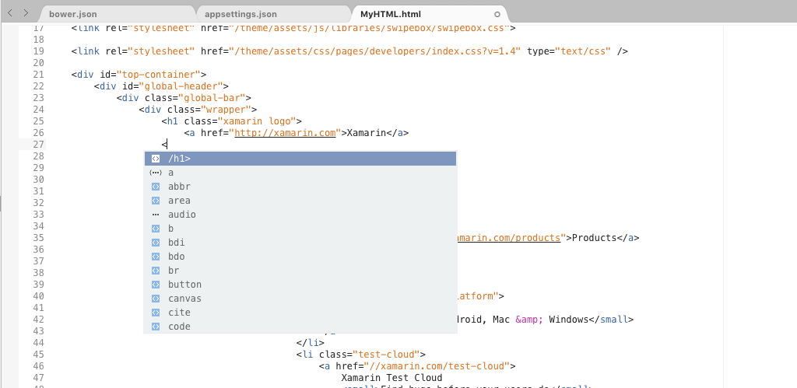
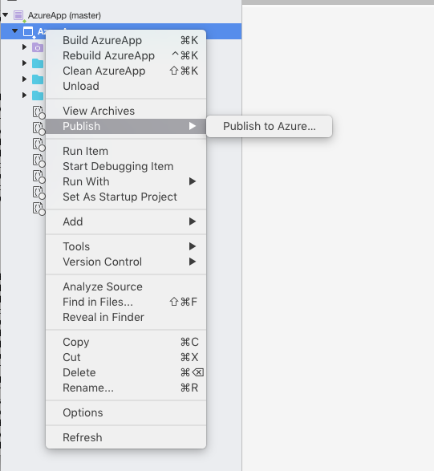

# Benefits of Visual Studio for Mac over Xamarin Studio 
 
Visual Studio for Mac has replaced Xamarin Studio as a full-featured IDE on Mac. It provides features that allow you to develop web applications and services, cross-platform mobile and desktop apps, and games. Additionally, it makes integrating with Azure a breeze, whether that means publishing to Azure or creating Azure Functions. It has everything you would expect from a modern IDE, including a full-featured source editor, a powerful debugger, a customizable workspace, git integration, and a rich extension system, all designed natively for the Mac.

Other features include:

* Roslyn-based C# IntelliSense, refactoring, analyzers, and code fixes
* NuGet-based package management
* Visual Studio compatible project format
* MSBuild build engine
* Integrated unit testing
* Support for F# out-of-the-box

## Language Support

Writing C# 7 code on your Mac is offered only on Visual Studio for Mac.

## .NET Core

[.NET Core](https://www.microsoft.com/net/core#macos) is a platform for creating applications that run on Windows, Linux, and Mac. Visual Studio for Mac has support for loading, creating, running, and debugging .NET Core projects.

.NET Core is installed with the Visual Studio for Mac and works out of the box.

.NET Core support includes:

* C# and F# IntelliSense.
* .NET Core project templates for console, library, and web applications.
* Full debugging support, including breakpoints, call stack, watch window, etc. 
* NuGet Package References and MSBuild-based restore. 
* Integrated unit testing support for running and debugging tests with the Visual Studio Test Platform that is included with the .NET Core SDK. 
* Migration from the old project.json format. 
* .NET standard project support.

## Web Development  

### ASP.NET Core 

Visual Studio for Mac includes ASP.NET Core templates for MVC and Web API projects out of the box.
 

Visual Studio for Mac also adds new web tooling support for HTML, CSS, and JSON files. 

### HTML 

* New HTML template. 
* Improved smart indent and formatting. 
* Improved colorization. 
* Improved IntelliSense. 
* Code folding (must be enabled). 
* Unminify command. 
* Improved Code Templates (snippets). 
* Surround selection with `
`. 
* Option up/down moves selected text up/down. 

### CSS 

* Improved smart indent and formatting. 
* Improved colorization. 
* Improved IntelliSense. 
* Code folding. 
* Many Code Templates (snippets). 
* Option up/down moves selected text up/down. 

### JSON 
* Schema picker with access to schemastore.org. 
* Validation from schema. 
* IntelliSense from schema. 
* Improved smart indent and formatting. 
* Improved colorization. 
* Comment/uncomment. 
* Quote injection and brace matching. 
* Option up/down moves selected text up/down. 

## Publishing to Azure

With Visual Studio for Mac it's possible to publish your ASP.NET Core web apps and services to Azure App Service. 

### Azure Functions

Azure Functions is a solution for easily running small pieces of code, or functions, in the cloud. Visual Studio for Mac allows you to code and locally debug your Azure Functions. To get started look for Azure Functions under Cloud in the New Project dialog. 

### Docker Support

You can now publish ASP.NET Core apps to Docker containers and run them from an Azure App Service. 

To enable Docker support in your project, right-click on your ASP.NET Core web app and select **Add > Add Docker Support**. 

To publish your web app to a Docker container, use the **Publish > Publish to Azure** workflow introduced in Visual Studio for Mac.

## Source Editor Improvements 

In addition to Roslyn-based C# IntelliSense, refactoring, analyzers and code fixes, the Visual Studio for Mac source editor provides the following improvements over Xamarin Studio: 

### Language Bundles 

Visual Studio for Mac has support for TextMate (`.tmBundle`) and sublime 3 (`.sublime`) language bundles, which you can use to add: 

* Editor color themes 
* Code snippets 
* Grammars for new languages, enabling highlighting, and basic IntelliSense 

You can add these bundles in **Preferences > Text Editor > Language Bundles**. 

### Color Theme Support 

The following color theme formats are supported in Visual Studio for Mac: 

* Visual Studio (`.vssettings`) 
* Xamarin studio (`.json`) 
* TextMate (`tmTheme`) 

## Unity 

[Unity](https://unity3d.com/) is a game creation tool you can use to create high-quality cross-platform 2D and 3D games for all the major platforms: mobiles, desktops, consoles, AR, and VR devices and even the web. 

Starting with Unity 5.6.1, you can use Visual Studio for Mac to write and debug your Unity game. To get started, set Visual Studio to be Unity’s 5.6.1 script editor. 

The Tools for Unity include: 

* Support for scripts written in C#. 
* Unity solution pad. 
* One click debugging of the Unity Editor. 
* IntelliSense for Unity messages. 
* Code coloration for Unity’s shaders. 
* Access to the Unity documentation. 

## Xamarin 

While Xamarin cross-platform features have always been a first-class feature of Xamarin Studio, there are Xamarin features that are only available in Visual Studio for Mac 

### Android 

* [Android SDK manager](https://developer.xamarin.com/guides/android/application_fundamentals/using-the-sdk-manager/)  
* Android O will only be supported in Visual Studio for Mac, not 
Xamarin Studio 

### iOS and Mac 

* [iOS signing workflow updates ](https://developer.xamarin.com/guides/cross-platform/macios/apple-account-management/) 
    * Create signing identities and install them to the local Keychain. 
    * Create Provisioning Profiles. 
    * Add a signing identity to an existing profile.
    *  Provision devices: register a device in the Apple Developer Portal and add them to a provisioning profile.
* iOS 11, watchOS 4, and tvOS 2 will only be supported in Visual Studio for Mac, not Xamarin Studio 
* MacOS High Sierra will only be supported in Visual Studio for Mac, not Xamarin Studio 

### Cross Platform 

* [Xamarin Live Player](https://developer.xamarin.com/guides/cross-platform/live/)