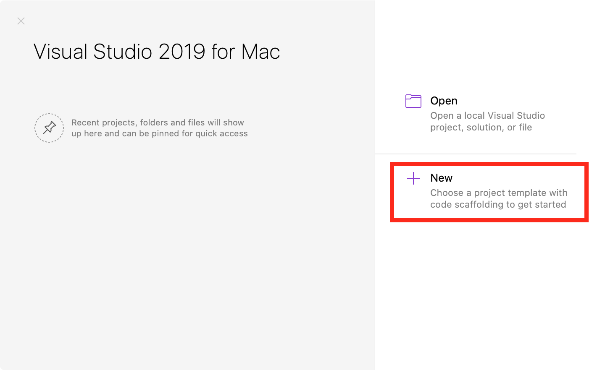
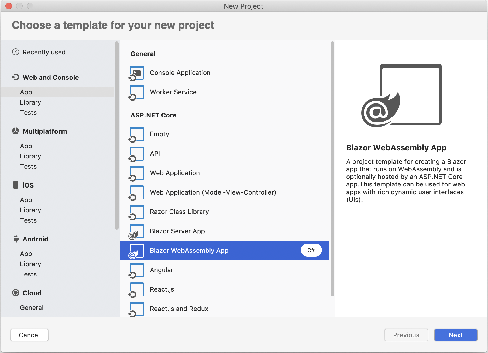
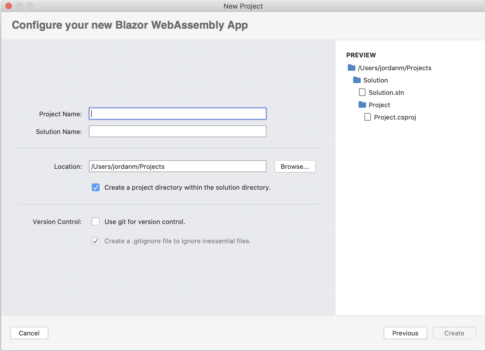
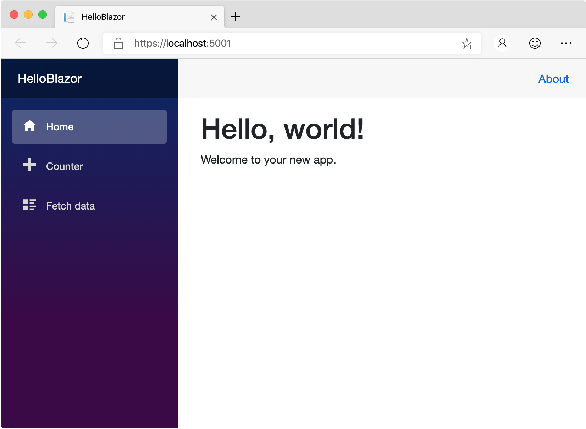
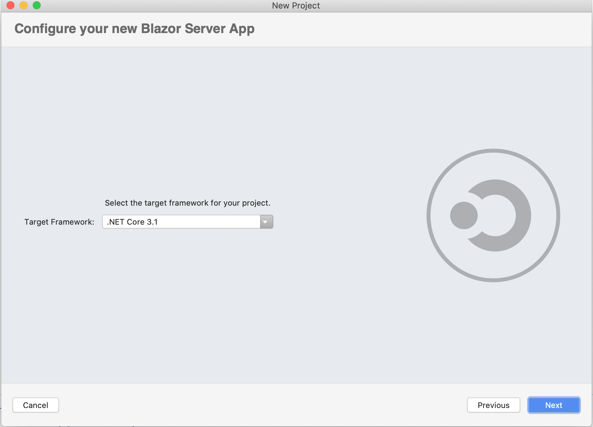
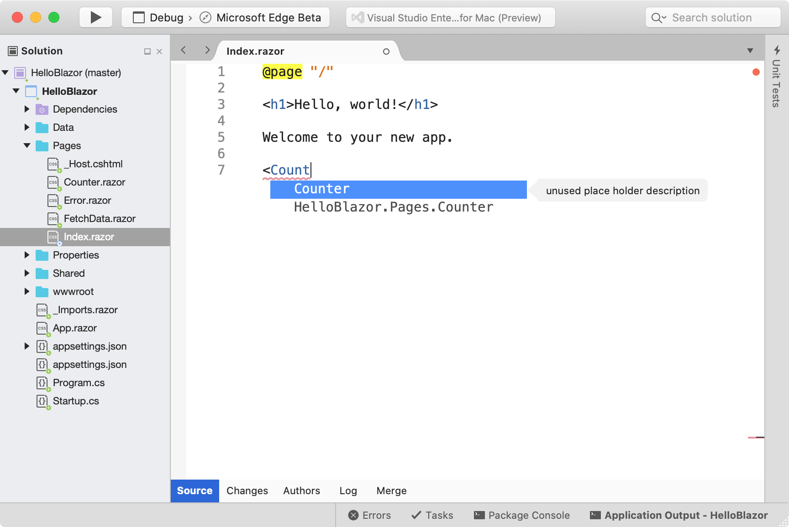
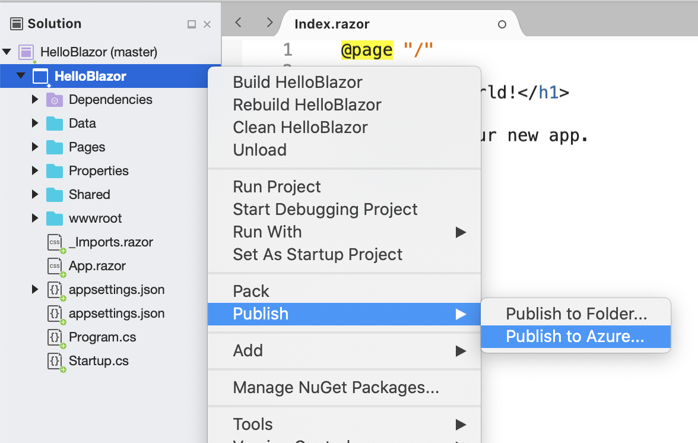

# Create Blazor web apps

 [!INCLUDE [Visual Studio for Mac](~/includes/applies-to-version/vs-mac-only.md)]

This guide offers an introduction to creating your first Blazor web app. For more in-depth guidance, see [Introduction to ASP.NET Core Blazor](/aspnet/core/blazor/index).

ASP.NET Core Blazor supports two different hosting options; Blazor WebAssembly (WASM) or Blazor Server. Visual Studio for Mac supports both hosting models. Visual Studio for Mac 8.4+ supports Blazor Server and Visual Studio for Mac 8.6+ supports both. For more info on Blazor hosting models see [ASP.NET Core Blazor hosting models
](/aspnet/core/blazor/hosting-models?view=aspnetcore-3.1&preserve-view=true). Support for debugging Blazor WebAssembly projects in Visual Studio for Mac is available in the Preview release of v8.8 (available via the Preview update channel in the **Visual Studio > Check for Updates...** menu).

What is Blazor? Blazor is a framework for building interactive client-side web UI with .NET, which offers the following advantages to web developers:

* Write code in C# instead of JavaScript.
* Leverage the existing .NET ecosystem of .NET libraries.
* Share app logic across server and client.
* Benefit from .NET’s performance, reliability, and security.
* Stay productive with Visual Studio on PC, Linux, and macOS.
* Build on a common set of languages, frameworks, and tools that are stable, feature-rich, and easy to use.

## Create a new Blazor WebAssembly project
1. On the **Start Window**, select **New** to create a new project:

   

1. In the **New Project** dialog box, select **.NET Core** > **App** > **Blazor WebAssembly App** and select **Next**:
   

1. Select .NET Core 3.1 as the target framework, then select **Next**. 
   

1. Choose a name for your project, and add Git support if desired. Select **Create** to create the project.
    

   Visual Studio for Mac opens your project in the Code layout window.

1. Select **Run** > **Start Without Debugging** to run the app.

   Visual Studio starts [Kestrel](/aspnet/core/fundamentals/servers/kestrel), opens a browser to `https://localhost:5001`, and displays your Blazor web app.

   

## Creating a new Blazor Server project

1. On the **Start Window**, select **New** to create a new project:

   
1. In the **New Project** dialog box, select **.NET Core** > **App** > **Blazor Server App** and select **Next**:
   

1. Select .NET Core 3.1 as the target framework, then select **Next**. 
   

1. Choose a name for your project, and add Git support if desired. Select **Create** to create the project.
   

   Visual Studio for Mac opens your project in the Code layout window.
1. Select **Run** > **Start Without Debugging** to run the app.

   Visual Studio starts [Kestrel](/aspnet/core/fundamentals/servers/kestrel), opens a browser to `https://localhost:5001`, and displays your Blazor web app.

   

## Blazor support in Visual Studio for Mac

Visual Studio for Mac (starting with version 8.4) includes new features to help you create new Blazor server projects. As well, it provides you the standard support you would expect such as building, running and debugging Blazor projects. In Visual Studio for Mac 8.6 support for creating, building and running Blazor WebAssembly projects was added.

In the walkthrough above, we saw how the Blazor Server App project template helps you create a new Blazor Server App or Blazor WebAssembly App project. Let's take a look at some of the additional features in Visual Studio for Mac to support Blazor project development.

### Editor support for *.razor* files
Visual Studio for Mac includes support for editing .razor files - the majority of the files that you’ll be using when creating Blazor applications. Visual Studio for Mac provides full colorization and completion support for your .razor files including completions for Razor components declared in the project.

### Publishing Blazor applications to Azure App Service
You can also publish Blazor applications directly to Azure App Service. If you don’t have an Azure account to run your Blazor app on Azure, you can always [sign up for a free one here](https://azure.microsoft.com/free) that also comes with 12 months of free popular services, $200 in free Azure credits, and over 25 always free services.

## Project anatomy

Blazor web apps include a few directories and files by default. As you're getting started, here are the main ones you'll need to be familiar with:

### Pages folder

This folder contains a project's webpages, which use a *.razor* file extension.

### Shared folder

This folder includes shared components, also using the *.razor* extension. You'll see that this includes *MainLayout.razor*, which is used to define common layout across the application. It also includes the shared *NavMenu.razor* component, which is used on all pages. If you're creating reusable components, they'll go in the **Shared** folder.

### App settings

The *appSettings.json* file contains configuration data such as connection strings.

For more information about configuration, see the [Configuration in ASP.NET guide](/aspnet/core/fundamentals/configuration/index).

### wwwroot folder

This folder contains static files, such as HTML, JavaScript, and CSS files. For more information, see [Static files in ASP.NET Core](/aspnet/core/fundamentals/static-files).

### Program.cs

This file contains the entry point for the program. For more information, see [ASP.NET Core Web Host](/aspnet/core/fundamentals/host/web-host).

### Blazor Server App specific files
#### App settings

The *appSettings.json* file contains configuration data such as connection strings.

For more information about configuration, see the [Configuration in ASP.NET guide](/aspnet/core/fundamentals/configuration/index).

#### Startup.cs

This file contains code that configures app behavior, such as whether the app requires consent for cookies. For more information, see [App startup in ASP.NET Core](/aspnet/core/fundamentals/startup).

## Summary
In this tutorial, you saw how to create a new Blazor Server App or Blazor WebAssembly App in Visual Studio for Mac, and learned about some of the features that Visual Studio for Mac offers to help you create Blazor applications.

## See also

For a more comprehensive guide to creating Blazor web apps, see [Introduction to ASP.NET Core Blazor](/aspnet/core/blazor/index).