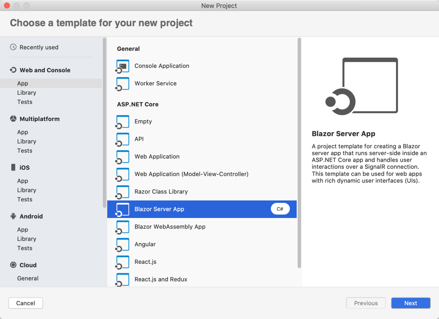

# Create Blazor web apps

This guide offers an introduction to creating your first Blazor web app. For more in-depth guidance, see [Introduction to ASP.NET Core Blazor](/aspnet/core/blazor/index).

Visual Studio for Mac 8.4 includes support for developing and publishing ASP.NET Core Blazor Server applications. Blazor is a framework for building interactive client-side web UI with .NET, which offers the following advantages to web developers:

* Write code in C# instead of JavaScript.
* Leverage the existing .NET ecosystem of .NET libraries.
* Share app logic across server and client.
* Benefit from .NET’s performance, reliability, and security.
* Stay productive with Visual Studio on PC, Linux, and macOS.
* Build on a common set of languages, frameworks, and tools that are stable, feature-rich, and easy to use.

## Creating a new Blazor project

1. On the welcome screen, select **New** to create a new project:

   
1. In the **New Project** dialog box, select **.NET Core** > **App** > **Blazor Server App** and select **Next**:
   

1. Select .NET Core 3.1 as the target framework, then select **Next**. 
   

1. Choose a name for your project, and add Git support if necessary. Select **Create** to create the project.
   

   Visual Studio for Mac opens your project in the Code layout window.
1. Select **Run** > **Start Without Debugging** to run the app.

   Visual Studio starts [Kestrel](/aspnet/core/fundamentals/servers/kestrel), opens a browser to `https://localhost:5001`, and displays your Blazor web app.

   

## Blazor support in Visual Studio for Mac

Visual Studio for Mac 8.4 includes new features to help you create new Blazor server projects as well as get the standard support you would expect such as building, running and debugging Blazor projects. As you saw in the walkthrough above, the Blazor Server App project template is now available in the New Project dialog.

Let's take a look at some of the additional features in Visual Studio for Mac to support Blazor server project development.

### Editor support for *.razor* files
One of the areas where the team has focused on this release was adding support for editing .razor files. These are the files that you’ll be using when creating Blazor applications. If you’ve edited these files in the Windows version of Visual Studio 2019, then you’ll be very comfortable in Visual Studio 2019 for Mac. Both the Windows and Mac version of the IDE share the same editor for .razor files. You’ll see full colorization and completion support for your .razor files including completions for Razor components declared in the project.

### Publishing Blazor applications to Azure App Service
You can also publish Blazor applications directly to Azure App Service. And if you don’t have an Azure account to run your Blazor app on Azure, you can always sign up for a free one here that also comes 12 months of free popular services, $200 free Azure credits, and over 25 always free services.

## Project anatomy

Blazor web apps include a few directories and files by default. As you're getting started, here are the main ones you'll need to be familiar with:

### Pages folder

This folder contains a project's webpages, which use a *.razor* file file extension.

### Shared folder

This folder includes shared components, also using the *.razor* extension. You'll see that this includes *MainLayout.razor*, which is used to define common layout across the application. It also includes the shared *NavMenu.razor* component, which is used on all pages. If you're creating reusable components, they'll go in the **Shared** folder.

### App settings

The *appSettings.json* file contains configuration data such as connection strings.

For more information about configuration, see the [Configuration in ASP.NET guide](/aspnet/core/fundamentals/configuration/index).

### wwwroot folder

This folder contains static files, such as HTML, JavaScript, and CSS files. For more information, see [Static files in ASP.NET Core](/aspnet/core/fundamentals/static-files).

### Program.cs

This file contains the entry point for the program. For more information, see [ASP.NET Core Web Host](/aspnet/core/fundamentals/host/web-host).

### Startup.cs

This file contains code that configures app behavior, such as whether the app requires consent for cookies. For more information, see [App startup in ASP.NET Core](/aspnet/core/fundamentals/startup).

## See also

For a more comprehensive guide to creating Blazor web apps, see [Introduction to ASP.NET Core Blazor](/aspnet/core/blazor/index).
