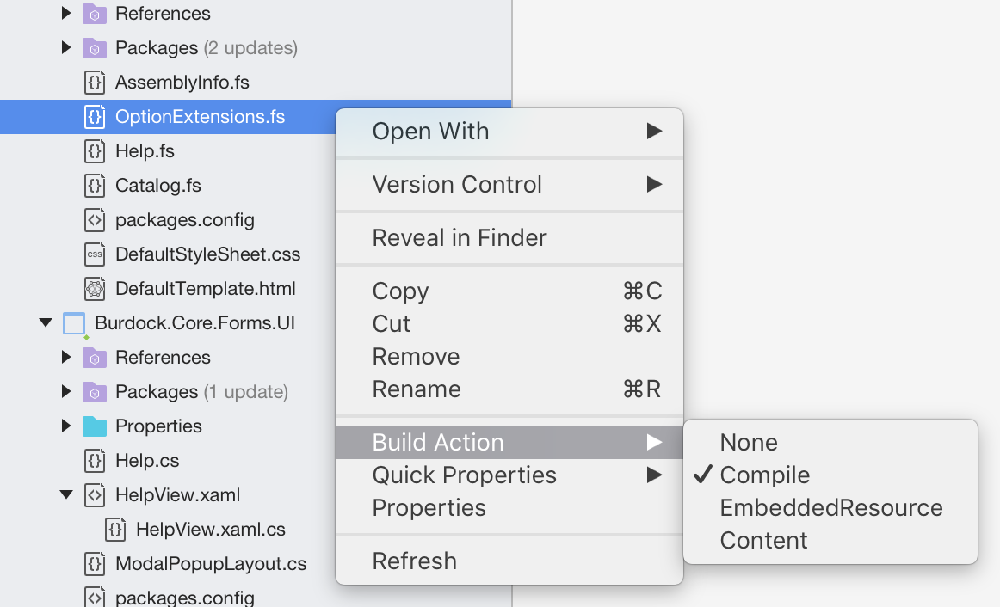

# Build actions

All files in a Visual Studio for Mac project have a build action. The build action controls what happens to the file during a build. 

>[!NOTE]
>This topic applies to Visual Studio for Mac. For Visual Studio on Windows, see [Build actions](/visualstudio/ide/build-actions).

## Set a build action

To set a build action for a file in Visual Studio for Mac, you can right-click on any file and browsing to **Build Action**, as illustrated below:

Build actions for this file will be shown in the flyout menu. 

## Build action values

Some of the common build actions for projects you can build in Visual Studio for Mac include:

|Build Action | Project types | Description |
|--|--|--|
| **Compile** | any | The file is passed to the C# compiler as a source file.|
| **Content** | .NET, Xamarin | For ASP.NET projects, these files are included as part of the site when it's deployed. For Xamarin.iOS and Xamarin.Mac projects, they'll be included in the app bundle.|
| **Embedded Resource** | .NET | The file is passed to the C# compiler as a resource to be embedded in the assembly. [Assembly.GetManifestResourceStream](/dotnet/api/system.reflection.assembly.getmanifestresourcestream), from the `System.Reflection` namespace, can then be used to read the file from the assembly.|
| **None** | any | The file isn't part of the build in any way and is included in the project for easy access from the IDE. This value can be used for documentation files such as "ReadMe" files, for example.|

> [!NOTE]
> Additional build actions may be defined by for specific project types, so the list of build actions depends on the project type and values might appear that are not in this list.  

Xamarin.iOS projects have the **BundleResource** build action, which will add the file as part of the app bundle. Information on Xamarin.Android specific build actions can be found in the [build process](/xamarin/android/deploy-test/building-apps/build-process#Build_Actions) guide.

It's also possible to select more than one file in the solution explorer, allowing you to set the build action to many files at once.

## See also

- [Build actions (Visual Studio on Windows)](/visualstudio/ide/build-actions)