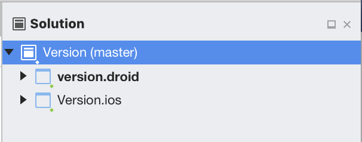
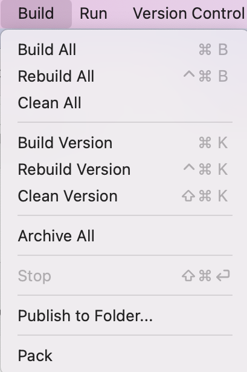

# Building and cleaning projects and solutions

Follow the steps in this article to learn how to build, rebuild, or clean your all or some of the projects in a solution.

> [!NOTE]
> This topic applies to Visual Studio for Mac. For Visual Studio on Windows, see [Build and clean projects and solutions in Visual Studio](/visualstudio/ide/building-and-cleaning-projects-and-solutions-in-visual-studio).

## To build, rebuild, or clean an entire solution

1. Select the Solution node in the **Solution Pad**:

    

2. Select the **Build** menu in the Menu Bar and choose one of the following options:

    

    * Choose **Build All** to compile the files and components within the project that have changed since the most recent build.

    * Choose **Rebuild All** to "clean" the solution and then builds all project files and components.

    * Choose **Clean All** to delete any intermediate and output files. With only the project and component files left, new instances of the intermediate and output files can then be built.

## To build or rebuild a single project

1. Select the project in the **Solution Pad**.

2. Select the **Build** menu from the Menu Bar.

3. Choose either Build[ProjectName], Rebuild[ProjectName], or Clean[ProjectName].

## To stop a build

To stop a build, use one of the following options:

* Press the red square in the status area:

    

* Use the **Stop** item in the **Build** menu.

* Press **Cmd+Shift+Return**.

## See also

- [Build and clean projects and solutions (Visual Studio on Windows)](/visualstudio/ide/building-and-cleaning-projects-and-solutions-in-visual-studio)