# Building ASP.NET Core applications in Visual Studio for Mac

ASP.NET Core is an open-source and cross-platform framework for building modern cloud-based internet connected applications, such as web apps and services, IoT apps, and mobile backends. ASP.NET Core apps can run on [.NET Core](https://www.microsoft.com/net/core/platform) or on the .NET Framework runtimes. It was architected to provide an optimized development framework for apps that are deployed to the cloud or run on-premises. It consists of modular components with minimal overhead, so you retain flexibility while constructing your solutions. You can develop and run your ASP.NET Core apps cross-platform on Windows, Mac, and Linux. ASP.NET Core is open source at [GitHub](https://github.com/aspnet/home).

In this lab, you will create and explore an ASP.NET Core application with Visual Studio for Mac.

## Objectives

> [!div class="checklist"]
> * Create an ASP.NET Core web app
> * Explore the ASP.NET Core hosting, configuration, and middleware model
> * Debug an ASP.NET Core web app

## Prerequisites

- [Visual Studio for Mac](https://www.visualstudio.com/vs/visual-studio-mac)

## Intended Audience

This lab is intended for developers who are familiar with C#, although deep experience is not required.

## Task 1: Creating a new ASP.NET Core application

1. Launch **Visual Studio for Mac**.

2. Select **File > New Solution**.

3. Select the **.NET Core > App** category and the **ASP.NET Core Web App (C#)** template. Click **Next**.

    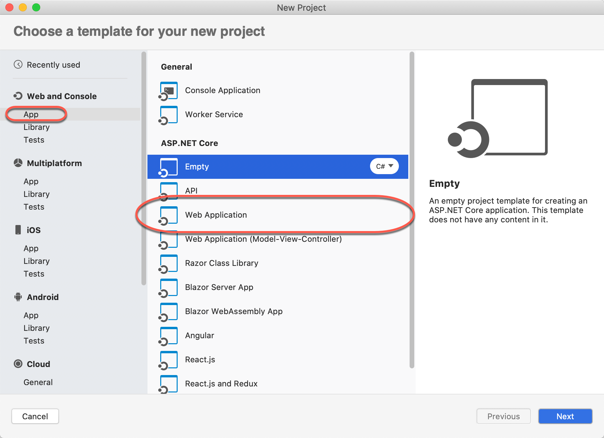

4. Enter a name of **"CoreLab"** and click **Create** to create the project. It will take a moment to complete.

    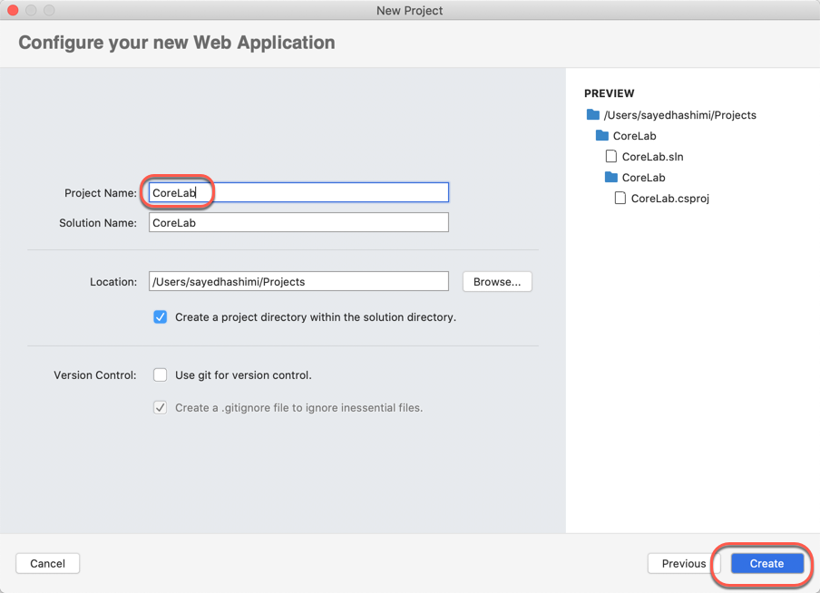

## Task 2: Touring the solution

1. The default template will produce a solution with a single ASP.NET Core project named **CoreLab**. Expand the project node to expose its contents.

    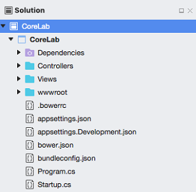

2. This project follows the model-view-controller (MVC) paradigm to provide a clear division of responsibilities between data (models), presentation (views), and functionality (controllers). Open the **HomeController.cs** file from the **Controllers** folder.

    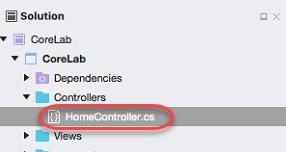

3. The **HomeController** class-by convention-handles all incoming requests that start with **/Home**. The **Index** method handles requests to the root of the directory (like `http://site.com/Home`) and other methods handle requests to their named path based on convention, such as **About()** handling requests to `http://site.com/Home/About`. Of course, this is all configurable. One notable is that the **HomeController** is the default controller in a new project, so requests to the root of the site (`http://site.com`) would go through **Index()** of the **HomeController** just like requests to `http://site.com/Home` or `http://site.com/Home/Index`.

    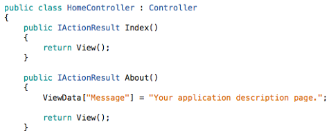

4. The project also has a **Views** folder that contains other folders that map to each controller (as well as one for **Shared** views. For example, the view CSHTML file (an extension of HTML) for the **/Home/About** path would be at **Views/Home/About.cshtml**. Open that file.

    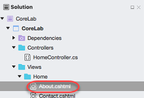

5. This CSHTML file uses the Razor syntax to render HTML based on a combination of standard tags and inline C#. You can learn more about this in the [online documentation](/aspnet/web-pages/overview/getting-started/introducing-razor-syntax-c).

    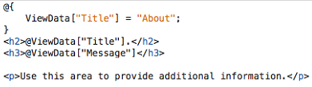

6. The solution also contains a **wwwroot** folder that will be the root for your web site. You can put static site content, such as CSS, images, and JavaScript libraries, directly at the paths you'd want them to be at when the site is deployed.

    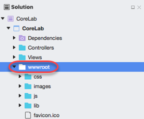

7. There are also a variety of configuration files that serve to manage the project, its packages, and the application at runtime. For example, the default application [configuration](/aspnet/core/fundamentals/configuration) is stored in **appsettings.json**. However, you can override some/all of these settings on a per-environment basis, such as by providing an **appsettings.Development.json** file for the **Development** environment.

    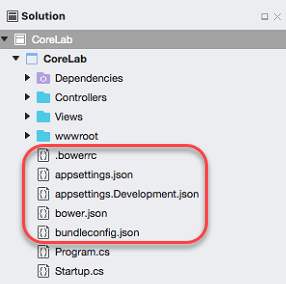

## Task 3: Understanding how the application is hosted

1. From **Solution Explorer**, open **Program.cs**. This is the bootstrapper that will run your application.

    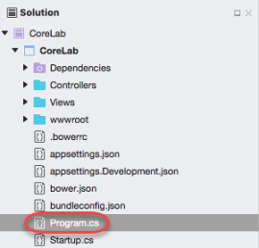

2. While there are only two lines of code here, they're substantial. Let's break them down. First, a new **WebHostBuilder** is created. ASP.NET Core apps require a host in which to execute. A host must implement the **IWebHost** interface, which exposes collections of features and services, and a **Start** method. The host is typically created using an instance of a **WebHostBuilder**, which builds and returns a **WebHost** instance. The **WebHost** references the server that will handle requests.

    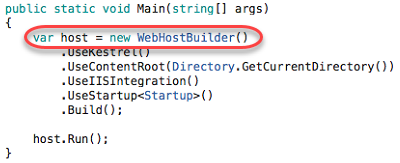

3. While the **WebHostBuilder** is responsible for creating the host that will bootstrap the server for the app, it requires you provide a server that implements **IServer**. By default, this is **[Kestrel](/aspnet/core/fundamentals/servers/kestrel)**, a cross-platform web server for ASP.NET Core based on **libuv**, which is a cross-platform asynchronous I/O library.

    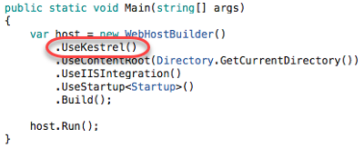

4. Next, the server's content root is set. This determines where it searches for content files, like MVC View files. The default content root is the folder from which the application is run.

    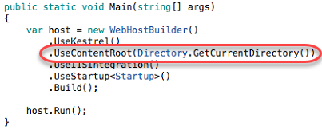

5. If the app must work with the Internet Information Services (IIS) web server, the **UseIISIntegration** method should be called as part of building the host. That this does not configure a server, like **UseKestrel** does. To use IIS with ASP.NET Core, you must specify both **UseKestrel** and **UseIISIntegration**. **Kestrel** is designed to be run behind a proxy and should not be deployed directly facing the internet. **UseIISIntegration** specifies IIS as the reverse proxy server, but it's only relevant when running on machines that have IIS. If you deploy your application to Windows, leave it in. It doesn't hurt otherwise.

    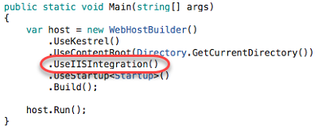

6. It's a cleaner practice to separate the loading of settings from the application bootstrapping. To easily do this, **UseStartup** is called to specify that the **Startup** class is to be called for the loading of settings and other startup tasks, such as inserting middleware into the HTTP pipeline. You may have multiple **UseStartup** calls with the expectation that each one overwrites previous settings as needed.

    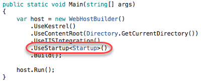

7. The last step in creating the **IWebHost** is to call **Build**.

    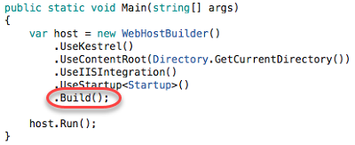

8. While **IWebHost** classes are required to implement the non-blocking **Start**, ASP.NET Core projects have an extension method called **Run** that wraps **Start** with blocking code so you don't need to manually prevent the method from exiting immediately.

    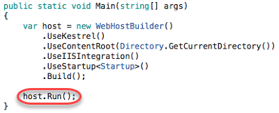

## Task 4: Running and debugging the application

1. In **Solution Explorer**, right-click the **CoreLab** project node and select **Options**.

    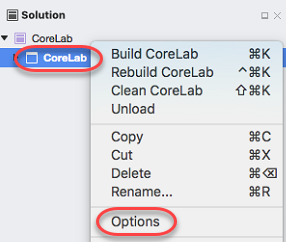

2. The **Project Options** dialog includes everything you need to adjust how the application is built and run. Select the **Run > Configurations > Default** node from the left panel.

3. Check **Run on external console** and uncheck **Pause console output**. Ordinarily the self-hosted application would not have its console visible, but would instead log its results to the **Output** pad. For the purposes of this lab, we'll show it in a separate window as well, although you don't need to do that during normal development.

4. Click **OK**.

    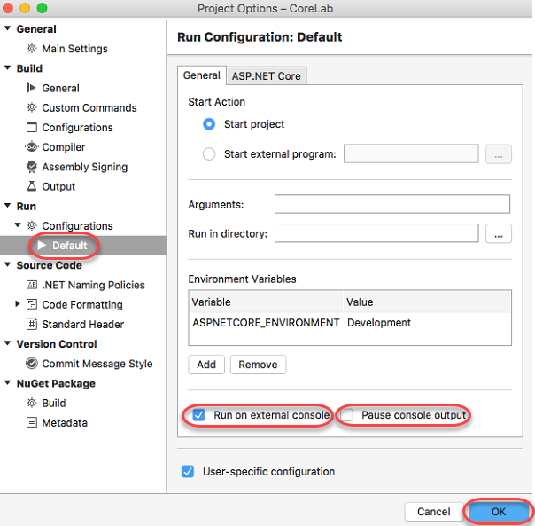

5. Press **F5** to build and run the application. Alternatively, you can select **Run > Start Debugging**.

6. Visual Studio for Mac will launch two windows. The first is a console window that provides you a view into the self-hosted server application.

    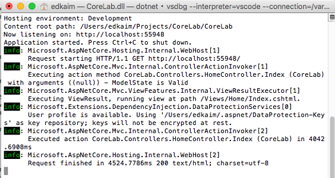

7. The second is a typical browser window to test the site. As far as the browser knows, this application could be hosted anywhere. Click **About** to navigate to that page.

    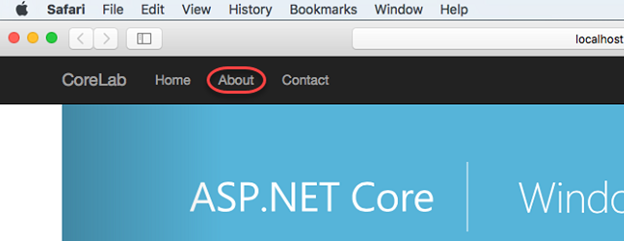

8. Among other things, the about page renders some text set in the controller.

    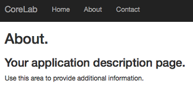

9. Keep both windows open and return to Visual Studio for Mac. Open **Controllers/HomeController.cs** if it's not already open.

    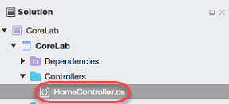

10. Set a breakpoint in the first line of the **About** method. You can do this by clicking in the margin or setting the cursor on the line and pressing **F9**. This line sets some data in the **ViewData** collection that is rendered in the CSHTML page at **Views/Home/About.cshtml**.

    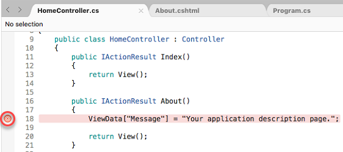

11. Return to the browser and refresh the about page. This will trigger the breakpoint in Visual Studio for Mac.

12. Mouse over the **ViewData** member to view its data. You can also expand its child members to see nested data.

    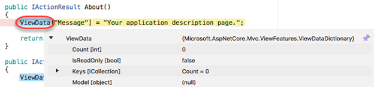

13. Remove the application breakpoint using the same method you used to add it.

14. Open **Views/Home/About.cshtml**.

15. Change the text **"additional"** to **"changed"** and save the file.

    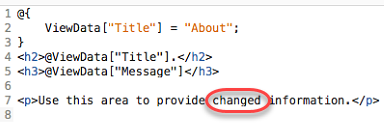

16. Press the **Continue** button to continue execution.

    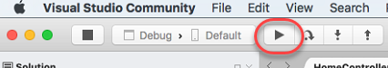

17. Return to the browser window to see the updated text. This change could be done at any time and didn't necessarily require a debugger breakpoint. Refresh the browser if you don't see the change reflected immediately.

    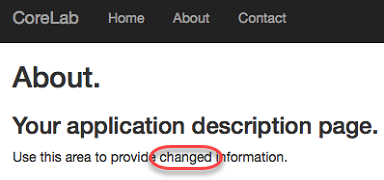

18. Close the test browser window and application console. This will stop debugging as well.

## Task 5: Application startup configuration

1. From **Solution Explorer**, open **Startup.cs**. You may notice some red squiggles initially as NuGet packages are being restored in the background and the Roslyn compiler is building a complete picture of the project dependencies.

    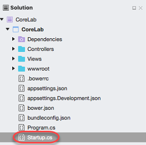

2. Locate the **Startup** method. This section defines the initial configuration for the application and is densely packed. Let's break it down.

    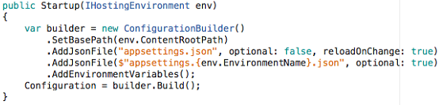

3. The method starts off by initializing a **ConfigurationBuilder** and setting its base path.

    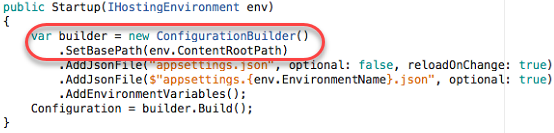

4. Next, it loads a required **appsettings.json** file.

    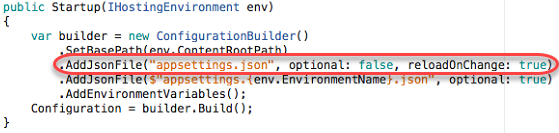

5. After that, it attempts to load an environment-specific **appsettings.json** file, which would override existing settings. For example, this is a provided **appsettings.Development.json** file used for that specific environment. To read more about configuration in ASP.NET Core, check out [the docs](/aspnet/core/fundamentals/configuration).

    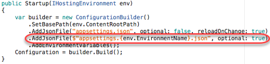

6. Finally, the environment variables are added to the configuration builder and the configuration is built and set for usage.

    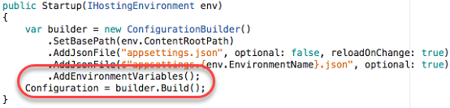

## Task 6: Inserting application middleware

1. Locate the **Configure** method in the **Startup** class. This is where all the middleware is configured so that it can be inserted into the HTTP pipeline and used to process every request to the server. While this method is called only once, the contents of the methods (such as **UseStaticFiles**) may be executed on every request.

    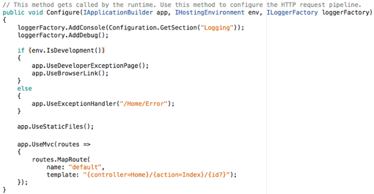

2. You can also add additional middleware to be executed as part of the pipeline. Add the code below after **app.UseStaticFiles** to automatically add an **X-Test** header to every outgoing response. IntelliSense will help complete the code as you type.

    ```csharp
    app.Use(async (context, next) =>
    {
        context.Response.Headers.Add("X-Test", new[] { "Test value" });
        await next();
    });
    ```

3. Press **F5** to build and run the project.

4. We can use the browser to inspect the headers to verify they are added. The instructions below are for Safari, but you can do the same in [Chrome](https://stackoverflow.com/questions/4423061/view-http-headers-in-google-chrome) or [Firefox](https://stackoverflow.com/questions/33974595/in-firefox-how-do-i-see-http-request-headers-where-in-web-console).

5. Once the browser loads the site, select **Safari > Preferences**.

6. On the **Advanced** tab, check **Show Develop menu in menu bar** and close the dialog.

    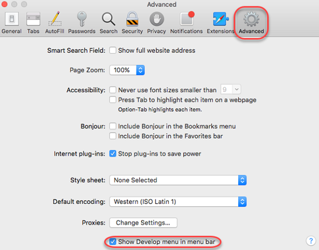

7. Select **Develop > Show Page Resources**.

8. Refresh the browser window so that the newly opened developer tools can track and analyze the traffic and content.

9. The localhost HTML page rendered by the server will be the item selected by default.

    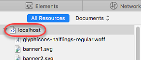

10. Expand the **Details sidebar**.

    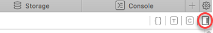

11. Scroll to the bottom of the sidebar to see the response header added in code earlier.

    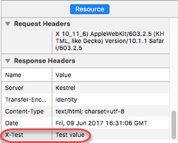

12. Close the browser window and console when satisfied.

## Summary

In this lab, you've learned how to get started developing ASP.NET Core apps with Visual Studio for Mac. If you'd like to explore developing a more complete movies database application, see the [Get started with ASP.NET Core MVC](/aspnet/core/tutorials/first-mvc-app/start-mvc) tutorial.
