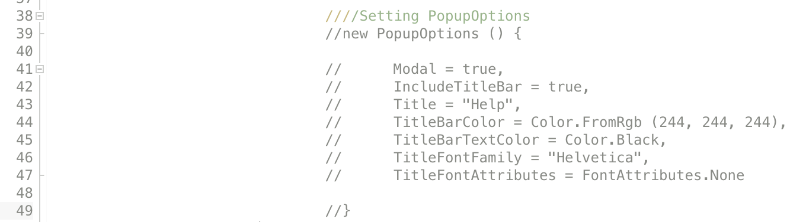

# Comments in Visual Studio for Mac

 [!INCLUDE [Retirement announcement for Visual Studio for Mac](includes/vsmac-retirement.md)]

While debugging or experimenting with code, you might want to comment blocks of code either temporarily or long term.

To comment out an entire block of code:

- Select the code and select **Toggle Line Comment(s)** from the context menu

OR

- Use the `cmd + /` key binding on the selected code.

These methods can be used to comment and uncomment sections of code.

In C# files, additional levels of line comments can be added, which allows regions of codes to be commented and uncommented, while still preserving actual comments:



Comments are also useful for documenting code for future developers who might interact with it. It's done in the form of multiline comments, which are added in the following way in each language:

**C#**

```csharp
/*
 This is a multi-line
 comment in C#
*/
```

**F#**

```fsharp
(*
 This is a multi-line
  comment in F#
*)
```

## See also

- [Comment out code (Visual Studio on Windows)](/visualstudio/ide/quickstart-editor#comment-out-code)
